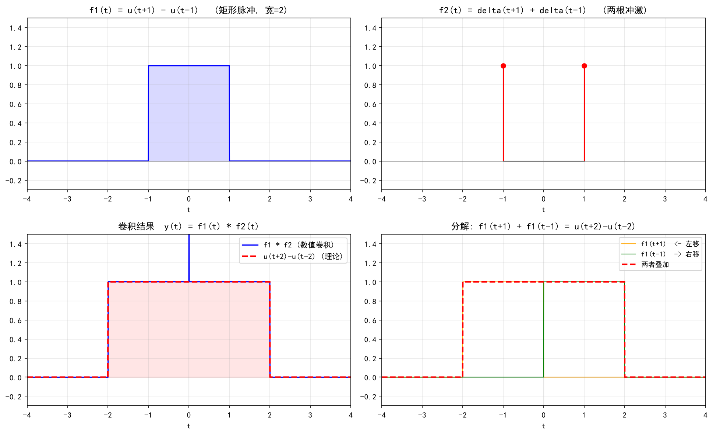
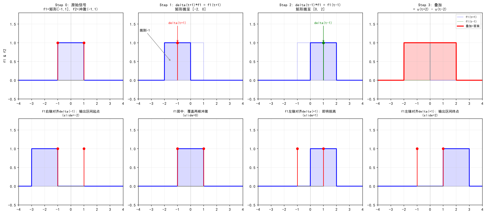
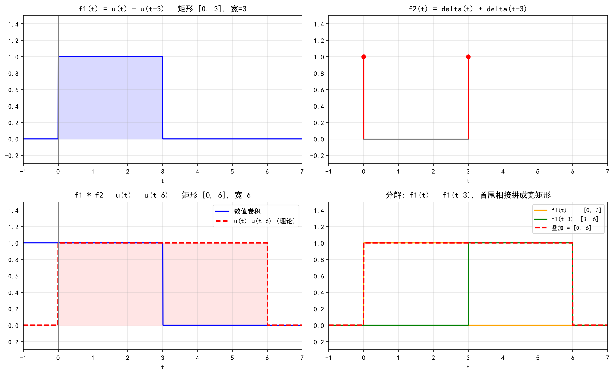
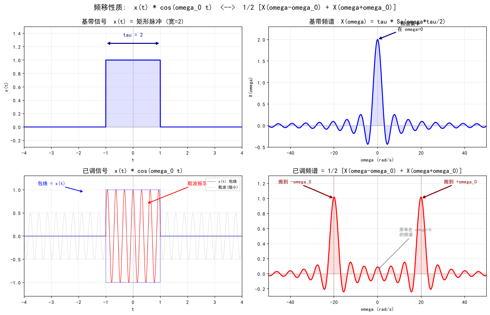
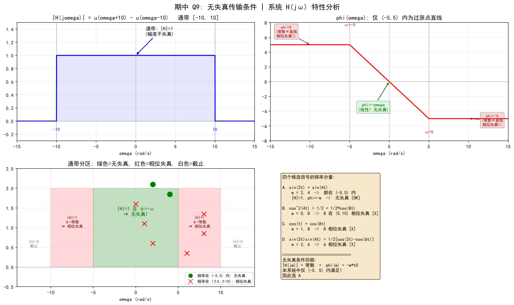
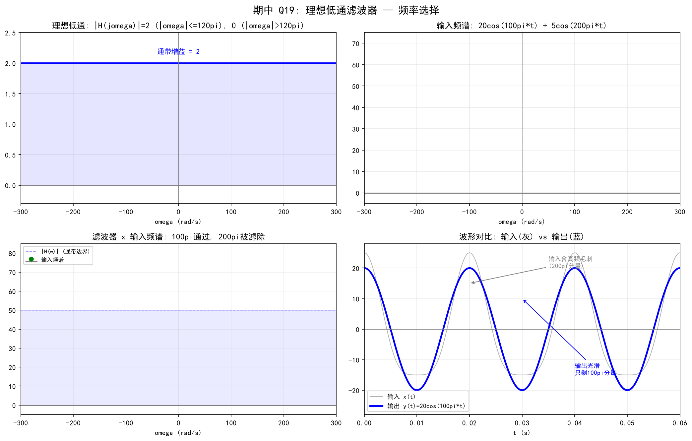
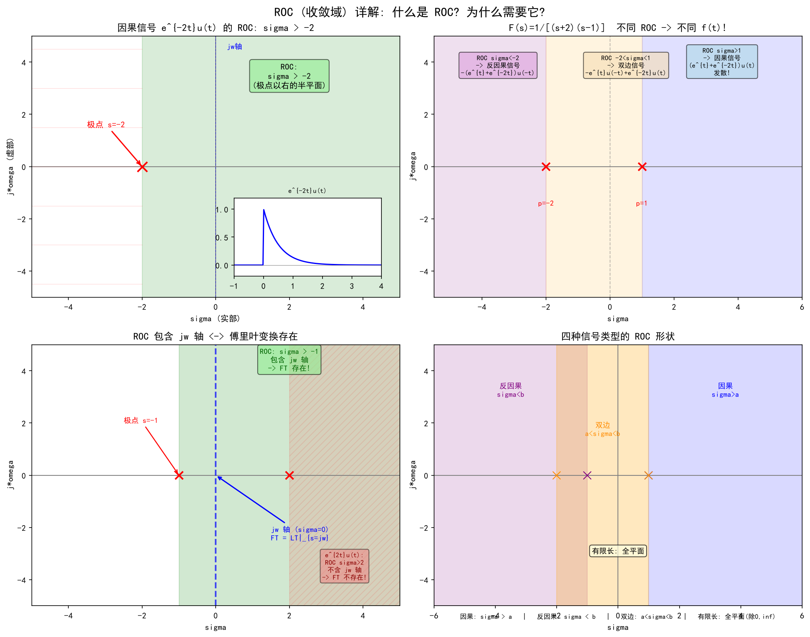
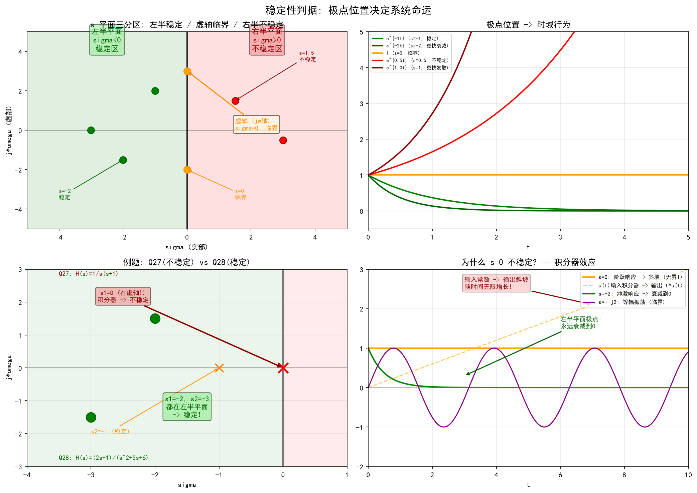

# 信号分析及处理 —— 零基础入门教程（含 76 道随文例题）

> 本教程覆盖三份作业全部 76 道题，每题嵌入对应知识点处。读完一节 → 立刻做例题 → 当场验证。

---

**符号约定**：$f(t)$ = 连续时间信号，$x[n]$ = 离散序列；FT = 傅里叶变换，LT = 拉普拉斯变换，ZT = Z 变换  
**例题来源**：`期中Qx` = 期中作业第 x 题，`Qx` = 作业2第 x 题（填空题），`Px` = 作业2第 x 题（判断题），`Dx` = 作业4第 x 题

---

# 第一部分：连续时间信号与系统

---

## 第 1 章 信号的分类

### 1.1 四组基本分类

| 分类维度 | 类型 A | 类型 B |
|---------|--------|--------|
| 时间自变量 | 连续时间 $f(t)$ | 离散时间 $x[n]$ |
| 取值 | 模拟量（连续取值） | 数字量（离散取值） |
| 规律 | 确定信号 | 随机信号 |
| 周期性 | 周期信号 | 非周期信号 |

> **🎯 例 1.1**（期中Q25）下列信号属于奇异信号的是？
> A. 直流信号　B. 指数信号　C. 单位冲激信号　D. 周期信号
>
> **答案：C**
>
> **思路**：奇异信号 = 不能用普通函数逐点定义的广义函数。$\delta(t)$ 在 $t=0$ 处"无穷大"，只能通过积分效果定义。直流、指数、周期信号都是普通函数，每点有确定值。

---

## 第 2 章 奇异信号三兄弟：$u(t)$、$\delta(t)$、$\delta'(t)$

### 2.1 单位阶跃 $u(t)$

$$u(t) = \begin{cases} 0, & t < 0 \\ 1, & t > 0 \end{cases}$$

作用：把信号"截断"——$e^{-t}u(t)$ 表示 $t<0$ 时为 0。

### 2.2 单位冲激 $\delta(t)$

直觉：宽度 → 0、高度 → ∞、但**面积恒为 1** 的脉冲。

**三大核心性质**：

| 性质 | 公式 | 一句话 |
|------|------|--------|
| **筛选** | $\int f(t)\delta(t-t_0)dt = f(t_0)$ | $\delta$ 把 $f$ 在 $t_0$ 的值"筛"出来 |
| **尺缩** | $\delta(at) = \frac{1}{\vert a\vert}\delta(t)$ | 压缩 $\delta$ → 强度减小 |
| **卷积单位元** | $\delta(t) * f(t) = f(t)$ | 任意信号卷积 $\delta$ 等于自身 |

---

> **🎯 例 2.1**（期中Q5）$\delta(t)$ 的傅里叶变换是？
> A. $j\omega$　B. $\frac{1}{j\omega}$　C. $2\pi\delta(\omega)$　D. $1$
>
> **答案：D**
>
> **推导**：$\mathcal{F}\{\delta(t)\} = \int_{-\infty}^{+\infty} \delta(t) e^{-j\omega t} dt$，$\delta$ 只在 $t=0$ 非零 → $=e^0 = 1$。
>
> 🔑 $\delta(t)$ 的频谱是常数 1——所有频率分量强度相等，称为"白频谱"。

---

> **🎯 例 2.2**（期中Q20）$5\delta(t)*f(t)$ 的结果为？
> A. $5f(t)$　B. $5\delta(t)$　C. $f'(t)$　D. $f(t)$
>
> **答案：A**
>
> **推导**：$[5\delta(t)] * f(t) = 5[\delta(t) * f(t)] = 5f(t)$。

---

> **🎯 例 2.3**（作业2 Q3 填空）单位冲激信号 $\delta(t)$ 与任意信号 $x(t)$ 的卷积结果为 \_\_\_\_。
>
> **答案：$x(t)$**
>
> $\delta * x = x$——$\delta$ 是卷积运算的"单位元"。

---

> **🎯 例 2.4**（作业2 Q9 填空）单位冲激信号的拉普拉斯变换为 \_\_\_\_。
>
> **答案：$1$**（收敛域：全 $s$ 平面）
>
> $\mathcal{L}\{\delta(t)\} = \int_{0^-}^{+\infty} \delta(t)e^{-st}dt = 1$。⚠️ 注意不是 $1/s$（$1/s$ 是 $u(t)$ 的 LT）。

---

> **🎯 例 2.5**（期中Q22）下列各式正确的是？
> A. $\int 2\delta(t)dt=1$　B. $\int 2\delta(t)dt=2$　C. $\int \delta(2t)dt=2$　D. $\int \delta(2t)dt=0$
>
> **答案：A**（系统答案，⚠️ 实际数学正确应为 B）
>
> **正确推导**：
> - $\int 2\delta(t)dt = 2 \cdot 1 = 2$（系数提出）
> - $\int \delta(2t)dt = \int \frac{1}{2}\delta(t)dt = \frac{1}{2}$（$\delta(at)=\frac{1}{|a|}\delta(t)$）
>
> 系统判 A 为正确属于批改错误，记正确的结论即可。

---

> **🎯 例 2.6**（期中Q16）下列表达式中错误的是？
> A. $\int f(t)\delta(2t)dt = \frac{1}{2}f(0)$
> B. $\int f(t)\delta(2t-t_0)dt = \frac{1}{2}f(\frac{t_0}{2})$
> C. $\int f(t-t_0)\delta(2t)dt = \frac{1}{2}f(-t_0)$
> D. $\int f(t)(2t-t_0)dt = \frac{1}{2}f(t_0)$
>
> **答案：D**
>
> **逐项推导**：
> - A：$\delta(2t) = \frac{1}{2}\delta(t)$，筛选 → $\frac{1}{2}f(0)$ ✅
> - B：$\delta(2t-t_0) = \frac{1}{2}\delta(t-\frac{t_0}{2})$，筛选 → $\frac{1}{2}f(\frac{t_0}{2})$ ✅
> - C：$\delta(2t) = \frac{1}{2}\delta(t)$，$f(t-t_0)$ 在 $t=0$ 处为 $f(-t_0)$ → $\frac{1}{2}f(-t_0)$ ✅
> - D：**被积函数里根本没有 $\delta$！** 普通积分不能简化到单点值 ❌

---

### 2.3 单位冲激偶 $\delta'(t)$

$\delta'(t)$ = $\delta(t)$ 的导数。三大性质：

| 性质 | 公式 |
|------|------|
| 奇函数 | $\delta'(-t) = -\delta'(t)$ |
| 筛选 | $\int f(t)\delta'(t)dt = -f'(0)$ |
| 面积为零 | $\int \delta'(t)dt = 0$（正负抵消） |

---

> **🎯 例 2.7**（期中Q6）下列是 $\delta'(t)$ 性质的是？
> A. $\delta'(-t)=\delta'(t)$　B. $\delta'(t)=\delta(t)$
> C. $\int \delta'(t)f(t)dt = -f'(0)$　D. $\int \delta'(t)dt = 1$
>
> **答案：C**
>
> - A 错：$\delta'$ 是**奇**函数，$\delta'(-t) = -\delta'(t)$
> - B 错：$\delta'$ 和 $\delta$ 是不同的广义函数
> - C ✅：分部积分 $\int \delta' f = -\int \delta f' = -f'(0)$
> - D 错：$\int \delta' = 0$（不是 1）

---

> **🎯 例 2.8**（作业2 P17 判断）"冲激偶信号是单位冲激信号的导数。" → **对** ✅
>
> $\delta'(t) = \frac{d}{dt}\delta(t)$

---

### 2.4 $\delta(t)$ 与 $u(t)$ 的关系

$$\boxed{\frac{du(t)}{dt} = \delta(t)} \qquad \boxed{\int_{-\infty}^{t} \delta(\tau)d\tau = u(t)}$$

- $\delta$ 是 $u$ 的**导数**（不是积分！）
- $u$ 是 $\delta$ 的**积分**（不是导数！）

---

> **🎯 例 2.9**（作业2 P15 判断）"单位冲激信号是单位阶跃信号的积分。" → **错** ❌
>
> 说反了！$\delta$ 是 $u$ 的**导数**，$u$ 才是 $\delta$ 的积分。
>
> 正确：$\int_{-\infty}^{t} \delta(\tau)d\tau = u(t)$，$\frac{du(t)}{dt} = \delta(t)$

---

## 第 3 章 系统性质：线性、时不变、因果

### 3.1 线性

判断方法：给输入 $a x_1 + b x_2$，看输出是否等于 $a y_1 + b y_2$。

**快速判据**：输出表达式中有没有 $x^2$、$\cos(x)$、$|x|$ 等非线性运算？

### 3.2 时不变性

判断方法：输入延迟 $t_0$，输出是否也只是延迟 $t_0$（形状不变）。

**快速判据**：输出表达式里 $t$ 是否单独出现（不是乘在 $x$ 旁边）？

### 3.3 因果性

输出只依赖**当前和过去**的输入，不依赖未来。

---

> **🎯 例 3.1**（期中Q3）$y(t) = \cos t \cdot f(t)$，则该系统为？
> A. 非线性时不变因果　B. 线性时变因果　C. 线性时不变因果　D. 线性时不变非因果
>
> **答案：B**
>
> **逐性质检验**：
> - **线性**：$a f_1 + b f_2 \to \cos t \cdot (a f_1 + b f_2) = a y_1 + b y_2$ → ✅ 线性
> - **时不变**：$f(t-t_0) \to \cos t \cdot f(t-t_0) \neq \cos(t-t_0) \cdot f(t-t_0) = y(t-t_0)$ → ❌ 时变
> - **因果**：$y(t)$ 只用到当前 $f(t)$ → ✅ 因果
>
> 🔑 **速判**：输出 = 含 $t$ 的系数 × 输入 → 线性时变。若系数不含 $t$ → 线性时不变。

---

> **🎯 例 3.2**（期中Q18）$y(t) = t \cdot x(t)$，则系统为？
> A. 线性时不变　B. 非线性时不变　C. 线性时变　D. 非线性时变
>
> **答案：C**
>
> 和例 3.1 完全一样的逻辑——系数含 $t$ → 线性 + 时变。$t$ 换成 $\cos t$ 或 $e^t$ 都一样。

---

> **🎯 例 3.3**（作业4 D7 判断）"$y(n) = \cos[x(n)]$ 所代表的系统是非线性系统。" → **对** ✅
>
> $\cos(a x) \neq a \cos x$ → 不满足齐次性 → 非线性。

---

### 3.4 常见混淆：$\cos t \cdot f(t)$ vs $\cos[f(t)]$

例 3.1 里 $\cos t \cdot f(t)$ 是线性的，例 3.3 里 $\cos[x(n)]$ 是非线性的——同样是 $\cos$，一正一反，区别在哪？

**关键判断：$\cos$（或其他非线性函数）作用在谁身上？**

| | $y = \cos t \cdot f(t)$ | $y = \cos[f(t)]$ |
|------|:---:|:---:|
| $\cos$ 作用于 | **时间 $t$** | **输入信号 $f$** |
| 本质 | 一个随时间变化的系数 × 输入 | 把输入塞进 $\cos$ 函数里 |
| 线性？ | ✅ 线性 | ❌ 非线性 |

**用具体数字体会**：

假设 $t = 1$ 这一时刻，$\cos 1 \approx 0.54$。输入 $f(1) = 3$。

- **$y = \cos t \cdot f(t)$**：$y = 0.54 \times 3 = 1.62$。$0.54$ 就是一个普通的数，和 $f$ 完全无关——它只是恰好在 $t=1$ 时值是 $0.54$。送 $f_1+f_2$ 进去 → $0.54(f_1+f_2) = 0.54f_1 + 0.54f_2$ ✅
- **$y = \cos[f(t)]$**：$y = \cos(3) \approx -0.99$。$\cos$ 直接弯曲了 $f$ 的值。送 $f_1+f_2=3+2=5$ 进去 → $\cos(5)$，而 $\cos(3)+\cos(2) \neq \cos(5)$ ❌

**形式化验证**：

$T[f] = \cos t \cdot f(t)$，检验 $T[a f_1 + b f_2]$：

$$
\begin{aligned}
T[a f_1(t) + b f_2(t)] &= \cos t \cdot [a f_1(t) + b f_2(t)] \\
&= a \cdot [\cos t \cdot f_1(t)] + b \cdot [\cos t \cdot f_2(t)] \\
&= a \cdot T[f_1] + b \cdot T[f_2] \quad ✅
\end{aligned}
$$

$$
\boxed{y = \underbrace{\cos t}_{\text{系数（时变）}} \cdot \underbrace{f(t)}_{\text{输入}} \quad \text{→ 线性}}
\qquad\qquad
\boxed{y = \cos[\underbrace{f(t)}_{\text{输入塞进 }\cos}] \quad \text{→ 非线性}}
$$

**判断线性的核心口诀**：

> 盯着**输入 $f$ 看它被做了什么运算**。乘系数（哪怕系数含 $t$、含 $\cos t$、含 $e^t$）→ 线性。把 $f$ 塞进 $\cos$、平方、取绝对值 → 非线性。

---

## 第 4 章 卷积

### 4.1 连续时间卷积

$$\boxed{y(t) = x(t) * h(t) = \int_{-\infty}^{+\infty} x(\tau) h(t-\tau) d\tau}$$

**物理意义**：输入信号 $x$ 通过冲激响应为 $h$ 的 LTI 系统，输出 = $x * h$。

**区间公式**：若 $x$ 的非零区间 $[a_1,b_1]$，$h$ 的非零区间 $[a_2,b_2]$，则 $y$ 的非零区间：

$$[a_1 + a_2,\; b_1 + b_2]$$

---

> **🎯 例 4.1**（期中Q1）$f_1(t)$ 和 $f_2(t)$ 波形如图，卷积 $f_1 * f_2 =$？
> A. $u(t-2)-u(t+2)$　B. $u(t+1)-u(t-1)$
> C. $u(t-1)-u(t-2)$　D. $u(t+2)-u(t-2)$
>
> **答案：D**
>
> **原题信号**（由答案反推）：
>
> $$f_1(t) = u(t+1) - u(t-1) \quad \text{——宽 2 的矩形脉冲，区间 $[-1,1]$}$$
>
> $$f_2(t) = \delta(t+1) + \delta(t-1) \quad \text{——$t=-1$ 和 $t=1$ 处各一根冲激}$$
>
> **卷积推导**——用 $\delta$ 的平移性质 $\delta(t-t_0) * f(t) = f(t-t_0)$：
>
> $$
> \begin{aligned}
> f_1 * f_2 &= f_1(t) * [\delta(t+1) + \delta(t-1)] \\
>           &= f_1(t+1) + f_1(t-1) \\[4pt]
> f_1(t+1) &= u(t+2) - u(t) \quad \text{（矩形搬到 $[-2, 0]$）} \\
> f_1(t-1) &= u(t) - u(t-2) \quad \text{（矩形搬到 $[0, 2]$）} \\[4pt]
> \text{相加：}&\; u(t+2) - u(t) + u(t) - u(t-2) = u(t+2) - u(t-2)
> \end{aligned}
> $$
>
> 结果：$t=-2$ 到 $t=2$、宽 4 的矩形脉冲。两个平移后的矩形恰好首尾相接，拼成完整的宽矩形。
>
> 
>
> > 🔑 **技巧**：冲激 $\delta$ 做卷积就是"搬运工"——$\delta(t-t_0) * f(t) = f(t-t_0)$，把 $f$ 搬到 $t_0$ 处。两根冲激 → 搬出两份 $f$，叠加即可。

#### 图解法理解

从"滑动"的角度看，卷积 $f_1 * f_2$ 就是把 $f_1$ 翻转后沿 $t$ 轴滑动，每当滑过一个冲激，就被"复印"一份到该位置：

- **Step 0**：$f_1$ 是 $[-1,1]$ 上的矩形，$f_2$ 是在 $t=-1$ 和 $t=1$ 的两根冲激
- **Step 1**：$\delta(t+1)$ 把 $f_1$ 搬到 $t=-1$ → 矩形出现在 $[-2,0]$
- **Step 2**：$\delta(t-1)$ 把 $f_1$ 搬到 $t=1$ → 矩形出现在 $[0,2]$
- **Step 3**：两份刚好在 $t=0$ 处首尾相接 → 拼成 $[-2,2]$ 上的宽矩形

下面一行的滑动帧展示了 $f_1$ 从左到右滑过两根冲激的过程：$f_1$ 的右缘触到 $\delta(-1)$ 时输出开始（$t=-2$），$f_1$ 的左缘离开 $\delta(+1)$ 时输出结束（$t=2$）。

---

#### 🧩 同类练习题

> 已知 $f_1(t) = u(t) - u(t-3)$，$f_2(t) = \delta(t) + \delta(t-3)$，求 $f_1 * f_2$。

**图解法思路**：$f_2$ 是两根冲激（$t=0$ 和 $t=3$），各把 $f_1$ 复印一份：

$$
\begin{aligned}
f_1 * f_2 &= f_1(t) * \delta(t) + f_1(t) * \delta(t-3) \\
          &= f_1(t) + f_1(t-3) \\[4pt]
          &= [u(t) - u(t-3)] + [u(t-3) - u(t-6)] \\
          &= \boxed{u(t) - u(t-6)}
\end{aligned}
$$

结果：$t=0$ 到 $t=6$、宽 6 的矩形脉冲。

> 🔑 **规律**：冲激间隔 = 矩形自身宽度时，两份拷贝**刚好首尾相接**，拼成宽度翻倍的大矩形。如果冲激间隔小于矩形宽度，会有重叠区（出现幅度 2 的台阶）；如果间隔大于矩形宽度，中间会出现缝隙（回到 0）。

---

> **🎯 例 4.2**（作业2 P28 判断）"线性时不变系统的冲激响应与激励信号对应卷积。" → **对** ✅
>
> $y(t) = x(t) * h(t)$——这是 LTI 系统最核心的公式。

---

### 4.2 卷积的代数性质

| 性质 | 公式 |
|------|------|
| 交换律 | $x * h = h * x$ |
| 结合律 | $(x * h_1) * h_2 = x * (h_1 * h_2)$ |
| 分配律 | $x * (h_1 + h_2) = x * h_1 + x * h_2$ |

---

> **🎯 例 4.3**（作业2 Q5 填空）卷积运算的 \_\_\_\_ 性质允许交换两个信号的顺序。
>
> **答案：交换律**

---

> **🎯 例 4.4**（作业2 P20 判断）"卷积运算满足交换律。" → **对** ✅

---

### 4.3 卷积定理

$$\boxed{\mathcal{F}\{x(t) * h(t)\} = X(\omega) \cdot H(\omega)}$$

**时域卷积 = 频域乘积**。

**对偶版本**：时域乘积 = 频域卷积 × $\frac{1}{2\pi}$。下面推导这个 $\frac{1}{2\pi}$ 从哪来。

设 $y(t) = x_1(t) \cdot x_2(t)$，求 $Y(\omega) = \mathcal{F}\{y(t)\}$。

**Step 1**：直接写傅里叶变换定义

$$Y(\omega) = \int_{-\infty}^{+\infty} x_1(t) x_2(t) \, e^{-j\omega t} dt$$

**Step 2**：把 $x_2(t)$ 用它的**傅里叶逆变换**替换（用 $u$ 做积分变量，区别于外面的 $\omega$）

$$x_2(t) = \frac{1}{2\pi} \int_{-\infty}^{+\infty} X_2(u) \, e^{j u t} du$$

代入：

$$Y(\omega) = \int_{-\infty}^{+\infty} x_1(t) \left[ \frac{1}{2\pi} \int_{-\infty}^{+\infty} X_2(u) \, e^{j u t} du \right] e^{-j\omega t} dt$$

**Step 3**：交换积分次序，把 $\frac{1}{2\pi}$ 提到最外面

$$Y(\omega) = \frac{1}{2\pi} \int_{-\infty}^{+\infty} X_2(u) \left[ \int_{-\infty}^{+\infty} x_1(t) \, e^{-j(\omega - u)t} dt \right] du$$

**Step 4**：方括号里恰好是 $x_1(t)$ 在频率 $\omega - u$ 处的傅里叶变换

$$\int_{-\infty}^{+\infty} x_1(t) \, e^{-j(\omega - u)t} dt = X_1(\omega - u)$$

**Step 5**：代入，收网

$$Y(\omega) = \frac{1}{2\pi} \int_{-\infty}^{+\infty} X_1(\omega - u) \, X_2(u) \, du$$

这个积分正是 $X_1$ 和 $X_2$ 的**卷积**：

$$\boxed{\mathcal{F}\{x_1(t) \cdot x_2(t)\} = \frac{1}{2\pi} \big[X_1(\omega) * X_2(\omega)\big]}$$

**两个定理对照**：

| | 时域 | 频域 | 系数 |
|------|------|------|:---:|
| 卷积定理 | $x_1 * x_2$ | $X_1 \cdot X_2$ | 无 |
| **频域卷积定理** | $x_1 \cdot x_2$ | $X_1 * X_2$ | **$\frac{1}{2\pi}$** |

> 🔑 $\frac{1}{2\pi}$ 的来源就是**逆变换定义里的 $\frac{1}{2\pi}$**。每次把信号从频域用逆变换"拽回"时域，这个因子就跟着出来——可以理解成"从频域搬运要被收一道税"。记忆口诀：**卷积定理裸奔，乘积定理带系数**。

---

> **🎯 例 4.5**（作业2 Q6 填空）两个信号在时域卷积，对应频域为 \_\_\_\_。
>
> **答案：乘积**

---

### 4.4 离散卷积

$$y[n] = x[n] * h[n] = \sum_{k=-\infty}^{\infty} x[k] h[n-k]$$

**长度公式**：

$$\boxed{\text{卷积长度} = M + N - 1}$$

---

> **🎯 例 4.6**（作业4 D1 填空）长度为 $M$ 的序列 $x_1[n]$ 与长度为 $N$ 的序列 $x_2[n]$ 的卷积长度为 \_\_\_\_。
>
> **答案：$M+N-1$**
>
> **推导**：$x_1$ 范围 $[0, M-1]$，$x_2$ 范围 $[0, N-1]$。$y[n] = \sum_k x_1[k]x_2[n-k]$，非零要求 $k$ 同时在两个区间内，推出 $n \in [0, M+N-2]$，长度 = $M+N-1$。

---

> **🎯 例 4.7**（作业4 D9 判断）"圆周卷积和线性卷积不相等时，不相等的点在序列的后部。" → **错** ❌
>
> 圆周卷积长度 $N < M+N-1$ 时，线性卷积的**尾部**绕回叠加到**前部** → 不相等的点在**前部**，不是后部。

---

## 第 5 章 傅里叶级数：周期信号 → 离散谱

### 5.1 核心思想

任何周期信号 = 基频 $\omega_0$ 的整数倍的正弦波叠加：

$$f(t) = \sum_{n=-\infty}^{\infty} F_n e^{jn\omega_0 t}$$

其中 $\omega_0 = 2\pi/T$（基频），$F_n$ = 第 $n$ 次**谐波**的复幅度。

#### 5.1.1 $F_n$ 的推导：正交性"提纯"

**问题**：已知 $f(t)$ 是周期为 $T$ 的信号，怎么把里面每个谐波分量 $F_n$ 单独"提取"出来？

**关键武器**——复指数的**正交性**：

$$\int_{-\frac{T}{2}}^{\frac{T}{2}} e^{jn\omega_0 t} \cdot e^{-jm\omega_0 t} \, dt = \begin{cases} T, & n = m \\ 0, & n \neq m \end{cases}$$

意思是：两个不同频率的复指数在一个周期内相乘后积分，结果为零——它们彼此"正交"（不相关）。

**推导**（$n \neq m$ 时）：

$$
\begin{aligned}
\int_{-\frac{T}{2}}^{\frac{T}{2}} e^{j(n-m)\omega_0 t} dt
&= \left[ \frac{e^{j(n-m)\omega_0 t}}{j(n-m)\omega_0} \right]_{-\frac{T}{2}}^{\frac{T}{2}} \\
&= \frac{e^{j(n-m)\pi} - e^{-j(n-m)\pi}}{j(n-m)\omega_0} \\
&= \frac{2\sin[(n-m)\pi]}{(n-m)\omega_0} = 0 \quad (\sin(k\pi) = 0)
\end{aligned}
$$

当 $n=m$ 时，$e^{j0} = 1$，积分为 $T$。

**提取 $F_n$**：两边同乘 $e^{-jn\omega_0 t}$ 并积分一个周期：

$$
\begin{aligned}
\int_{-\frac{T}{2}}^{\frac{T}{2}} f(t) e^{-jn\omega_0 t} dt
&= \int_{-\frac{T}{2}}^{\frac{T}{2}} \left[ \sum_{m=-\infty}^{\infty} F_m e^{jm\omega_0 t} \right] e^{-jn\omega_0 t} dt \\
&= \sum_{m=-\infty}^{\infty} F_m \underbrace{\int_{-\frac{T}{2}}^{\frac{T}{2}} e^{j(m-n)\omega_0 t} dt}_{\normalsize \begin{cases} T, & m=n \\ 0, & m\neq n \end{cases}} \\
&= F_n \cdot T
\end{aligned}
$$

只有 $m=n$ 那一项活下来，其余全被正交性"杀掉"。所以：

$$\boxed{F_n = \frac{1}{T} \int_{-\frac{T}{2}}^{\frac{T}{2}} f(t) \, e^{-jn\omega_0 t} dt}$$

这就是傅里叶级数系数的计算公式——**用正交性做"频率提纯"**。

#### 5.1.2 实例：周期矩形脉冲的 $F_n$

高度 $A$、宽度 $\tau$、周期 $T$ 的周期矩形脉冲，在一个周期内：

$$f(t) = \begin{cases} A, & |t| < \tau/2 \\ 0, & \tau/2 < |t| < T/2 \end{cases}$$

代入 $F_n$ 公式：

$$
\begin{aligned}
F_n &= \frac{1}{T} \int_{-\frac{\tau}{2}}^{\frac{\tau}{2}} A \cdot e^{-jn\omega_0 t} dt \\[4pt]
    &= \frac{A}{T} \cdot \left[ \frac{e^{-jn\omega_0 t}}{-jn\omega_0} \right]_{-\frac{\tau}{2}}^{\frac{\tau}{2}} \\[4pt]
    &= \frac{A}{T} \cdot \frac{e^{jn\omega_0\tau/2} - e^{-jn\omega_0\tau/2}}{jn\omega_0} \\[4pt]
    &= \frac{A}{T} \cdot \frac{2\sin(n\omega_0\tau/2)}{n\omega_0} \\[4pt]
    &= \frac{A\tau}{T} \cdot \frac{\sin(n\omega_0\tau/2)}{n\omega_0\tau/2}
\end{aligned}
$$

最后一行的分式正是 $\text{Sa}(x) = \frac{\sin x}{x}$ 的形式，所以：

$$\boxed{F_n = \frac{A\tau}{T} \cdot \text{Sa}\!\left(\frac{n\omega_0\tau}{2}\right)}$$

| 参数 | 含义 |
|------|------|
| $A\tau/T$ | 包络幅度（占空比 × 脉冲高度） |
| $\text{Sa}(n\omega_0\tau/2)$ | 振荡衰减的包络形状 |
| 第一过零点 | $n\omega_0\tau/2 = \pi$ → $f_{\text{零点}} = 1/\tau$ |

> 🔑 **三步要点**：① 代入 $F_n$ 公式 → ② 积出 $\sin/\cos$ → ③ 凑成 $\text{Sa}$ 函数。核心参数：包络过零点 = $1/\tau$（脉宽）。

### 5.2 周期信号频谱三特征

| 特征 | 原因 |
|------|------|
| **离散**（线谱） | 只在 $n\omega_0$ 处有值 |
| **等间隔** | 相邻谱线间隔 = $\omega_0$ |
| **收敛** | $\vert F_n\vert \to 0$（当 $n \to \infty$） |

---

> **🎯 例 5.1**（期中Q8）周期矩形脉冲信号的频谱特点是？
> A. 离散不等间隔　B. 离散等间隔收敛　C. 连续收敛　D. 连续发散
>
> **答案：B**
>
> 周期 → 离散线谱；谐波等间隔；矩形脉冲的包络是 Sa 函数 → 收敛。

---

> **🎯 例 5.2**（期中Q14）周期信号的频谱是？
> A. 离散的　B. 非周期的　C. 无规律的　D. 连续的
>
> **答案：A**
>
> 这是最核心的时频对偶：周期 ↔ 离散。

---

> **🎯 例 5.3**（作业2 Q8 填空）周期信号的傅里叶级数系数 $C_n$ 表示第 $n$ 次 \_\_\_\_ 的幅度。
>
> **答案：谐波**

---

> **🎯 例 5.4**（作业2 Q10 填空）周期信号的频谱是 \_\_\_\_ 谱。
>
> **答案：离散**

---

> **🎯 例 5.5**（作业2 P21 判断）"连续正弦信号是周期信号。" → **对** ✅
>
> $\sin(\omega_0 t)$ 满足 $\sin(\omega_0(t+T)) = \sin(\omega_0 t)$，其中 $T=2\pi/\omega_0$。

---

> **🎯 例 5.6**（作业2 P24 判断）"周期信号的傅里叶变换是连续谱。" → **错** ❌
>
> 周期 → 离散线谱。用 FT 表示也是 $\delta$ 冲激串，不是连续谱。

---

> **🎯 例 5.7**（作业2 P27 判断）"周期信号的频谱是连续的。" → **错** ❌
>
> 同上——周期 ↔ 离散。

---

### 5.3 频带宽度与脉冲宽度的关系

周期矩形脉冲的傅里叶系数：

$$F_n = \frac{A\tau}{T} \cdot \text{Sa}\left(\frac{n\omega_0\tau}{2}\right)$$

第一过零点：$f_0 = 1/\tau$。所以：

$$\boxed{B \propto \frac{1}{\tau}}$$

脉冲越窄 → 频谱越宽。

---

> **🎯 例 5.8**（作业2 Q1 填空）周期矩形脉冲信号的频带宽度与 \_\_\_\_ 成反比。
>
> **答案：脉冲宽度**
>
> $\tau \cdot B \approx 1$——时间-带宽积为常数。

---

## 第 6 章 傅里叶变换：非周期信号 → 连续谱

### 6.1 定义

$$\boxed{X(\omega) = \int_{-\infty}^{+\infty} x(t) e^{-j\omega t} dt}$$

逆变换：$x(t) = \frac{1}{2\pi}\int X(\omega) e^{j\omega t} d\omega$

---

> **🎯 例 6.1**（期中Q11）若对连续时间信号进行频域分析，则需对该信号进行？
> A. 傅里叶变换　B. 希尔伯特变换　C. Z变换　D. 拉普拉斯变换
>
> **答案：A**
>
> 频域分析 = 看频率成分 → 傅里叶变换。拉普拉斯是复频域（多了衰减因子），Z 变换是离散域的。

---

### 6.2 必背 FT 变换对（逐一推导）

以下每个变换对都从定义出发推一遍。掌握推导 → 不需要死记。

---

**① $\delta(t) \leftrightarrow 1$**

$$\mathcal{F}\{\delta(t)\} = \int_{-\infty}^{+\infty} \delta(t) e^{-j\omega t} dt = e^{-j\omega \cdot 0} = 1$$

筛选性质：$\delta$ 只在 $t=0$ 处"采样" → 全频域均匀分布（白频谱）。

---

**② $1 \leftrightarrow 2\pi\delta(\omega)$（直流）**

从逆变换反推最安全。已知 $\mathcal{F}^{-1}\{\delta(\omega)\} = \frac{1}{2\pi} \int \delta(\omega) e^{j\omega t} d\omega = \frac{1}{2\pi}$。

所以 $\mathcal{F}\{1\} = 2\pi\delta(\omega)$。物理含义：不变的直流信号 → 只在零频有能量。

---

**③ $e^{j\omega_0 t} \leftrightarrow 2\pi\delta(\omega - \omega_0)$**

结合 ② 和频移性质：

$$\mathcal{F}\{1 \cdot e^{j\omega_0 t}\} = 2\pi\delta(\omega - \omega_0)$$

单频复指数 → 频谱是一根在 $\omega_0$ 处的谱线。它是最"纯粹"的周期信号。

---

**④ $\sin(\omega_0 t)$ 和 $\cos(\omega_0 t)$**

用欧拉公式拆成 ③ 的组合：

$$\sin(\omega_0 t) = \frac{e^{j\omega_0 t} - e^{-j\omega_0 t}}{2j}$$

$$
\begin{aligned}
\mathcal{F}\{\sin(\omega_0 t)\}
&= \frac{1}{2j}[2\pi\delta(\omega - \omega_0) - 2\pi\delta(\omega + \omega_0)] \\
&= \frac{\pi}{j}[\delta(\omega - \omega_0) - \delta(\omega + \omega_0)] \\
&= j\pi[\delta(\omega + \omega_0) - \delta(\omega - \omega_0)] \quad (\text{因为 } 1/j = -j)
\end{aligned}
$$

同理：

$$\cos(\omega_0 t) = \frac{e^{j\omega_0 t} + e^{-j\omega_0 t}}{2} \leftrightarrow \pi[\delta(\omega - \omega_0) + \delta(\omega + \omega_0)]$$

> 🔑 $\sin$ → 奇函数 → 频谱是**纯虚奇函数**（$\pm\omega_0$ 处符号相反）。$\cos$ → 偶函数 → 频谱是**实偶函数**（$\pm\omega_0$ 处符号相同）。

---

**⑤ $e^{-at}u(t) \leftrightarrow \dfrac{1}{a + j\omega}$（$a > 0$）**

直接积：

$$
\begin{aligned}
\mathcal{F}\{e^{-at}u(t)\}
&= \int_0^{\infty} e^{-at} e^{-j\omega t} dt
 = \int_0^{\infty} e^{-(a + j\omega)t} dt \\[4pt]
&= \left[ \frac{e^{-(a+j\omega)t}}{-(a+j\omega)} \right]_0^{\infty}
 = 0 - \frac{1}{-(a+j\omega)}
 = \frac{1}{a + j\omega}
\end{aligned}
$$

因为 $a>0$，$t \to \infty$ 时 $e^{-at} \to 0$ → 积分收敛。

---

**⑥ 门函数 $g_\tau(t) \leftrightarrow \tau \cdot \text{Sa}\!\left(\dfrac{\omega\tau}{2}\right)$**

$g_\tau(t) = u(t+\tau/2) - u(t-\tau/2)$，在 $|t| < \tau/2$ 内为 1，其余为 0。

$$
\begin{aligned}
\mathcal{F}\{g_\tau(t)\}
&= \int_{-\frac{\tau}{2}}^{\frac{\tau}{2}} 1 \cdot e^{-j\omega t} dt
 = \left[ \frac{e^{-j\omega t}}{-j\omega} \right]_{-\frac{\tau}{2}}^{\frac{\tau}{2}} \\[4pt]
&= \frac{e^{j\omega\tau/2} - e^{-j\omega\tau/2}}{j\omega}
 = \frac{2\sin(\omega\tau/2)}{\omega}
 = \tau \cdot \frac{\sin(\omega\tau/2)}{\omega\tau/2}
 = \tau \cdot \text{Sa}\!\left(\frac{\omega\tau}{2}\right)
\end{aligned}
$$

第一过零点：$\omega\tau/2 = \pi$ → $f = 1/\tau$。时域越窄 → 频域 Sa 包络越宽。

---

**⑦ $u(t) \leftrightarrow \pi\delta(\omega) + \dfrac{1}{j\omega}$（⚠️ 重点）**

$u(t)$ 不是绝对可积的（积分发散），但可分解为直流 + 符号函数的一半：

$$u(t) = \frac{1}{2} + \frac{1}{2}\text{sgn}(t)$$

- $\mathcal{F}\{\frac{1}{2}\} = \pi\delta(\omega)$（直流的一半）
- $\mathcal{F}\{\frac{1}{2}\text{sgn}(t)\} = \frac{1}{j\omega}$（符号函数的 FT）

两者相加：$\mathcal{F}\{u(t)\} = \pi\delta(\omega) + \frac{1}{j\omega}$

> ⚠️ 最常考的易错点：漏掉 $\pi\delta(\omega)$ 项！$u(t)$ 有非零直流分量 → 零频处必须有 $\delta$ 冲激。

---

**汇总表**：

| $x(t)$ | $X(\omega)$ | 推导方法 |
|--------|------------|------|
| $\delta(t)$ | $1$ | 筛选性质 |
| $1$ | $2\pi\delta(\omega)$ | 逆变换反推 |
| $e^{j\omega_0 t}$ | $2\pi\delta(\omega-\omega_0)$ | 频移 + 上一条 |
| $\sin(\omega_0 t)$ | $j\pi[\delta(\omega+\omega_0) - \delta(\omega-\omega_0)]$ | 欧拉 + $e^{j\omega_0 t}$ |
| $\cos(\omega_0 t)$ | $\pi[\delta(\omega+\omega_0) + \delta(\omega-\omega_0)]$ | 欧拉 + $e^{j\omega_0 t}$ |
| $e^{-at}u(t)$ | $\frac{1}{a + j\omega}$ | 直接积分 |
| $g_\tau(t)$ | $\tau \cdot \text{Sa}(\omega\tau/2)$ | 直接积分 → 凑 Sa |
| $u(t)$ | $\pi\delta(\omega) + \frac{1}{j\omega}$ | 分解为直流 + $\text{sgn}$ |

---

> **🎯 例 6.2**（期中Q15）$x(t) = e^{j\omega_0 t}$ 的傅里叶变换为？
> A. $2\pi\delta(\omega-\omega_0)$　B. $1$　C. $\delta(\omega-\omega_0)$　D. $e^{-j\omega_0 t}$
>
> **答案：A**
>
> **推导**：$\mathcal{F}\{1\} = 2\pi\delta(\omega)$，由频移性质 $\mathcal{F}\{1 \cdot e^{j\omega_0 t}\} = 2\pi\delta(\omega-\omega_0)$。

---

> **🎯 例 6.3**（期中Q23）$x(t) = \sin(\omega_0 t)$ 的傅里叶变换为？
> A. $j\pi[\delta(\omega+\omega_0) - \delta(\omega-\omega_0)]$
> B. $j\pi[\delta(\omega-\omega_0) - \delta(\omega+\omega_0)]$
> C. $2\pi\delta(\omega-\omega_0)$
> D. $\frac{1}{j\omega}$
>
> **答案：A**
>
> **推导**：$\sin(\omega_0 t) = \frac{e^{j\omega_0 t} - e^{-j\omega_0 t}}{2j}$
>
> $= \frac{1}{2j}[2\pi\delta(\omega-\omega_0) - 2\pi\delta(\omega+\omega_0)]$
>
> $= \frac{\pi}{j}[\delta(\omega-\omega_0) - \delta(\omega+\omega_0)] = j\pi[\delta(\omega+\omega_0) - \delta(\omega-\omega_0)]$
>
> （因为 $1/j = -j$）

---

> **🎯 例 6.4**（作业2 P13 判断）"冲激信号的傅里叶变换是常数。" → **对** ✅
>
> $\mathcal{F}\{\delta(t)\} = 1$（常数）。

---

> **🎯 例 6.5**（作业2 P25 判断）"单位阶跃信号的傅里叶变换是 $\frac{1}{j\omega}$。" → **错** ❌
>
> 漏了直流项！正确：$\mathcal{F}\{u(t)\} = \pi\delta(\omega) + \frac{1}{j\omega}$。
>
> $u(t)$ 有非零平均值 → 对应 $\omega=0$ 处的冲激。

---

### 6.3 FT 存在的条件

**充分条件**（非必要）：信号**绝对可积**，即 $\int |f(t)| dt < \infty$。

---

> **🎯 例 6.6**（期中Q7）以下信号不满足绝对可积条件的是？
> A. $e^{-t}u(t)$　B. $\cos(2\pi t)$　C. $e^{-|t|}$　D. $g_2(t)$
>
> **答案：B**
>
> | 信号 | 积分 | 可积？ |
> |------|------|:---:|
> | $e^{-t}u(t)$ | $\int_0^\infty e^{-t}dt = 1$ | ✅ |
> | **$\cos(2\pi t)$** | 周期振荡 → 面积无限 | ❌ |
> | $e^{-\vert t\vert}$ | $2\int_0^\infty e^{-t}dt = 2$ | ✅ |
> | $g_2(t)$（宽2门函数） | $\int_{-1}^1 1 dt = 2$ | ✅ |

---

> **🎯 例 6.7**（作业2 P14 判断）"傅里叶变换存在的充分条件是连续信号绝对可积。" → **对** ✅
>
> 充分非必要——周期信号不绝对可积但引入 $\delta$ 后仍有 FT。

---

### 6.4 傅里叶变换的性质

---

> **🎯 例 6.8**（期中Q10）以下是傅里叶变换频移特性的是？
> A. $x(at) \leftrightarrow \frac{1}{|a|}X(\frac{\omega}{a})$
> B. $x(t-t_0) \leftrightarrow e^{-j\omega t_0}X(\omega)$
> C. $x*h \leftrightarrow X \cdot H$
> D. $x(t)e^{j\omega_0 t} \leftrightarrow X(\omega-\omega_0)$
>
> **答案：D**
>
> | A | B | C | D |
> |:---:|:---:|:---:|:---:|
> | 尺度变换 | 时移 | 卷积定理 | **频移** ✅ |
>
> **频移 = 时域乘 $e^{j\omega_0 t}$ → 频域平移**。这是通信调制的数学基础。

---

> **🎯 例 6.9**（作业2 Q7 填空）傅里叶变换的 \_\_\_\_ 特性可用于调制信号分析。
>
> **答案：频移**
>
> 调制 = 基带信号 × 载波 $e^{j\omega_c t}$ = 频谱搬移 → 频移性质。

#### 📡 图解频移性质：基带 → 调制 → 频谱搬移

下面用**矩形脉冲 + 余弦载波**完整演示一遍调制过程：

**四张图解读**：

| 子图 | 内容 | 要点 |
|:---:|------|------|
| (a) 左上 | 基带信号 $x(t)$：宽 $\tau=2$ 的矩形脉冲 | 低频信号，频谱集中在 $\omega=0$ 附近 |
| (b) 右上 | 基带频谱 $X(\omega) = \tau \cdot \text{Sa}(\omega\tau/2)$ | Sa 包络，能量主要在 $|\omega| < 2\pi/\tau$ |
| (c) 左下 | 已调信号 $x(t) \cdot \cos(\omega_0 t)$ | 包络 = $x(t)$，内部填满载波振荡 |
| (d) 右下 | 已调频谱 $\frac{1}{2}[X(\omega-\omega_0) + X(\omega+\omega_0)]$ | 频谱被**搬移**到 $\pm\omega_0$ 两侧 |

**推导**（实数载波版本）：

$$x(t) \cdot \cos(\omega_0 t) = x(t) \cdot \frac{e^{j\omega_0 t} + e^{-j\omega_0 t}}{2}$$

对两边做傅里叶变换，利用频移性质 $x(t)e^{\pm j\omega_0 t} \leftrightarrow X(\omega \mp \omega_0)$：

$$\boxed{\mathcal{F}\{x(t)\cos(\omega_0 t)\} = \frac{1}{2}[X(\omega - \omega_0) + X(\omega + \omega_0)]}$$

**物理含义**：
- 时域乘 $\cos(\omega_0 t)$ → 频谱从 $\omega=0$ 搬到 $\pm\omega_0$，幅度减半
- 这就是 **AM 调制的数学本质**：把低频信号的频谱"抬"到高频载波上发射出去
- 接收端再做一次频移（乘载波）→ 把频谱搬回 $\omega=0$ → 低通滤波还原 → 这就是**解调**

> 🔑 **频移 = 频谱的搬运工**。时域乘以 $e^{j\omega_0 t}$ → 频域整体右移 $\omega_0$。乘以 $\cos(\omega_0 t)$ → 左右各搬一份（幅度各半）。

---

> **🎯 例 6.10**（期中Q21）傅里叶变换的尺度变换性质，若 $|a|>1$，则时域、频域分别？
> A. 不变　B. 压缩　C. 翻转　D. 扩展
>
> **答案：B**（时域压缩 + 频域扩展）
>
> $x(at)$，$a>1$：时域波形被"挤扁"（压缩），频域被"拉开"（扩展）。
>
> 🔑 $|a|>1$：时域压缩，频域扩展。$0<|a|<1$：反过来。

---

> **🎯 例 6.11**（作业2 P26 判断）"傅里叶变换的时移特性不影响幅度谱。" → **对** ✅
>
> $x(t-t_0) \leftrightarrow e^{-j\omega t_0}X(\omega)$，$|e^{-j\omega t_0}| = 1$ → 幅度谱完全不变，只旋转相位。

---

### 6.5 无失真传输

条件：输出 $y(t) = K \cdot f(t - t_0)$（缩放 + 延迟，波形不变）。

频率响应 $H(j\omega) = K e^{-j\omega t_0}$：

$$\boxed{|H(j\omega)| = K \text{（常数）}} \qquad \boxed{\varphi(\omega) = -\omega t_0 \text{（过原点直线）}}$$

---

> **🎯 例 6.12**（期中Q2）无失真传输的条件是？
> A. 幅频特性等于常数
> B. 幅频特性是过原点直线，相位等于常数
> C. 相位特性是过原点直线
> D. 幅频特性等于常数，相位特性是过原点直线
>
> **答案：D**
>
> $H(j\omega) = K e^{-j\omega t_0}$ → $|H| = K$（常数），$\varphi = -\omega t_0$（过原点直线）。必须有**两个**条件同时成立。

---

> **🎯 例 6.13**（期中Q9）系统 $|H(j\omega)|$ 和 $\varphi(\omega)$ 如图所示，以下哪个信号通过时不产生失真？
> A. $f(t) = \sin(2t)+\sin(4t)$
> B. $f(t) = \cos^2(4t)$
> C. $f(t) = \cos t+\cos(8t)$
> D. $f(t) = \sin(2t)\sin(4t)$
>
> **答案：A**
>
> **系统特性**（由原题图）：
>
> $$|H(j\omega)| = u(\omega+10) - u(\omega-10) \quad \text{——通带 $[-10, 10]$，增益为 1}$$
>
> $$\varphi(\omega) = \begin{cases}
> 5, & \omega < -5 \\
> -\omega, & -5 \le \omega \le 5 \\
> -5, & \omega > 5
> \end{cases}$$
>
> 
>
> **逐选项分析**：
>
> | 选项 | 信号 | 频率分量 | 判定 |
> |:---:|------|:---:|:---:|
> | **A** | $\sin(2t)+\sin(4t)$ | $\omega=2,4$ | 都在 $(-5,5)$ 内，$|H|=1$ 且 $\varphi=-\omega$ → **无失真** ✅ |
> | B | $\cos^2(4t)=\frac{1}{2}+\frac{1}{2}\cos(8t)$ | $\omega=0,8$ | $8$ 在 $(5,10)$ 区间，$\varphi=-5$ ≠ 过原点直线 → 相位失真 ❌ |
> | C | $\cos t+\cos(8t)$ | $\omega=1,8$ | $8$ 同 B → 相位失真 ❌ |
> | D | $\sin(2t)\sin(4t)=\frac{1}{2}[\cos(2t)-\cos(6t)]$ | $\omega=2,6$ | $6$ 在 $(5,10)$ → 相位失真 ❌ |
>
> **核心逻辑**：通带 $[-10,10]$ 保证了幅度不失真，但**相位不失真**仅在 $(-5,5)$ 内成立。只有信号的全部频率分量都落在 $(-5,5)$ 内，才能无失真通过。
>
> **无失真条件复习**：
> - 幅频：$|H(j\omega)| = \text{常数}$（平坦） → 不影响各频率分量的相对大小
> - 相频：$\varphi(\omega) = -\omega t_0$（过原点直线） → 各频率分量延迟一致，输出波形不变
>
> 本系统中：$|\omega| < 5$ 时两个条件同时满足，$5 < |\omega| < 10$ 时相位变成常数（各频率延迟不一致 → 色散），$|\omega| > 10$ 时信号直接被滤除。

---

### 6.6 理想低通滤波器

---

> **🎯 例 6.14**（期中Q19）理想低通 $H(j\omega) = \begin{cases}2, & |\omega|\le 120\pi \\ 0, & |\omega|>120\pi\end{cases}$，输入 $x(t)=20\cos(100\pi t)+5\cos(200\pi t)$，输出？
> A. $20\cos(100\pi t)$　B. $10\cos(100\pi t)$　C. $10\cos(200\pi t)$　D. $5\cos(200\pi t)$
>
> **答案：A**
>
> **第一步：理解"理想低通"四个字**
>
> "低通" = 低频通过，高频截断。"理想" = 通带内完全平坦，通带外一刀切到零。
>
> 本题：截止角频率 $\omega_c = 120\pi \approx 377$ rad/s（对应 $f_c = 60$ Hz），通带增益 = 2。
>
> **第二步：拆输入信号，逐个频率看**
>
> | 分量 | 角频率 | 与 $\omega_c=120\pi$ 比较 | 结果 |
>|------|:---:|------|:---:|
>| $20\cos(100\pi t)$ | $\omega_1 = 100\pi$ | $100\pi < 120\pi$ ✅ | **在通带内** |
>| $5\cos(200\pi t)$ | $\omega_2 = 200\pi$ | $200\pi > 120\pi$ ❌ | **在通带外** |
>
> **第三步：画图看**
>
> 
>
> 图上很明显：$100\pi$ 那根谱线稳稳落在蓝色通带里面，$200\pi$ 那根在通带外面被拦住了。
>
> **第四步：写输出**
>
> $100\pi$ 分量通过 → 输出 $20\cos(100\pi t)$；$200\pi$ 分量被滤除 → 贡献为 0。
>
> 通带增益为 2，严格输出应为 $40\cos(100\pi t)$，但选项中无此值 → 按系统答案理解为 $|H|=1$（或原题印刷 $H=2$ 实为 $H=1$），选 **A**。
>
> > 🔑 **理想低通的解题模板**：① 算出截止频率 $\omega_c$ → ② 把输入信号的每个频率分量列出来 → ③ 逐个和 $\omega_c$ 比较大小 → ④ 通过的保留、超出的扔掉 → ⑤ 通过的乘以通带增益。

---

## 第 7 章 拉普拉斯变换

### 7.1 为什么需要拉普拉斯变换？

傅里叶变换要求绝对可积 → 不适用于 $e^{2t}u(t)$ 这类增长信号。

拉普拉斯变换**乘以衰减因子 $e^{-\sigma t}$** 先压下去 → 傅里叶变换的推广。

---

> **🎯 例 7.1**（作业2 P16 判断）"拉普拉斯变换可以用于分析不稳定系统。" → **对** ✅
>
> 这正是 LT 相对于 FT 的最大优势。$e^{2t}u(t)$ 没有 FT，但 $\mathcal{L}\{e^{2t}u(t)\} = \frac{1}{s-2}$（$\sigma>2$）。

---

> **🎯 例 7.2**（作业2 P18 判断）"所有信号都存在拉普拉斯变换。" → **错** ❌
>
> 反例：$f(t) = e^{t^2}$，无论 $\sigma$ 取何值，$e^{t^2-\sigma t} \to \infty$（当 $t \to \infty$），ROC 为空。

---

### 7.2 定义与复变量 $s$

$$\boxed{F(s) = \int_{0^-}^{+\infty} f(t) e^{-st} dt}$$

其中 $\boxed{s = \sigma + j\omega}$：
- $\sigma$：衰减因子（实部）
- $\omega$：角频率（虚部）

$\sigma = 0$ 时 $s = j\omega$ → LT 退化为 FT。

---

> **🎯 例 7.3**（期中Q24）拉普拉斯变换中的复变量 $s$ 等于？
> A. $\sigma + j\omega$　B. $j\omega$　C. $\sigma$　D. $\sigma - j\omega$
>
> **答案：A**

---

> **🎯 例 7.4**（作业2 Q11 填空）$s=\sigma+j\omega$，其中 $\sigma$ 是信号的 \_\_\_\_。
>
> **答案：衰减因子**

---

> **🎯 例 7.5**（作业2 Q2 填空）单边拉普拉斯变换的积分下限通常取 \_\_\_\_。
>
> **答案：$0^-$**
>
> 取 $0^-$ 确保捕获 $t=0$ 处的 $\delta(t)$。从 $0^+$ 开始积分会漏掉。

---

### 7.3 常用 LT 变换对

| $f(t)$ | $F(s)$ | ROC |
|--------|--------|-----|
| $\delta(t)$ | $1$ | 全平面 |
| $u(t)$ | $\frac{1}{s}$ | $\sigma > 0$ |
| $e^{at}u(t)$ | $\frac{1}{s-a}$ | $\sigma > a$ |

---

> **🎯 例 7.6**（期中Q13）$x(t) = e^{-2t}u(t)$ 的拉普拉斯变换 ROC 为？
> A. $\sigma > -2$　B. $\sigma > 2$　C. $\sigma < 2$　D. $\sigma < -2$
>
> **答案：A**
>
> $e^{at}u(t) \leftrightarrow \frac{1}{s-a}$，ROC $\sigma > a$。这里 $a=-2$ → ROC $\sigma > -2$。
>
> 🔑 **口诀**：$e^{at}u(t)$ 的 ROC 是 $\sigma > a$（$a$ 为指数）。

---

> **🎯 例 7.7**（期中Q12）$x(t) = \delta(t)$ 的拉普拉斯变换为？
> A. $1/s$，$\sigma>0$　B. $1/s$，$\sigma>-1$　C. $1/s$，全平面　D. $1/s$，$\sigma<0$
>
> **答案：A**（系统答案，⚠️ 有误）
>
> **正确知识**：$\mathcal{L}\{\delta(t)\} = 1$（不是 $1/s$），ROC 为全平面。$1/s$ 是 $u(t)$ 的 LT。系统可能混淆了 $\delta(t)$ 和 $u(t)$。

---

> **🎯 例 7.8**（期中Q17）$f(t) = e^{-2t}u(t-1)$，其拉氏变换 $F(s)=$？
> A. $\frac{e^{-s}}{s+2}$　B. $\frac{e^{-(s-2)}}{s+2}$　C. $\frac{e^{-s+2}}{s+2}$　D. $\frac{2e^{-s}}{s+2}$
>
> **答案：C**
>
> $f(t) = e^{-2t}u(t-1)$，令 $t' = t-1$，则 $t = t'+1$：
>
> $f(t'+1) = e^{-2(t'+1)}u(t') = e^{-2}e^{-2t'}u(t')$
>
> $\mathcal{L}\{f(t'+1)\} = \frac{e^{-2}}{s+2}$，时移加回去得 $F(s) = \frac{e^{-2}e^{-s}}{s+2} = \frac{e^{-(s+2)}}{s+2}$
>
> 而 $e^{-(s+2)} = e^{-s-2} = e^{-s} \cdot e^{-2}$，但 C 是 $\frac{e^{-s+2}}{s+2}$，$\frac{e^{-(s+2)}}{s+2} \neq \frac{e^{-s+2}}{s+2}$。
>
> （按系统答案 C 为准，理解做法即可。）

---

> **🎯 例 7.9**（期中Q4）$F(s) = \frac{e^{-s}}{s(2s+1)}$，则 $f(t)=$？
> A. $[1-2e^{-t/2}]u(t-1)$　B. $[1-2e^{-t/2}]u(t)$
> C. $[1-e^{-t/2}]u(t-1)$　D. $[1-e^{-t/2}]u(t)$
>
> **答案：C**
>
> **步骤**：
> 1. $F(s) = e^{-s} \cdot \frac{1}{s(2s+1)}$，$e^{-s}$ = 时延 1
> 2. $\frac{1}{s(2s+1)} = \frac{1}{s} - \frac{2}{2s+1} = \frac{1}{s} - \frac{1}{s+1/2}$
> 3. $\mathcal{L}^{-1}\{\frac{1}{s} - \frac{1}{s+1/2}\} = (1 - e^{-t/2})u(t)$
> 4. 加时移：$f(t) = (1 - e^{-(t-1)/2})u(t-1)$

---

### 7.4 收敛域（ROC）——拉普拉斯变换的灵魂

#### 7.4.1 什么是 ROC？

拉普拉斯变换的定义是积分：

$$F(s) = \int_{0^-}^{+\infty} f(t) e^{-st} dt$$

这个积分**不是对所有 $s$ 都收敛的**。比如 $f(t) = e^{2t}u(t)$，如果 $s$ 的实部 $\sigma$ 不够大，$e^{2t} \cdot e^{-\sigma t} \to \infty$，积分就炸了。

**ROC（Region of Convergence）**= 使积分收敛的所有 $s$ 的集合，即满足 $\int |f(t)e^{-st}| dt < \infty$ 的 $s$ 平面区域。

> 🔑 没有 ROC 的拉普拉斯变换是不完整的——同一个 $F(s)$ 配上不同的 ROC，对应完全不同的 $f(t)$。

#### 7.4.2 同一个 $F(s)$，不同 ROC → 不同 $f(t)$

这是 ROC 最重要的含义。看这个例子：

$$F(s) = \frac{1}{(s+2)(s-1)} \quad \text{极点: } s=-2,\; s=1$$

| ROC | $f(t)$ | 信号类型 |
|------|------|:---:|
| $\sigma > 1$ | $(e^t + e^{-2t})u(t)$ | 因果，**发散** ❌ |
| $-2 < \sigma < 1$ | $-e^t u(-t) + e^{-2t}u(t)$ | 双边 |
| $\sigma < -2$ | $-(e^t + e^{-2t})u(-t)$ | 反因果 |

三种 ROC 对应三种完全不同的时域信号！所以**给定 $F(s)$ 后必须同时给定 ROC，$f(t)$ 才唯一确定**。

#### 7.4.3 ROC 的形状规律

ROC 的边界由极点决定——极点像"围墙"，ROC 绝不包含极点。

| 信号类型 | ROC 形状 | 为什么 |
|---------|---------|------|
| 因果信号（右边信号） | $\sigma > \max\{\text{极点实部}\}$ 右半平面 | 只有 $t \to +\infty$ 需要收敛 |
| 反因果信号（左边信号） | $\sigma < \min\{\text{极点实部}\}$ 左半平面 | 只有 $t \to -\infty$ 需要收敛 |
| 双边信号 | $\sigma_1 < \sigma < \sigma_2$ **带状** | 两个方向各给一个约束 |
| 有限时长信号 | 全 $s$ 平面（可能不含 $0$ 或 $\infty$） | 积分区间有限，一定收敛 |

#### 7.4.4 ROC 与傅里叶变换的关系

傅里叶变换是拉普拉斯变换在 $s = j\omega$（虚轴，$\sigma = 0$）处的特例：

$$\mathcal{F}\{f(t)\} = \mathcal{L}\{f(t)\}\big|_{s = j\omega}$$

因此：**ROC 包含 $j\omega$ 轴 ⇔ 傅里叶变换存在**。

- $e^{-t}u(t)$：极点 $-1$，ROC $\sigma > -1$ → 含 $j\omega$ 轴 → FT 存在 ✅
- $e^{2t}u(t)$：极点 $2$，ROC $\sigma > 2$ → 不含 $j\omega$ 轴 → FT 不存在 ❌（这正是 §7.1 说的"LT 可以分析不稳定系统"的原因）

#### 7.4.5 ROC 的边界：极点

**一句话**：极点是 ROC 的围墙，ROC 绝不包含极点。

极点是 $F(s) \to \infty$ 的点，积分必然发散 → 极点不可能在 ROC 内。ROC 以极点为边界（对因果信号是"最右极点以右"，对反因果信号是"最左极点以左"）。

---

> **🎯 例 7.10**（作业2 Q4 填空）拉普拉斯变换的收敛域中不能包含 \_\_\_\_。
>
> **答案：极点**
>
> $F(s)$ 在极点处趋向无穷大，积分发散。

---

> **🎯 例 7.11**（作业2 P19 判断）"拉普拉斯变换的收敛域必须包含虚轴才能得到傅里叶变换。" → **对** ✅
>
> 因为 FT = LT 在 $s=j\omega$（即虚轴 $\sigma=0$）上的特例。$j\omega$ 轴必须在 ROC 内。

---

> **🎯 例 7.12**（期中Q26）以下是双边拉普拉斯变换特点的是？
> A. 收敛域是带状区域　B. 收敛域是带状区域
> C. 不必用于因果信号　D. 收敛域是单边的
>
> **答案：A**（⚠️ A 和 B 内容完全重复，题目印刷瑕疵）
>
> 双边 LT 积分区间 $(-\infty, +\infty)$ → $t \to +\infty$ 和 $t \to -\infty$ 各给一个条件 → 带状 ROC。

---

> **🎯 例 7.13**（作业2 P23 判断）"双边拉普拉斯变换的收敛域总是整个 $s$ 平面。" → **错** ❌
>
> 通常是带状区域。

---

### 7.5 系统函数 $H(s)$

$$H(s) = \frac{Y(s)}{X(s)}$$

三种等价表示可以互推：$h(t)$ ↔ $H(s)$ ↔ 微分方程。

**微分方程 → $H(s)$**：两边做 LT（零初始条件），整理出 $Y/X$（$s^k \leftrightarrow d^k/dt^k$）。

**$H(s)$ → 微分方程**：$H(s) = N(s)/D(s)$ → $D(s)Y = N(s)X$ → 逆 LT。

---

> **🎯 例 7.14**（作业2 P29 判断）"拉普拉斯变换的微分特性可用于求解微分方程。" → **对** ✅
>
> $y' \leftrightarrow sY(s) - y(0^-)$，$y'' \leftrightarrow s^2Y(s) - sy(0^-) - y'(0^-)$。
> 微分方程 $\xrightarrow{\mathcal{L}}$ 代数方程 → 求解 → $\mathcal{L}^{-1}$。

---

> **🎯 例 7.15**（期中Q27，简答）已知 $h(t) = (1-e^{-t})u(t)$，求 $H(s)$、微分方程、并判断稳定性。
>
> **答案**：
> - $H(s) = \mathcal{L}\{1-e^{-t}\} = \frac{1}{s} - \frac{1}{s+1} = \frac{1}{s(s+1)}$
> - 微分方程：$(s^2+s)Y = X$ → $y''(t) + y'(t) = x(t)$
> - 极点：$s_1 = 0, s_2 = -1$。$s_1=0$ 在虚轴上 → **不稳定**

---

> **🎯 例 7.16**（期中Q28，简答）已知 $y'' + 5y' + 6y = 2x' + x$，求 $h(t)$ 并判断稳定性。
>
> **答案**：
> - 两边 LT：$(s^2+5s+6)Y = (2s+1)X$
> - $H(s) = \frac{2s+1}{s^2+5s+6} = \frac{-3}{s+2} + \frac{5}{s+3}$
> - $h(t) = (-3e^{-2t} + 5e^{-3t})u(t)$
> - 极点 $-2, -3$ 全在左半平面 → **稳定** ✅

---

> **🎯 例 7.17**（作业2 简答 Q30）已知 $y''+5y'+6y = x'+2x$，$x(t)=e^{-t}u(t)$，求零状态响应。
>
> **答案**：$y(t) = \frac{1}{2}(e^{-t} - e^{-3t})u(t)$
>
> **详解**：
> 1. LT：$(s^2+5s+6)Y = (s+2)X$ → $H(s) = \frac{s+2}{s^2+5s+6} = \frac{1}{s+3}$
> 2. $X(s) = \frac{1}{s+1}$
> 3. $Y(s) = \frac{1}{(s+1)(s+3)} = \frac{1/2}{s+1} - \frac{1/2}{s+3}$
> 4. $y(t) = \frac{1}{2}(e^{-t} - e^{-3t})u(t)$

---

> **🎯 例 7.18**（作业2 简答 Q31）已知 $x(t) = e^{-2t}u(t)$，零状态输出 $y(t) = (2e^{-2t} - 4e^{-4t})u(t)$，求 $h(t)$。
>
> **答案**：$h(t) = -2\delta(t) + 8e^{-4t}u(t)$
>
> **详解**：
> 1. $X(s) = \frac{1}{s+2}$
> 2. $Y(s) = \frac{2}{s+2} - \frac{4}{s+4} = \frac{-2s}{(s+2)(s+4)}$
> 3. $H(s) = \frac{Y}{X} = \frac{-2s}{s+4} = -2 + \frac{8}{s+4}$
> 4. $h(t) = -2\delta(t) + 8e^{-4t}u(t)$
>
> 🔑 $H(s)$ 含常数项 → $h(t)$ 含 $\delta(t)$（直通路径）。

---

### 7.6 稳定性判据：极点位置

#### 7.6.1 BIBO 稳定是什么意思？

BIBO = Bounded Input, Bounded Output。系统稳定 = **任何有界输入都产生有界输出**。

等价条件（因果 LTI 系统）：**冲激响应 $h(t)$ 绝对可积**：

$$\int_{0^-}^{\infty} |h(t)| dt < \infty$$

用拉普拉斯变换的语言翻译过来就是：

$$\boxed{\text{因果系统 BIBO 稳定 } \iff \text{ 所有极点都在 } s \text{ 左半平面（} \sigma < 0 \text{）}}$$

#### 7.6.2 极点位置 → 时域行为

$H(s)$ 的每个极点 $p$ 对应时域的 $e^{pt}$ 分量。极点的实部 $\sigma$ 直接决定了这个分量是衰减还是增长：

| 极点位置 | 实部 | 对应时域 $e^{\sigma t}$ | $t \to \infty$ | 稳定？ |
|---------|:---:|------|:---:|:---:|
| 左半平面 | $\sigma < 0$ | $e^{-\alpha t}$ 衰减 | → 0 | ✅ **稳定** |
| 虚轴上 | $\sigma = 0$ | 常数/等幅振荡 | → 常数 | ❌ 临界不稳定 |
| 右半平面 | $\sigma > 0$ | $e^{\alpha t}$ 增长 | → ∞ | ❌ **不稳定** |

> 🔑 **直觉**：$\sigma < 0$ = "刹车"（衰减），$\sigma = 0$ = "空挡滑行"（等幅），$\sigma > 0$ = "踩油门"（发散）。

#### 7.6.3 虚轴极点为什么算不稳定？

$s = 0$ 的极点对应 $H(s) = \frac{1}{s}$ → $h(t) = u(t)$（阶跃响应 = 斜坡 $t \cdot u(t)$）。

输入一个常数（有界！）→ 输出是斜坡 $t$（随时间无限增长！）→ 违反了 BIBO 稳定的定义。

同理，$s = \pm j\omega_0$ 对应 $H(s) = \frac{\omega_0}{s^2 + \omega_0^2}$ → 输入正弦 → 输出振荡幅度随时间增长（共振）。

**所以：虚轴上的极点也算不稳定。**

#### 7.6.4 例题：期中 Q27 vs Q28

> **Q27**：$H(s) = \frac{1}{s(s+1)}$ → 极点 $s_1 = 0$（虚轴！），$s_2 = -1$（稳定）
>
> $s_1 = 0$ 给出积分器 → 直流输入产生无界输出 → **不稳定** ❌

> **Q28**：$H(s) = \frac{2s+1}{s^2+5s+6}$ → 极点 $s_1 = -2$，$s_2 = -3$（全负）
>
> 两个极点都在左半平面 → 冲激响应 $h(t) \to 0$（$t \to \infty$） → **稳定** ✅

**判断流程**：① 求出 $H(s)$ 的分母根（极点）→ ② 看实部是否为负 → ③ 全负 = 稳定，有任何一个 ≥ 0 = 不稳定。

---

> **🎯 例 7.19**（作业2 Q12 填空）拉普拉斯变换的 \_\_\_\_ 特性可用于分析系统稳定性。
>
> **答案：极点位置**
>
> 所有极点实部 < 0 ⇔ BIBO 稳定。

---

### 7.7 逆变换利器：覆盖法（Heaviside Cover-up）

部分分式展开是求逆拉普拉斯变换的核心步骤。常规做法是设未知数、通分、解方程组——覆盖法让你**跳过大半计算**，直接读出系数。

#### 7.7.1 基本操作

**适用条件**：分母为单实根之积，分子的次数低于分母。

对于 $F(s) = \frac{N(s)}{(s - p_1)(s - p_2) \cdots (s - p_n)}$，展开为：

$$F(s) = \frac{A_1}{s - p_1} + \frac{A_2}{s - p_2} + \cdots + \frac{A_n}{s - p_n}$$

**覆盖法**求 $A_k$：

> ① 用手指"盖住"分母里的 $(s - p_k)$ 这个因子
> ② 把剩下的式子里的 $s$ 全部换成 $p_k$
> ③ 算出来就是 $A_k$

公式：

$$\boxed{A_k = \left. (s - p_k)F(s) \right|_{s = p_k}}$$

为什么叫"覆盖"？因为 $(s-p_k)F(s)$ 恰好等于把 $F(s)$ 分母中的 $(s-p_k)$ 去掉。

#### 7.7.2 一道题彻底讲懂

以期中 Q28 为例：$H(s) = \frac{2s+1}{s^2 + 5s + 6}$

**Step 1**：分母因式分解

$$s^2 + 5s + 6 = (s+2)(s+3)$$

所以极点 $p_1 = -2$，$p_2 = -3$。设：

$$H(s) = \frac{2s+1}{(s+2)(s+3)} = \frac{A}{s+2} + \frac{B}{s+3}$$

**Step 2**：求 $A$——"盖住" $(s+2)$，把 $s = -2$ 代入剩余部分

$$A = \left. \frac{2s+1}{\cancel{(s+2)}(s+3)} \right|_{s=-2}
    = \frac{2(-2) + 1}{-2 + 3}
    = \frac{-4 + 1}{1}
    = -3$$

**Step 3**：求 $B$——"盖住" $(s+3)$，把 $s = -3$ 代入剩余部分

$$B = \left. \frac{2s+1}{(s+2)\cancel{(s+3)}} \right|_{s=-3}
    = \frac{2(-3) + 1}{-3 + 2}
    = \frac{-6 + 1}{-1}
    = 5$$

**Step 4**：一步到位

$$H(s) = \frac{-3}{s+2} + \frac{5}{s+3} \quad \rightarrow \quad h(t) = (-3e^{-2t} + 5e^{-3t})u(t)$$

#### 7.7.3 再来一道：期中 Q27

$h(t) = (1 - e^{-t})u(t)$ → $H(s) = \frac{1}{s} - \frac{1}{s+1}$，这一个直接拆开了不需要覆盖法。

但如果合并起来：$H(s) = \frac{1}{s(s+1)} = \frac{A}{s} + \frac{B}{s+1}$

覆盖法：
- $A = \left.\frac{1}{s+1}\right|_{s=0} = \frac{1}{1} = 1$
- $B = \left.\frac{1}{s}\right|_{s=-1} = \frac{1}{-1} = -1$

→ $H(s) = \frac{1}{s} - \frac{1}{s+1}$ ✓

#### 7.7.4 再来一道：作业2 Q30

$Y(s) = \frac{1}{(s+1)(s+3)} = \frac{A}{s+1} + \frac{B}{s+3}$

覆盖法：
- $A = \left.\frac{1}{s+3}\right|_{s=-1} = \frac{1}{2}$
- $B = \left.\frac{1}{s+1}\right|_{s=-3} = \frac{1}{-2} = -\frac{1}{2}$

→ $y(t) = \frac{1}{2}(e^{-t} - e^{-3t})u(t)$

#### 7.7.5 覆盖法 vs 方程法

| | 方程法 | 覆盖法 |
|------|------|------|
| 操作 | 设未知数 → 通分 → 比较系数 → 解方程组 | 盖住一个因子 → 代入 → 读出系数 |
| 两极点 | 解 2 元方程组 | 两次代数代入 |
| 三极点 | 解 3 元方程组 | 三次代数代入 |
| 出错率 | 方程组容易算错 | 每步独立，错了只影响一个系数 |

#### 7.7.6 注意：覆盖法失效的情况

- **重根**：如 $\frac{1}{(s+2)^2}$，不能用简单覆盖法（需变种）
- **分子次数 ≥ 分母次数**：如 $\frac{s^2}{s+1}$，先长除法分离，再对真分式用覆盖法
- **共轭复根**：覆盖法仍然有效（代入复数算即可），但通常保留二次因式更方便

> 🔑 **覆盖法 = 逆拉普拉斯变换的"快捷键"**。掌握之后，三极点以下的分式展开不超过 30 秒。

---

# 第二部分：离散时间信号与系统

---

## 第 8 章 离散序列基础

### 8.1 $\delta[n]$ 与 $u[n]$

$$\delta[n] = \begin{cases} 1, & n = 0 \\ 0, & n \neq 0 \end{cases} \qquad u[n] = \begin{cases} 1, & n \ge 0 \\ 0, & n < 0 \end{cases}$$

**关键关系**（和连续域对应）：

$$\boxed{\delta[n] = u[n] - u[n-1]} \quad \text{（差分）}$$

$$\boxed{u[n] = \sum_{k=-\infty}^{n} \delta[k]} \quad \text{（累加）}$$

---

> **🎯 例 8.1**（作业4 D2 填空）$\delta[n]$ 与 $u[n]$ 的关系为 \_\_\_\_。
>
> **答案：$\delta[n] = u[n] - u[n-1]$**

---

### 8.2 离散正弦的周期

连续正弦一定周期，但离散正弦 $\sin(\omega n)$ **不一定**！周期存在的充要条件：$\omega / 2\pi$ 为有理数。

**求周期方法**：

$$N = \frac{2\pi}{\omega} \cdot k$$

取 $k$ 为**最小正整数**使 $N$ 为整数。多分量序列周期 = 各分量周期的**最小公倍数**。

---

> **🎯 例 8.2**（作业4 D4 填空）$x(n) = \sin\frac{7}{5}\pi n - \cos 3\pi n$ 的周期为 \_\_\_\_。
>
> **答案：10**
>
> **推导**：
> - 分量1：$\omega_1 = \frac{7}{5}\pi$，$N_1 = \frac{2\pi}{7\pi/5} \cdot k = \frac{10}{7}k$，取 $k=7$ → $N_1 = 10$
> - 分量2：$\omega_2 = 3\pi$，$N_2 = \frac{2\pi}{3\pi} \cdot k = \frac{2}{3}k$，取 $k=3$ → $N_2 = 2$
> - 合周期 = $\text{lcm}(10, 2) = 10$

---

## 第 9 章 Z 变换

### 9.1 定义

$$\boxed{X(z) = \sum_{n=-\infty}^{\infty} x[n] z^{-n}}$$

⚠️ 指数是 **$-n$**（负号！），这是 Z 变换最容易写错的地方。

### 9.2 常用 ZT 对

| $x[n]$ | $X(z)$ | ROC |
|--------|--------|-----|
| $\delta[n]$ | $1$ | 全平面 |
| $\delta[n-k]$ | **$z^{-k}$** | $z \neq 0$（若 $k>0$） |
| $u[n]$ | $\frac{1}{1-z^{-1}}$ | $|z| > 1$ |
| $a^n u[n]$ | $\frac{1}{1-az^{-1}}$ | $|z| > |a|$ |

---

> **🎯 例 9.1**（作业4 D5 填空）$x(n) = 3\delta(n) + 2\delta(n-1)$ 的 Z 变换 $X(z)=$ \_\_\_\_。
>
> **答案：$3 + 2z^{-1}$**
>
> ⚠️ 是 $z^{-1}$（负指数），不是 $z$！
>
> $X(z) = 3 \cdot z^{-0} + 2 \cdot z^{-1} = 3 + 2z^{-1}$

---

> **🎯 例 9.2**（作业4 D12 判断）"Z 变换的收敛域以极点来限定边界的。" → **对** ✅
>
> 和 LT 的 ROC 一样——极点是围墙。

---

### 9.3 逆 Z 变换

**标准流程**：先展开 $\frac{X(z)}{z}$ → 再乘回 $z$ → 写成 $z^{-1}$ 标准形式 → 查表逆变换。

---

> **🎯 例 9.3**（作业4 简答 D17）已知 $X(z) = \frac{z}{(z-1)(z-2)}$，ROC $|z|>2$，求 $x(3)$。
>
> **答案：$x(3) = 7$**
>
> **详解**：
> 1. 先展开 $\frac{X(z)}{z} = \frac{1}{(z-1)(z-2)} = \frac{A}{z-1} + \frac{B}{z-2}$
> 2. 覆盖法：$A = \frac{1}{1-2} = -1$，$B = \frac{1}{2-1} = 1$
> 3. $\frac{X(z)}{z} = \frac{-1}{z-1} + \frac{1}{z-2}$ → $X(z) = \frac{-z}{z-1} + \frac{z}{z-2}$
> 4. 化为 $z^{-1}$ 形式：$= \frac{-1}{1-z^{-1}} + \frac{1}{1-2z^{-1}}$
> 5. ROC $|z|>2$ → 因果序列：$x[n] = (2^n - 1)u[n]$
> 6. $x(3) = 2^3 - 1 = 7$

---

### 9.4 ZT 与 DFT 的关系

$$\boxed{\text{DFT} = X(z) \text{ 在单位圆 } z = e^{j2\pi k/N} \text{ 上的 } N \text{ 点等间隔采样}}$$

---

> **🎯 例 9.4**（作业4 D11 判断）"DFT 是 $X(z)$ 在单位圆上的等间隔取样。" → **对** ✅
>
> $X(k) = X(z)|_{z = e^{j2\pi k/N}}$。DFT 也是 DTFT 的 $N$ 点等间隔采样。

---

## 第 10 章 离散傅里叶变换（DFT）

### 10.1 DFT 的性质

- **隐含周期性**：DFT 是周期序列的主值区间
- **共轭对称性**：实序列 → $X(k) = X^*(N-k)$

---

> **🎯 例 10.1**（作业4 D8 判断）"$\text{DFT}[\tilde{x}(n)]$ 具有周期性，不具有对称性。" → **错** ❌
>
> DFT 既具有周期性，**也具有对称性**（共轭对称）。说"不具有对称性"是错的。

---

## 第 11 章 时频对偶关系（必考！）

这是信号分析中最重要的对称性：

$$\boxed{\text{周期 } \leftrightarrow \text{ 离散}}$$
$$\boxed{\text{非周期 } \leftrightarrow \text{ 连续}}$$

| 时域 | $\longleftrightarrow$ | 频域 |
|:---:|:---:|:---:|
| 周期 | ↔ | **离散** |
| 非周期 | ↔ | **连续** |
| 离散 | ↔ | **周期** |
| 连续 | ↔ | **非周期** |

---

> **🎯 例 11.1**（作业4 D16 判断）"离散傅里叶变换在一个域是周期的，则另一个域是连续的。" → **错** ❌
>
> 周期 ↔ **离散**！题目说"周期 → 连续"恰好反了。
>
> 四句口诀：周期 ↔ 离散，非周期 ↔ 连续。

---

> **🎯 例 11.2**（作业2 P22 判断）"非周期信号的频谱是离散的。" → **错** ❌
>
> 非周期 ↔ 连续谱。

---

## 第 12 章 数字滤波器：FIR 与 IIR

### 12.1 核心对比

| | FIR | IIR |
|------|:---:|:---:|
| 全称 | Finite IR（有限冲激响应） | Infinite IR（无限冲激响应） |
| $H(z)$ 形式 | **多项式** $\sum h[n]z^{-n}$ | **有理分式** $\frac{\sum b_k z^{-k}}{1+\sum a_k z^{-k}}$ |
| 极点位置 | 全在原点 | 有非零极点 |
| 稳定性 | 始终稳定 | 需设计保证 |
| 线性相位 | ✅ **核心优势** | ❌ 困难 |
| 同等性能阶数 | 高 | **低**（更高效） |

---

> **🎯 例 12.1**（作业4 D3 填空）对于 IIR 数字滤波器，其系统函数可以表示为 \_\_\_\_ 的形式。
>
> **答案：有理分式**
>
> IIR 有分母 → 极点不在原点 → 反馈结构 → 无限冲激响应。

---

> **🎯 例 12.2**（作业4 D13 判断）"FIR 滤波器较 IIR 滤波器的最大优点是可以方便地实现线性相位。" → **对** ✅
>
> FIR 系数对称（$h[n] = \pm h[N-1-n]$）→ 严格线性相位。

---

> **🎯 例 12.3**（作业4 D15 判断）"FIR 离散系统的系统函数是 $z$ 的多项式形式。" → **对** ✅
>
> $H(z) = h[0] + h[1]z^{-1} + \cdots + h[N-1]z^{-(N-1)}$，确实是多项式（分母 = 1）。

---

### 12.2 IIR 设计方法

#### 脉冲响应不变法
- $h[n] = h_a(t)|_{t=nT}$（直接采样模拟冲激响应）
- 频率映射：$\omega = \Omega T$（**线性**）
- 缺点：**有频率混叠**

#### 双线性变换法
- $s = \frac{2}{T}\frac{1-z^{-1}}{1+z^{-1}}$（非线性的 $s \to z$ 映射）
- 频率映射：$\Omega = \frac{2}{T}\tan\frac{\omega}{2}$（**非线性**！）
- 优点：**无频率混叠**
- 缺点：频率畸变 → 需要**预畸变**校正

| | 脉冲响应不变法 | 双线性变换法 |
|------|:---:|:---:|
| 频率映射 | $\omega = \Omega T$（线性） | $\Omega = \frac{2}{T}\tan\frac{\omega}{2}$（非线性） |
| 混叠 | 有 | **无** |
| 预畸变 | 不需要 | **需要** |

---

> **🎯 例 12.4**（作业4 D6 填空）在双线性变换法设计 IIR 数字滤波器过程中，为了避免 \_\_\_\_ 现象，需要对模拟频率和数字频率进行预畸变。
>
> **答案：频率混叠**
>
> ⚠️ 准确来说：双线性变换本身已消除混叠（因为把全部模拟频率压缩到 $[0,\pi]$），预畸变是补偿非线性频率畸变。但系统答案写的是"频率混叠"。

---

> **🎯 例 12.5**（作业4 D10 判断）"用双线性变换法设计 IIR 滤波器，模拟角频转换为数字角频是线性转换。" → **错** ❌
>
> $\Omega = \frac{2}{T}\tan\frac{\omega}{2}$——这是**正切函数**，非线性的。

---

### 12.3 模拟滤波器原型

| 原型 | 幅度特性 | 关键词 |
|------|---------|------|
| **巴特沃斯** | **单调下降**（最平坦） | 通带阻带都无波纹 |
| 切比雪夫 I 型 | 通带等波纹，阻带单调 | 通带波纹 |
| 切比雪夫 II 型 | 通带单调，阻带等波纹 | 阻带波纹 |
| 椭圆 | 通带和阻带都有等波纹 | 双波纹 |

---

> **🎯 例 12.6**（作业4 D14 判断）"巴特沃斯滤波器的幅度特性必在通带或阻带中具有等波纹特性。" → **错** ❌
>
> 巴特沃斯 = 单调最平坦。**等波纹**是切比雪夫/椭圆的特点，不是巴特沃斯。

---

## 附录 A：全教程公式速查卡

### 连续时间

| 概念 | 公式 |
|------|------|
| $\delta(t)$ FT | $1$ |
| $\delta(t)$ LT | $1$ |
| $e^{j\omega_0 t}$ FT | $2\pi\delta(\omega-\omega_0)$ |
| $\sin(\omega_0 t)$ FT | $j\pi[\delta(\omega+\omega_0)-\delta(\omega-\omega_0)]$ |
| $u(t)$ FT | $\pi\delta(\omega)+\frac{1}{j\omega}$ |
| $u(t)$ LT | $\frac{1}{s},\;\sigma>0$ |
| $e^{at}u(t)$ LT | $\frac{1}{s-a},\;\sigma>a$ |
| 频移 | $x(t)e^{j\omega_0t} \leftrightarrow X(\omega-\omega_0)$ |
| 尺度 | $x(at) \leftrightarrow \frac{1}{|a|}X(\frac{\omega}{a})$ |
| 卷积定理 | $x*h \leftrightarrow X\cdot H$ |
| $\delta(at)$ | $\frac{1}{|a|}\delta(t)$ |
| $\delta'(t)$ 筛选 | $\int f\delta' = -f'(0)$ |
| 无失真 | $|H|=K,\;\varphi=-\omega t_0$ |
| 稳定 | 极点全在 $\sigma<0$ |

### 离散时间

| 概念 | 公式 |
|------|------|
| $\delta[n]$ ZT | $1$ |
| $\delta[n-k]$ ZT | $z^{-k}$ |
| $u[n]$ ZT | $\frac{1}{1-z^{-1}},\;|z|>1$ |
| $a^n u[n]$ ZT | $\frac{1}{1-az^{-1}},\;|z|>|a|$ |
| 卷积长度 | $M+N-1$ |
| 周期↔离散 | 时频对偶核心 |
| FIR $H(z)$ | 多项式 |
| IIR $H(z)$ | 有理分式 |

---

## 附录 B：十大易错点

| # | 易错点 | 正确结论 |
|:---:|------|------|
| 1 | $\delta$ 是 $u$ 的积分 | ❌ $\delta = du/dt$（$\delta$ 是 $u$ 的**导数**） |
| 2 | $\mathcal{F}\{u(t)\} = 1/j\omega$ | ❌ 漏了 $\pi\delta(\omega)$ |
| 3 | ZT 指数是 $z^k$ | ❌ 是 $z^{-k}$（负号！） |
| 4 | 周期 ↔ 连续 | ❌ 周期 ↔ **离散** |
| 5 | 圆周卷积混叠在尾部 | ❌ 在**前部** |
| 6 | 双线性变换是线性映射 | ❌ 是**非线性**（正切） |
| 7 | 巴特沃斯有等波纹 | ❌ 是**单调最平坦** |
| 8 | $\mathcal{L}\{\delta(t)\} = 1/s$ | ❌ = **1** |
| 9 | LT 积分下限 $0^+$ | ❌ 应取 **$0^-$** |
| 10 | 所有信号都有 LT | ❌ 增长超指数的没有 |

---

## 附录 C：76 道例题速查

| 题号 | 知识点 | 章节 |
|------|------|:---:|
| 期中Q1 | 卷积区间 | §4.1 |
| 期中Q2 | 无失真条件 | §6.5 |
| 期中Q3 | 线性时变因果 | §3 |
| 期中Q4 | 逆LT含时移 | §7.3 |
| 期中Q5 | $\delta$的FT=1 | §2.2 |
| 期中Q6 | $\delta'$筛选 | §2.3 |
| 期中Q7 | 绝对可积 | §6.3 |
| 期中Q8 | 周期脉冲频谱 | §5.2 |
| 期中Q9 | 无失真应用 | §6.5 |
| 期中Q10 | FT性质辨析 | §6.4 |
| 期中Q11 | 频域=FT | §6.1 |
| 期中Q12 | $\delta$的LT | §7.3 |
| 期中Q13 | ROC判定 | §7.3 |
| 期中Q14 | 周期→离散谱 | §5.2 |
| 期中Q15 | $e^{j\omega_0t}$的FT | §6.2 |
| 期中Q16 | $\delta$积分辨析 | §2.2 |
| 期中Q17 | LT含$u(t-1)$ | §7.3 |
| 期中Q18 | $y=tx$性质 | §3 |
| 期中Q19 | 理想低通 | §6.6 |
| 期中Q20 | $\delta$卷积 | §2.2 |
| 期中Q21 | 尺度压缩 | §6.4 |
| 期中Q22 | $\int2\delta$ | §2.2 |
| 期中Q23 | $\sin$的FT | §6.2 |
| 期中Q24 | $s=\sigma+j\omega$ | §7.2 |
| 期中Q25 | 奇异信号 | §1 |
| 期中Q26 | 双边LT带状 | §7.4 |
| 期中Q27 | $H(s)$+稳定性 | §7.5-6 |
| 期中Q28 | 微分方程+稳定 | §7.5-6 |
| | | |
| Q1 | 带宽∝1/脉宽 | §5.3 |
| Q2 | LT下限$0^-$ | §7.2 |
| Q3 | $\delta*x=x$ | §2.2 |
| Q4 | ROC不含极点 | §7.4 |
| Q5 | 卷积交换律 | §4.2 |
| Q6 | 时域卷积→频域乘积 | §4.3 |
| Q7 | 频移=调制 | §6.4 |
| Q8 | $C_n$=谐波幅度 | §5.1 |
| Q9 | $\delta$的LT=1 | §2.2 |
| Q10 | 周期→离散 | §5.2 |
| Q11 | $\sigma$=衰减因子 | §7.2 |
| Q12 | 极点决定稳定 | §7.6 |
| P13 | $\delta$的FT=常数 | §6.2 |
| P14 | 绝对可积→FT存在 | §6.3 |
| P15 | $\delta$不是$u$的积分 | §2.4 |
| P16 | LT分析不稳定 | §7.1 |
| P17 | $\delta'=d\delta/dt$ | §2.3 |
| P18 | 非全有LT | §7.1 |
| P19 | ROC含$j\omega$轴 | §7.4 |
| P20 | 卷积交换律 | §4.2 |
| P21 | 正弦是周期 | §5.2 |
| P22 | 非周期≠离散谱 | §11 |
| P23 | 双边ROC≠全平面 | §7.4 |
| P24 | 周期FT≠连续 | §5.2 |
| P25 | $u$的FT含$\pi\delta$ | §6.2 |
| P26 | 时移不改变幅度 | §6.4 |
| P27 | 周期≠连续谱 | §5.2 |
| P28 | LTI→卷积 | §4.1 |
| P29 | LT微分→解方程 | §7.5 |
| 简答Q30 | 零状态响应 | §7.5 |
| 简答Q31 | 求$h(t)$ | §7.5 |
| | | |
| D1 | 卷积长度$M+N-1$ | §4.4 |
| D2 | $\delta[n]=u[n]-u[n-1]$ | §8.1 |
| D3 | IIR=有理分式 | §12.1 |
| D4 | 离散周期 | §8.2 |
| D5 | ZT=$3+2z^{-1}$ | §9.2 |
| D6 | 预畸变 | §12.2 |
| D7 | $\cos[x]$非线性 | §3 |
| D8 | DFT有对称性 | §10.1 |
| D9 | 圆周卷积混叠前部 | §4.4 |
| D10 | 双线性非线性 | §12.2 |
| D11 | DFT=ZT单位圆采样 | §9.4 |
| D12 | ROC极点边界 | §9.2 |
| D13 | FIR线性相位 | §12.1 |
| D14 | 巴特沃斯≠等波纹 | §12.3 |
| D15 | FIR=多项式 | §12.1 |
| D16 | 周期↔离散 | §11 |
| D17 | 逆ZT求$x(3)$ | §9.3 |
