# 概率论与数理统计 — 从零开始的完整教程

> **阅读指引**：这份教程假设你只有高中数学基础（知道集合、排列组合、函数的基本概念），从最朴素的"可能性"直觉出发，一步步带你理解概率论与数理统计的全部核心知识。**每个新概念都由一个具体的例题引出**——先看到问题，再自然引入解决问题的工具。

---

## 问题导引：我们为什么要学概率论？

先看以下几个日常场景：

1. **抛硬币**：抛 10 次硬币，有 7 次正面。这枚硬币是均匀的吗？
2. **生日巧合**：一个 60 人的班级里，至少两人生日相同的概率是多少？
3. **质检问题**：手机工厂有两个生产基地，S 市占 60%（次品率 5%），T 市占 40%（次品率 10%）。随机抽一个手机发现是次品——它最可能来自哪个基地？
4. **疾病筛查**：某病患病率 0.1%，血检误诊率 1%。一个人血检呈阳性，他真的患病了吗？
5. **保险定价**：保险公司如何确定保费才能既不亏本又不过高？

这些问题看似不相关，但背后有统一的数学框架来解决——这就是**概率论与数理统计**。

---

## 预备知识 1：集合——描述"事件"的语言

> **为什么要在这里讲集合？** 因为概率论研究的是"哪些结果可能发生"——而"一组结果"天然就是一个集合。如果你已经熟悉集合，可以跳过本节。

### 什么是集合？

**集合**就是"一堆确定的东西"。比如：
- 一个班的所有学生 → 一个集合
- 抛骰子可能出现的点数 {1, 2, 3, 4, 5, 6} → 一个集合
- 所有偶数 {2, 4, 6, 8, ...} → 一个集合

每个"东西"叫**元素**。如果元素 $x$ 在集合 $A$ 中，记作 $x \in A$；不在则记作 $x \notin A$。

### 集合的运算

| 运算 | 符号 | 含义 | 例子（设全集={1,2,3,4,5,6}） |
|------|------|------|------|
| 并 | $A \cup B$ | 在 A 里**或**在 B 里的元素 | {1,2} ∪ {2,3} = {1,2,3} |
| 交 | $A \cap B$ | 在 A 里**且**在 B 里的元素 | {1,2} ∩ {2,3} = {2} |
| 差 | $A - B$ | 在 A 里但**不在** B 里的元素 | {1,2} − {2,3} = {1} |
| 补（对立） | $\bar{A}$ | 不在 A 里的所有元素 | A={1,2}，则 $\bar{A}$={3,4,5,6} |

**空集** $\emptyset$：没有任何元素的集合。比如"骰子掷出 7 点"= $\emptyset$。

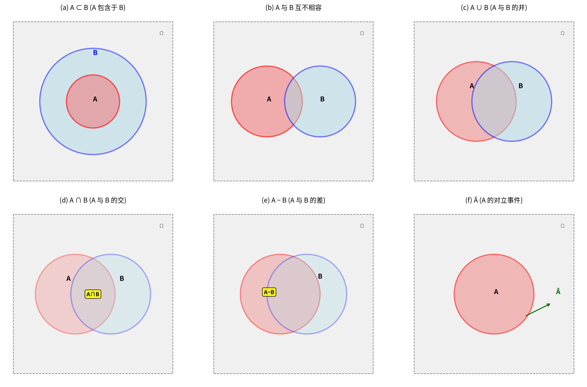

> **图表解读**：每种集合关系用一个"文氏图"（Venn Diagram）表示。灰色矩形区域代表整个"样本空间"（所有可能结果），彩色圆圈代表不同的事件。

---

## 问题 1：抛硬币与抛骰子——概率最朴素的样子

### 例题 1.1

> 抛一枚均匀硬币，正面朝上的可能性有多大？

**直觉回答**：一半对一半，即 $\frac{1}{2}$。

**追问**：这个 $\frac{1}{2}$ 是怎么来的？

因为：
- 可能的结果只有 2 个：{正面, 反面}。
- 硬币是均匀的，意味着每个结果发生的可能性**相等**。
- 我们关心的"正面朝上"是这 2 个结果中的 1 个。

所以：**概率 = 关心结果的个数 ÷ 所有可能结果的个数 = 1/2**。

### 例题 1.2

> 抛一枚均匀骰子，掷出偶数的概率是多少？

- 所有可能结果：{1, 2, 3, 4, 5, 6}，共 6 个。
- 关心结果（偶数）：{2, 4, 6}，共 3 个。
- 每个结果等可能。

$$P(\text{偶数}) = \frac{3}{6} = \frac{1}{2}$$

### 从这里提取出的核心概念

这两个例题揭示了概率论最基本的框架：

**(1) 样本空间 $\Omega$**：随机试验中**所有可能结果**组成的集合。

- 抛硬币：$\Omega = \{H, T\}$（H 正面，T 反面）
- 抛骰子：$\Omega = \{1, 2, 3, 4, 5, 6\}$
- 测一段路的车流量：$\Omega = \{0, 1, 2, \dots\}$（无限）

**(2) 样本点 $\omega$**：样本空间中的每一个可能结果。

**(3) 随机事件 $A$**：样本空间的**子集**——"我们关心的那一部分结果"。

> **为什么要定义"事件"？** 因为我们关心的通常不是单个结果（"恰好掷出 3"），而是一类结果（"掷出偶数"、"点数大于 4"）。事件 = "一组结果的集合"。

**(4) 基本事件**：只含一个样本点的事件（如"掷出 3" = {3}）。

**(5) 必然事件** = $\Omega$（一定发生）。不可能事件 = $\emptyset$（一定不发生）。

---

## 问题 2：抛三枚硬币——用事件运算简化问题

### 例题 2.1

> 抛 3 枚均匀硬币。用 $A_i$ 表示"第 $i$ 枚正面朝上"（$i=1,2,3$）。请用 $A_i$ 表示下列事件：
> (1) "至少有两枚正面朝上"
> (2) "只有第一枚正面朝上"
> (3) "至少有一枚正面朝上"
> (4) "最多一枚正面朝上"

**解答**：

(1) "至少两枚正面" = 恰好两枚正面 **或** 三枚全部正面：
$$A_1 A_2 \bar{A_3} \cup A_1 \bar{A_2} A_3 \cup \bar{A_1} A_2 A_3 \cup A_1 A_2 A_3$$

(2) "只有第一枚正面" = 第一枚正面 **且** 第二枚反面 **且** 第三枚反面：
$$A_1 \bar{A_2} \bar{A_3}$$

(3) "至少一枚正面" = $A_1 \cup A_2 \cup A_3$。它等价于"不是三枚都是反面"：
$$A_1 \cup A_2 \cup A_3 = \overline{\bar{A_1} \bar{A_2} \bar{A_3}}$$

这里用到了**对偶律**（De Morgan 定律）：$\overline{A \cup B} = \bar{A} \cap \bar{B}$，或等价的 $A \cup B = \overline{\bar{A} \cap \bar{B}}$。

(4) "最多一枚正面" = 零枚正面 **或** 恰好一枚正面。

### 事件运算的核心规则

设 $A, B, C$ 为任意事件，$\Omega$ 为样本空间：

| 规律 | 表达式 | 通俗理解 |
|------|--------|---------|
| 交换律 | $A \cup B = B \cup A$，$AB = BA$ | 顺序无所谓 |
| 结合律 | $(A \cup B) \cup C = A \cup (B \cup C)$ | 括号可以重排 |
| 分配律 | $(A \cup B)C = AC \cup BC$ | 类似乘法分配律 |
| **对偶律** | $\overline{A \cup B} = \bar{A} \cap \bar{B}$ | "都不是" = "每个都不是" |

> **记忆口诀**：对偶律 = "并的补 = 补的交"。"至少有一个发生"的对立面是"一个都不发生"。

---

## 问题 3：生日悖论——看似不可能，其实很可能

### 例题 3.1（生日问题）

> 一个班级有 $n$ 个人（$n \le 365$）。至少两人生日相同的概率是多少？

**直觉陷阱**：很多人会想"一年 365 天，60 个人，重合的概率应该不大"。实际上恰恰相反！

**第一步**：直接计算"至少两人生日相同"非常复杂（要考虑恰好 2 人相同、恰好 3 人相同...）。

**第二步**：利用**对立事件**。"至少两人生日相同"的对立面是"所有人生日都不同"。

$$P(\text{至少两人生日相同}) = 1 - P(\text{所有人生日都不同})$$

**第三步**：计算 $P(\text{所有人生日都不同})$。

- 第 1 个人可以选任意一天：$\frac{365}{365}$
- 第 2 个人不能和第 1 个人同一天：$\frac{364}{365}$
- 第 3 个人不能和前 2 个人同一天：$\frac{363}{365}$
- ...
- 第 $n$ 个人不能和前 $n-1$ 个人同一天：$\frac{365-(n-1)}{365}$

根据**乘法原理**（每步选择数相乘）：

$$P(\text{所有人生日都不同}) = \frac{365}{365} \cdot \frac{364}{365} \cdot \frac{363}{365} \cdot \dots \cdot \frac{365-(n-1)}{365}$$

所以：
$$P(\text{至少两人生日相同}) = 1 - \frac{365 \cdot 364 \cdot 363 \cdot \dots \cdot [365-(n-1)]}{365^n}$$

**第四步**：代入不同 n 值计算。

| n | 概率 | 
|---|------|
| 10 | 11.7% |
| 23 | **50.7%** |
| 30 | 70.6% |
| 40 | 89.1% |
| 50 | 97.0% |
| 60 | **99.4%** |

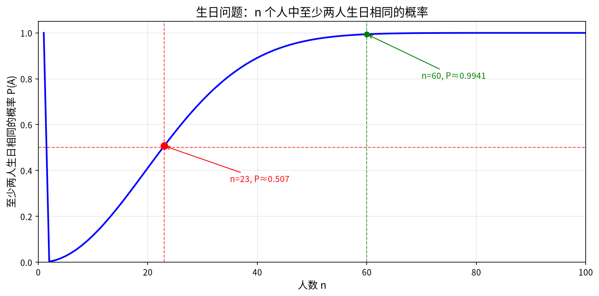

> **惊人的事实**：只需要 23 个人，概率就超过 50%；60 个人时几乎必然发生！这被称为"生日悖论"——不是逻辑上的悖论，而是直觉和数学之间的巨大差距。

### 从生日问题引出概率的基本性质

从上面的推导中，我们实际使用了概率的几条基本规则。下面系统地建立**概率的三条公理**（公理 = 不需要证明的基本假设）：

### 概率的公理化定义

> **为什么要公理化？** 在 1933 年之前，概率论缺乏统一的数学基础。柯尔莫哥洛夫提出三条公理，让概率论成为一门严谨的数学学科。

设 $\Omega$ 为样本空间，对任意事件 $A$，定义实数 $P(A)$ 为其概率，满足：

**(1) 非负性**：对任意事件 $A$，$P(A) \ge 0$。

> **为什么？** 概率代表"可能性大小"，不可能是负数——就像不能说"明天有 -30% 的概率下雨"。

**(2) 规范性**：$P(\Omega) = 1$。

> **为什么？** 样本空间包含所有可能结果，必然有一个结果会发生，所以概率是 1（100%）。

**(3) 可列可加性**：如果 $A_1, A_2, \dots$ 两两互不相容（不可能同时发生），则
$$P(A_1 \cup A_2 \cup \dots) = P(A_1) + P(A_2) + \dots$$

> **为什么？** "互不相容的事件，它们中至少一个发生的概率 = 各自概率之和"——这是最自然的加法规则。

### 由三条公理推导出的基本性质

下面每一条都从公理出发——**不跳步**。

**性质 1**：$P(\emptyset) = 0$（不可能事件的概率为零）。

推导（点击展开）

在可列可加性公理中，取所有 $A_i = \emptyset$：

$$P(\emptyset) = P(\emptyset \cup \emptyset \cup \dots) = P(\emptyset) + P(\emptyset) + \dots$$

令 $x = P(\emptyset)$，则 $x = x + x + x + \dots$。由非负性公理 $x \ge 0$，唯一可能的解是 $x = 0$。（如果 $x > 0$，右边会无穷大，等式不成立。）

**性质 2（有限可加性）**：若 $A_1, \dots, A_n$ 两两互不相容，则
$$P(A_1 \cup \dots \cup A_n) = P(A_1) + \dots + P(A_n)$$

**性质 3（对立事件公式）**：$P(\bar{A}) = 1 - P(A)$。

推导（点击展开）

$A$ 和 $\bar{A}$ 互不相容，且 $A \cup \bar{A} = \Omega$。

由规范性：$P(\Omega) = 1$。

由有限可加性：$P(A \cup \bar{A}) = P(A) + P(\bar{A})$。

所以 $P(A) + P(\bar{A}) = 1$，即 $P(\bar{A}) = 1 - P(A)$。

> **这就是生日问题中"至少两人生日相同 = 1 − 所有人生日都不相同"的数学依据！**

**性质 4（包含关系）**：若 $A \subset B$（A 发生必然导致 B 发生），则
$$P(B - A) = P(B) - P(A)$$
从而 $P(A) \le P(B)$。

**性质 5（减法公式）**：对任意事件 $A, B$：
$$P(A - B) = P(A) - P(AB)$$

**性质 6（加法公式——最重要！）**：对任意事件 $A, B$：
$$P(A \cup B) = P(A) + P(B) - P(AB)$$

推导（点击展开）

因为 $A \cup B = A \cup (B - AB)$，且 $A$ 与 $B - AB$ 互不相容。

由有限可加性：$P(A \cup B) = P(A) + P(B - AB)$。

由性质 5：$P(B - AB) = P(B) - P(AB)$（因为 $AB \subset B$）。

代入即得：$P(A \cup B) = P(A) + P(B) - P(AB)$。

> **为什么减去 $P(AB)$？** 因为 $P(A) + P(B)$ 把"A 和 B 同时发生"算了两次，需要扣掉一次。

推广到三个事件：
$$P(A \cup B \cup C) = P(A) + P(B) + P(C) - P(AB) - P(AC) - P(BC) + P(ABC)$$

（三个事件两两重叠的部分各减一次，三个事件都重叠的部分被加了三次又减了三次、需要加回去一次。）

### 例题 3.2（应用加法公式）

> 已知 $P(A) = 0.2$，$P(B) = 0.4$，$P(A \cup B) = 0.5$，求 $P(AB)$ 和 $P(A - B)$。

**解**：

由加法公式：$P(A \cup B) = P(A) + P(B) - P(AB)$

代入：$0.5 = 0.2 + 0.4 - P(AB)$

所以：$P(AB) = 0.6 - 0.5 = 0.1$

再由减法公式：$P(A - B) = P(A) - P(AB) = 0.2 - 0.1 = 0.1$

---

## 问题 4：抽检产品——古典概型的典型应用

### 古典概型（等可能概型）

> **是什么**：样本空间中样本点个数**有限**，且每个基本事件发生的可能性**相等**。

> **为什么需要它**：这是最早被研究的概率模型（从赌博问题开始），也是最直观的概率计算方式。

**公式**：
$$P(A) = \frac{A \text{ 中包含的样本点个数}}{\Omega \text{ 中样本点的总个数}} = \frac{n_A}{n}$$

核心变成**计数问题**——需要排列组合工具。

### 预备知识 2：排列组合——计数的基本工具

> **为什么要在这里讲排列组合？** 古典概型的概率计算 = 数数。排列组合是"数数"的数学工具。高三数学学过的话可以快速浏览。

**加法原理**：做一件事有 $n$ 类办法，第 $i$ 类有 $m_i$ 种方法 → 总方法数 = $m_1 + m_2 + \dots + m_n$。

> 类比：从北京到上海，可以坐飞机（5 个航班）、坐高铁（10 趟）、自驾（1 条路线）。一共有 5+10+1=16 种方式。

**乘法原理**：做一件事需要 $n$ 个步骤，第 $i$ 步有 $m_i$ 种方法 → 总方法数 = $m_1 \times m_2 \times \dots \times m_n$。

> 类比：出门穿搭，上衣 3 件、裤子 2 条、鞋子 2 双。一共有 3×2×2 = 12 种搭配。

**排列（有序）**：从 $n$ 个不同元素中取出 $r$ 个排成一列。
$$A_n^r = \frac{n!}{(n-r)!}$$

推导：第一个位置有 $n$ 种选择，第二个有 $n-1$ 种，...，第 $r$ 个有 $n-r+1$ 种。相乘即得。

**组合（无序）**：从 $n$ 个不同元素中取出 $r$ 个（不考虑顺序）。
$$C_n^r = \binom{n}{r} = \frac{n!}{r!(n-r)!}$$

推导：排列数 $A_n^r$ 中，每组 $r$ 个元素被重复计数了 $r!$ 次（这 $r$ 个元素自身的排列方式），所以组合数 = 排列数 ÷ $r!$。

### 例题 4.1（抽样模型——不放回）

> 已知 $N$ 件产品中有 $M$ 件不合格品。现**不放回**地随机抽取 $n$ 件，求恰好有 $k$ 件不合格品的概率。

**解**：

- 样本空间：从 $N$ 件中选 $n$ 件，总共有 $\binom{N}{n}$ 种结果。每种结果等可能。
- 事件 $A$ = "恰好 $k$ 件不合格品"：从 $M$ 件不合格品中选 $k$ 件，从 $N-M$ 件合格品中选 $n-k$ 件。

$$P(A) = \frac{\binom{M}{k} \cdot \binom{N-M}{n-k}}{\binom{N}{n}}$$

这个公式被称为**超几何分布**的概率公式——在后面"随机变量"部分还会遇到。

### 例题 4.2（抽样模型——有放回）

> 同样的问题，但改为**有放回**抽样（每次抽完放回去再抽下一次）。

**解**：

- 样本空间：每次从 $N$ 件中抽 1 件，抽 $n$ 次，总共有 $N^n$ 种结果。
- 事件 $A$：$n$ 次中有 $k$ 次抽到不合格品。
  - 选出哪 $k$ 次是不合格品：$\binom{n}{k}$ 种
  - 每次抽到不合格品有 $M$ 种选择 → $M^k$
  - 每次抽到合格品有 $N-M$ 种选择 → $(N-M)^{n-k}$

$$P(A) = \binom{n}{k} \cdot \frac{M^k (N-M)^{n-k}}{N^n} = \binom{n}{k} \left(\frac{M}{N}\right)^k \left(1 - \frac{M}{N}\right)^{n-k}$$

这个公式就是**二项分布**——后面会详细讲。

---

## 问题 5：条件概率——当知道更多信息时，概率会改变

### 例题 5.1

> 一个家庭有两个孩子。已知至少有一个是男孩，求另一个也是男孩的概率。

**直觉陷阱**：很多人会回答 1/2——"另一个孩子要么男要么女"。

**正确分析**：

样本空间（按大小排序）：{（男,男）,（男,女）,（女,男）,（女,女）}，4 种等可能。

条件"至少有一个男孩"：排除（女,女），剩下 3 种等可能：{（男,男）,（男,女）,（女,男）}。

在这 3 种中，"另一个也是男孩"只有 1 种：{（男,男）}。

所以概率 = **1/3，不是 1/2**！

> **为什么直觉错了？** 因为"已知至少有一个男孩"这个条件改变了样本空间——我们不再考虑全部 4 种情况，只考虑满足条件的 3 种情况。**条件概率 = 在缩小后的样本空间中重新计算概率。**

### 条件概率的严格定义

已知事件 $B$ 发生（$P(B) > 0$），则事件 $A$ 的**条件概率**为：

$$P(A|B) = \frac{P(AB)}{P(B)}$$

> **通俗理解**：
> - $P(AB)$ = "A 和 B 同时发生"的概率（在原来大样本空间中的比例）
> - $P(B)$ = "B 发生"的概率（在原来大样本空间中的比例）
> - $P(A|B)$ = 在 B 已经发生的条件下，A 发生的概率（把 B 当作新的"全集"）

以"两孩问题"为例：
- $P(\text{两个男孩}) = 1/4$
- $P(\text{至少一个男孩}) = 3/4$
- $P(\text{两个男孩} | \text{至少一个男孩}) = \frac{1/4}{3/4} = \frac{1}{3}$

### 乘法公式

由条件概率定义直接变形：

$$P(AB) = P(A|B) \cdot P(B) = P(B|A) \cdot P(A)$$

推广到 $n$ 个事件：

$$P(A_1 A_2 \dots A_n) = P(A_1) \cdot P(A_2|A_1) \cdot P(A_3|A_1 A_2) \cdot \dots \cdot P(A_n|A_1 \dots A_{n-1})$$

> **理解**：$A_1$ 先发生 → 在 $A_1$ 发生的前提下 $A_2$ 发生 → 在前两个都发生的前提下 $A_3$ 发生 → ...

---

## 问题 6：质检与溯源——全概率公式与贝叶斯公式

### 例题 6.1（全概率——由因推果）

> 手机工厂有两个基地：S 市占 60%（次品率 5%），T 市占 40%（次品率 10%）。产品混合存放。**随机抽一个手机，求它是次品的概率。**

**分析**：

一个手机被抽到是次品，有两个"原因"：
1. 它来自 S 市 **且** 恰好是次品
2. 它来自 T 市 **且** 恰好是次品

这两个原因互不相容（一台手机不可能同时来自两个基地），所以：

$$P(\text{次品}) = P(\text{S市}) \cdot P(\text{次品}|\text{S市}) + P(\text{T市}) \cdot P(\text{次品}|\text{T市})$$

$$= 0.6 \times 0.05 + 0.4 \times 0.10 = 0.03 + 0.04 = 0.07$$

即总次品率为 **7%**。

### 全概率公式——一般形式

设 $A_1, A_2, \dots, A_n$ 是样本空间的一个**分割**（$\Omega$ 被分成 $n$ 个互不相容的"原因"），且每个 $P(A_i) > 0$，则对任意事件 $B$：

$$P(B) = \sum_{i=1}^{n} P(A_i) \cdot P(B|A_i)$$

> **通俗理解**：$B$ 发生的总概率 = 每条可能"路径"的概率之和。每条"路径"的概率 =（走该路径的概率）×（在该路径下 B 发生的概率）。

### 例题 6.2（贝叶斯——由果溯因）

> 接上题。**随机抽一个手机发现是次品，求它来自 S 市的概率。**

**分析**：

这恰好是条件概率！已知 $B$ = "次品"，求 $P(\text{S市}|\text{次品})$。

由条件概率定义：
$$P(\text{S市}|\text{次品}) = \frac{P(\text{S市} \cap \text{次品})}{P(\text{次品})}$$

分子 = $P(\text{S市}) \cdot P(\text{次品}|\text{S市}) = 0.6 \times 0.05 = 0.03$

分母 = 0.07（全概率公式的结果）

$$P(\text{S市}|\text{次品}) = \frac{0.03}{0.07} = \frac{3}{7} \approx 42.9\%$$

> **有趣的结论**：虽然 S 市的次品率（5%）低于 T 市（10%），但因为 S 市产量占比大（60%），所以次品中来自 S 市的反而占了约 43%。

### 贝叶斯公式——一般形式

$$P(A_i|B) = \frac{P(A_i) \cdot P(B|A_i)}{\sum_{j=1}^{n} P(A_j) \cdot P(B|A_j)} = \frac{P(A_i) \cdot P(B|A_i)}{P(B)}$$

- $P(A_i)$ 叫**先验概率**——在知道结果之前的判断
- $P(A_i|B)$ 叫**后验概率**——在知道结果 $B$ 之后，对 $A_i$ 概率的修正

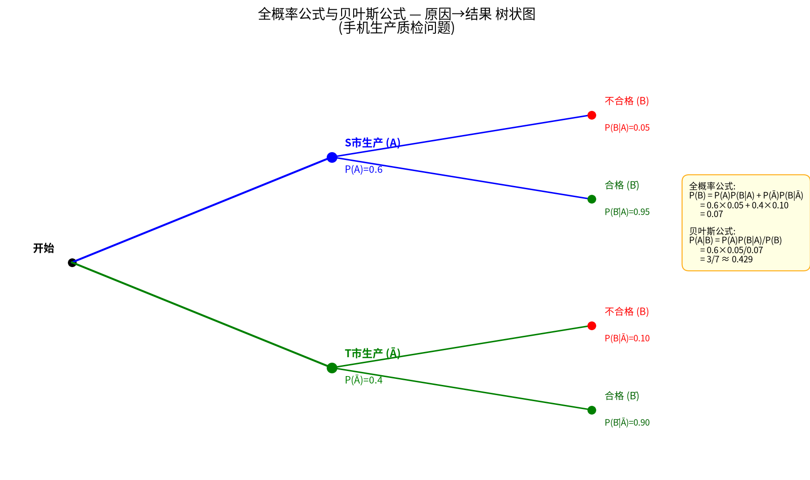

> **核心理解**：
> - **全概率公式** = "由因推果"：知道各种原因的概率 → 推算结果的总概率。
> - **贝叶斯公式** = "由果溯因"：观察到结果 → 反推最可能的原因。
> - 贝叶斯公式的本质 = **用新信息（结果 B）更新我们的信念（先验 → 后验）**。

### 例题 6.3（疾病检测——贝叶斯的力量与陷阱）

> 某病患病率 0.1%。血检：患者中有 99% 呈阳性，非患者中有 1% 呈阳性（误诊率 1%）。**一人血检呈阳性，他真正患病的概率是多少？**

**直觉陷阱**：误诊率才 1%，检出来是阳性，应该大概率患病吧？

**按贝叶斯公式严格计算**：

设 $A$ = "患病"（先验概率 $P(A)=0.001$），$B$ = "阳性"。

$$P(B|A) = 0.99 \quad \text{（患者阳性率）}$$
$$P(B|\bar{A}) = 0.01 \quad \text{（非患者阳性率 = 误诊率）}$$

**第一步**——全概率公式求 $P(B)$：

$$P(B) = P(A)P(B|A) + P(\bar{A})P(B|\bar{A})$$
$$= 0.001 \times 0.99 + 0.999 \times 0.01$$
$$= 0.00099 + 0.00999 = 0.01098$$

**第二步**——贝叶斯公式求 $P(A|B)$：

$$P(A|B) = \frac{P(A)P(B|A)}{P(B)} = \frac{0.001 \times 0.99}{0.01098}$$
$$= \frac{0.00099}{0.01098} \approx 0.09 = \mathbf{9\%}$$

**真相**：即使血检阳性，真正患病的概率也只有约 9%！

> **为什么会这么低？** 因为该病患病率极低（0.1%）。在 10000 人中：
> - 约 10 人是真患者 → 约 10 人阳性（99% 检出率）
> - 约 9990 人健康 → 约 100 人阳性（1% 误诊率）
> - 总共约 110 人阳性，其中只有约 10 人是真患者 → 约 9%

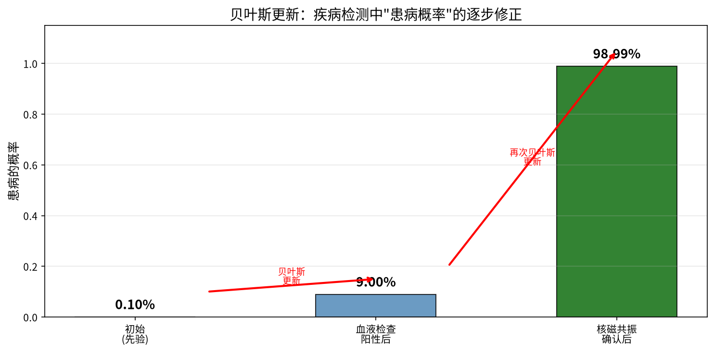

> **贝叶斯更新**：如果再做一次更精确的检查（如核磁共振），可以将后验概率 9% 作为新的"先验概率"，再次用贝叶斯公式更新，得到更可靠的诊断结果。这个过程叫**贝叶斯更新**——每一步都利用新信息修正判断。

---

## 问题 7：独立事件——"互不影响"的数学定义

### 例题 7.1

> 同时抛一枚硬币和一枚骰子。硬币正面朝上会影响骰子掷出 6 的概率吗？

**直觉**：显然不会。两个操作互不影响。

**数学表达**：
$$P(\text{正面} \cap \text{6点}) = \frac{1}{2} \times \frac{1}{6} = \frac{1}{12}$$

且：
$$P(\text{6点}|\text{正面}) = \frac{1}{6} = P(\text{6点})$$

即：知道硬币的结果，不影响对骰子结果的判断。

### 独立性的严格定义

事件 $A$ 与 $B$ **相互独立**，当且仅当：

$$P(AB) = P(A) \cdot P(B)$$

等价地：$P(A|B) = P(A)$（在 $P(B)>0$ 时）或 $P(B|A) = P(B)$（在 $P(A)>0$ 时）。

> ⚠️ **重要区分**：
> - **互不相容**（互斥）：$AB = \emptyset$ → 不可能同时发生 → $P(AB) = 0$
> - **相互独立**：$P(AB) = P(A)P(B)$ → 一个发生不影响另一个的概率
>
> 如果 $P(A)>0$ 且 $P(B)>0$，则互不相容的事件**一定不独立**（因为 $P(AB)=0 \neq P(A)P(B) > 0$）。

### 推广到多个事件

$n$ 个事件 $A_1, \dots, A_n$ 相互独立，当且仅当对任意 $k$ 个（$2 \le k \le n$）：
$$P(A_{i_1} A_{i_2} \dots A_{i_k}) = P(A_{i_1}) P(A_{i_2}) \dots P(A_{i_k})$$

> ⚠️ 仅两两独立（任意两个独立）**不等于**相互独立（全体一起独立）！这是常见陷阱。

### 例题 7.2（可靠性问题）

> 有 $2n$ 个元件，每个正常工作的概率为 $p$，且相互独立。比较两种系统可靠性：
> (1) 每 $n$ 个串联成子系统，再把两个子系统并联
> (2) 每两个并联成子系统，再把 $n$ 个子系统串联

**解**：

**系统 (1)**：
- 一个串联子系统正常工作的概率 = $p^n$（$n$ 个都要正常）
- 两个串联子系统并联，至少一个正常即可：$1 - (1-p^n)^2$

**系统 (2)**：
- 每两个并联后正常工作的概率 = $1 - (1-p)^2 = 2p - p^2$
- $n$ 个这样的子系统串联：$(2p - p^2)^n$

当 $p=0.9$，$n=5$ 时：
- 系统 (1)：$1 - (1-0.9^5)^2 \approx 1 - (1-0.5905)^2 \approx 0.832$
- 系统 (2)：$(2 \times 0.9 - 0.81)^5 = 0.99^5 \approx 0.951$

系统 (2) 更可靠！这说明了**并联提高可靠性，串联降低可靠性**。

---

## 从一个新视角看问题：引入"随机变量"

到目前为止，我们一直在讨论"事件"：正面朝上、掷出偶数、至少两人生日相同...但很多实际问题中，我们更关心**数量**——"正面朝上的次数"、"等待的时间"、"测量的误差"。

这就引出了**随机变量**——概率论中最重要的概念之一。

### 从例题 2.1 出发

> 抛 3 枚硬币。我们不关心"具体哪几枚是正面"，只关心"一共有几枚正面"。

定义 $X$ = "3 枚硬币中正面朝上的枚数"。$X$ 可能取值为 0, 1, 2, 3。

$X$ 的取值是随机的——这就是一个**随机变量**。

$$P(X=0) = P(\text{TTT}) = \frac{1}{8}$$
$$P(X=1) = P(\text{HTT, THT, TTH}) = \frac{3}{8}$$
$$P(X=2) = P(\text{HHT, HTH, THH}) = \frac{3}{8}$$
$$P(X=3) = P(\text{HHH}) = \frac{1}{8}$$

> **随机变量的定义**：将样本空间中的每个样本点映射到一个实数上的函数。通俗地说：**给每个可能结果分配一个数字**。

---

## 分布函数——完整描述随机变量的"行为"

### 离散型随机变量：分布律

当 $X$ 只能取有限个或可列无限个值时，用**分布律**（概率质量函数 PMF）描述：

$$P(X = x_k) = p_k, \quad k = 1, 2, \dots$$

要求：$p_k \ge 0$，且 $\sum_k p_k = 1$（所有概率加起来等于 1）。

上例中 $X$ 的分布律就是一张表：
| $X$ | 0 | 1 | 2 | 3 |
|-----|---|---|---|---|
| $P$ | 1/8 | 3/8 | 3/8 | 1/8 |

### 连续型随机变量：密度函数

有些量不能只取有限个值——比如"航班延误的时间"可以是 0 到无穷之间任意实数，"测量的误差"可以是任意实数。

对于连续型随机变量，任意一个具体值的概率都是 0。我们只能问"取值在某个区间的概率"。

用**概率密度函数** $f(x)$ 描述：

$$P(a < X \le b) = \int_a^b f(x) \, dx$$

> **怎么理解积分？** $\int_a^b f(x) dx$ 就是 $f(x)$ 曲线下面、$x$ 从 $a$ 到 $b$ 之间的面积。如果你学过定积分，这就是求面积；如果还没学，就理解为"小长方条的面积之和"。

要求：$f(x) \ge 0$，且 $\int_{-\infty}^{+\infty} f(x) dx = 1$（总面积为 1）。

### 分布函数——离散和连续的统一描述

**定义**：$F(x) = P(X \le x)$，即随机变量 $X$ 取值不超过 $x$ 的概率。

- 对离散型：$F(x) = \sum_{x_k \le x} P(X = x_k)$（累加）
- 对连续型：$F(x) = \int_{-\infty}^x f(t) \, dt$（积分）

$F(x)$ 的性质：
1. $F(x)$ 单调不减（$x$ 越大，$P(X \le x)$ 不会减少）
2. $F(-\infty) = 0$，$F(+\infty) = 1$
3. $P(a < X \le b) = F(b) - F(a)$

---

## 常见分布 1：离散型——模型的"积木"

### 二项分布 $B(n, p)$

> **来源**：$n$ 次独立重复试验，每次"成功"概率为 $p$。$X$ = 成功的总次数。

$$P(X = k) = \binom{n}{k} p^k (1-p)^{n-k}, \quad k = 0, 1, 2, \dots, n$$

**例题**：抛硬币 10 次，正面朝上次数 $X \sim B(10, 0.5)$。
- $P(X=5) = \binom{10}{5} \cdot 0.5^{10} \approx 0.246$（约 24.6%）
- $P(X \le 2) \approx 0.055$（约 5.5%——这不是一枚均匀硬币的可能性很小）

### 泊松分布 $P(\lambda)$

> **来源**：一段时间内随机事件发生的次数（如电话交换机接到的呼叫数、网页的访问量）。

$$P(X = k) = \frac{\lambda^k e^{-\lambda}}{k!}, \quad k = 0, 1, 2, \dots$$

> **为什么需要它？** 当二项分布的 $n$ 很大、$p$ 很小时（如 $n=1000, p=0.003$），直接用二项公式计算非常繁琐。泊松分布（取 $\lambda=np$）提供了极好的近似。

**例题**：某网站平均每分钟有 4 次访问（$\lambda=4$）。求某分钟恰好有 2 次访问的概率。

$$P(X=2) = \frac{4^2 \cdot e^{-4}}{2!} = \frac{16 \times 0.0183}{2} \approx 0.147$$

### 几何分布 $Ge(p)$

> **来源**：独立重复试验，直到第一次"成功"所需的试验次数。

$$P(X = k) = (1-p)^{k-1}p, \quad k = 1, 2, 3, \dots$$

**例题**：投篮命中率 30%。第一次命中恰好出现在第 4 次投篮的概率：

$$P(X=4) = (0.7)^3 \times 0.3 \approx 0.103$$

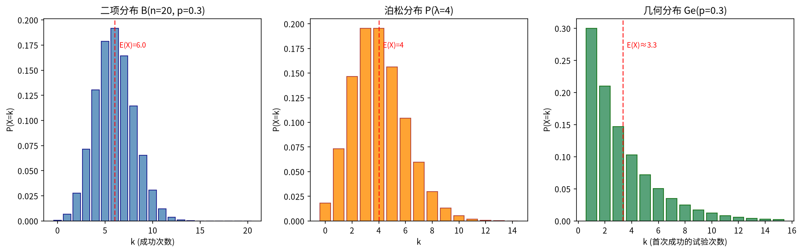

---

## 常见分布 2：连续型——无处不在的曲线

### 均匀分布 $U(a, b)$

> **来源**：在区间 $[a, b]$ 上任意一点被取到的"可能性密度"相同。

$$f(x) = \begin{cases} \frac{1}{b-a}, & a \le x \le b \\ 0, & \text{其他} \end{cases}$$

**例题**：公交每 10 分钟一班，你随机到达车站。等待时间 $X \sim U(0, 10)$。求等不超过 3 分钟的概率：

$$P(X \le 3) = \int_0^3 \frac{1}{10} dx = 0.3$$

### 指数分布 $Exp(\lambda)$

> **来源**：独立随机事件之间的等待时间（如两个电话之间的间隔、元件的寿命）。

$$f(x) = \lambda e^{-\lambda x}, \quad x \ge 0$$

> **为什么是指数形式？** 因为它满足"无记忆性"：不管已经等了多久，还要再等的分布和从头开始等一样。只有指数分布有这个性质。

### 正态分布 $N(\mu, \sigma^2)$

> **来源**：这是概率论中**最重要**的分布。测量误差、人的身高体重、考试成绩...大量独立微小因素的叠加结果都服从正态分布（这是中心极限定理的结论，后面会讲）。

$$f(x) = \frac{1}{\sqrt{2\pi}\sigma} e^{-\frac{(x-\mu)^2}{2\sigma^2}}, \quad -\infty < x < +\infty$$

两个参数：
- $\mu$ = 均值（分布的"中心"位置）
- $\sigma$ = 标准差（分布的"胖瘦"程度）

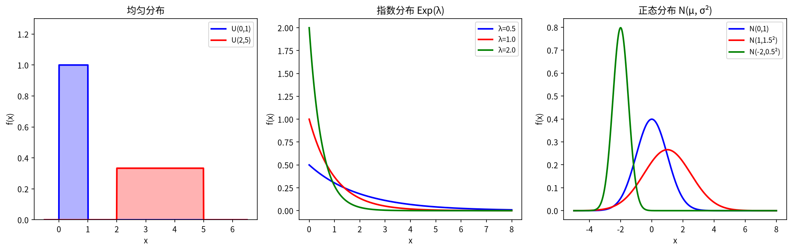

### 标准正态分布 $N(0, 1)$

$\mu=0, \sigma=1$ 的正态分布，记作 $Z \sim N(0, 1)$。任意正态分布都可以转化为标准正态：

$$X \sim N(\mu, \sigma^2) \quad \Longrightarrow \quad Z = \frac{X-\mu}{\sigma} \sim N(0, 1)$$

> **为什么要标准化？** 不同 $\mu$ 和 $\sigma$ 的正态分布有无数种，但我们只需要一张标准正态分布表，就可以查所有正态分布的概率。

### $1\sigma/2\sigma/3\sigma$ 规则

对于正态分布：
- 约 **68.3%** 的数据落在 $\mu \pm 1\sigma$ 内
- 约 **95.4%** 的数据落在 $\mu \pm 2\sigma$ 内
- 约 **99.7%** 的数据落在 $\mu \pm 3\sigma$ 内

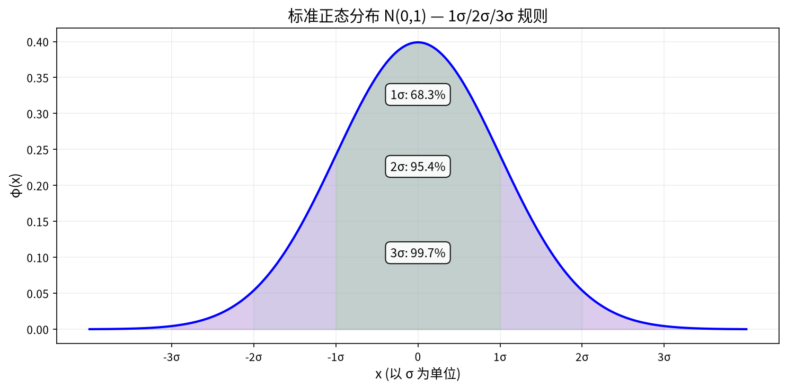

> **$3\sigma$ 规则的应用**：如果测量值偏离均值超过 $3\sigma$，则很可能不是随机误差，而是有系统性问题。这在质量控制中广泛使用。

---

## 数学期望——"平均而言"是多少？

### 例题：赌局公平性

> 一个游戏：掷骰子，掷出 6 点赢 60 元，掷出其他点数输 10 元。这个游戏公平吗？

定义 $X$ = 每局赢的钱数。$X$ 的分布律：
| 结果 | 6 点 | 1~5 点 |
|------|------|--------|
| $X$ 的值 | +60 | −10 |
| 概率 | 1/6 | 5/6 |

**平均每局赢钱** = $60 \times \frac{1}{6} + (-10) \times \frac{5}{6} = 10 - \frac{50}{6} = 10 - 8.33 = 1.67$ 元。

这个"概率加权平均"就是**数学期望**。

### 定义

**离散型**：
$$E(X) = \sum_k x_k \cdot P(X = x_k)$$

**连续型**：
$$E(X) = \int_{-\infty}^{+\infty} x \cdot f(x) \, dx$$

> **通俗理解**：数学期望 = 把每个可能取值乘上它的概率再求和——"如果这个随机试验重复很多很多次，平均每次的结果"。

### 期望的性质（零跳步推导）

**(1) 常数的期望**：$E(c) = c$（常数没有随机性，就是它自己）

**(2) 线性性质**：$E(aX + b) = a \cdot E(X) + b$

推导——离散型（连续型类似，把求和换成积分）

$$E(aX + b) = \sum_k (a x_k + b) \cdot P(X = x_k)$$
$$= \sum_k [a x_k \cdot P(X = x_k) + b \cdot P(X = x_k)]$$
$$= a \sum_k x_k \cdot P(X = x_k) + b \sum_k P(X = x_k)$$
$$= a \cdot E(X) + b \cdot 1 = a E(X) + b$$

**(3) 和的期望**：$E(X + Y) = E(X) + E(Y)$（**总是成立**，不管 $X$ 和 $Y$ 是否独立！）

---

## 方差——"波动有多大"？

数学期望告诉我们中心在哪，但不知道波动有多大。

两个班级平均分都是 75 分，但一个班成绩分散（有人满分、有人不及格），另一个班成绩集中（大多在 70-80 之间）。用**方差**衡量这种"离散程度"。

### 定义

$$Var(X) = E[(X - E(X))^2]$$

> **为什么用平方？** "偏差" $(X-E(X))$ 有正有负，平均后会互相抵消。取平方后所有偏差都变成正数，再取平均。

**简便计算公式**（非常重要！）：

$$Var(X) = E(X^2) - [E(X)]^2$$

推导——每一步都写出来

$$Var(X) = E[(X - E(X))^2]$$
$$= E[X^2 - 2X \cdot E(X) + (E(X))^2]$$

利用期望的线性性质分别计算每一项：
$$= E(X^2) - E[2X \cdot E(X)] + E[(E(X))^2]$$

注意 $E(X)$ 是常数，所以 $E[2X \cdot E(X)] = 2E(X) \cdot E(X) = 2[E(X)]^2$，$E[(E(X))^2] = [E(X)]^2$：
$$= E(X^2) - 2[E(X)]^2 + [E(X)]^2$$
$$= E(X^2) - [E(X)]^2$$

**标准差**：$\sigma(X) = \sqrt{Var(X)}$。标准差和原变量单位相同，更直观。

### 例题：计算均匀分布的期望和方差

$X \sim U(0, 1)$，即 $f(x) = 1$（$0 \le x \le 1$），否则为 0。

$$E(X) = \int_0^1 x \cdot 1 \, dx = \left.\frac{x^2}{2}\right|_0^1 = \frac{1}{2}$$

$$E(X^2) = \int_0^1 x^2 \cdot 1 \, dx = \left.\frac{x^3}{3}\right|_0^1 = \frac{1}{3}$$

$$Var(X) = E(X^2) - [E(X)]^2 = \frac{1}{3} - \left(\frac{1}{2}\right)^2 = \frac{1}{3} - \frac{1}{4} = \frac{1}{12}$$

>

---

## 协方差与相关系数——两个变量"一起动"的程度

### 例题：身高和体重的关联

一个人的身高 $X$ 和体重 $Y$ ——身高越高的人**倾向**于体重更重，但不是严格对应。如何量化这种"一起变化"的趋势？

### 协方差的定义

$$Cov(X, Y) = E\big[(X - E(X))(Y - E(Y))\big]$$

**简便计算式**（推导和方差公式类似）：
$$Cov(X, Y) = E(XY) - E(X)E(Y)$$

**解读**：
- $Cov > 0$：$X$ 高于均值时 $Y$ 也倾向于高于均值（同向变化）→ **正相关**
- $Cov < 0$：$X$ 高于均值时 $Y$ 倾向于低于均值（反向变化）→ **负相关**
- $Cov \approx 0$：$X$ 和 $Y$ 没有明显的线性关联

### 相关系数

协方差的大小受 $X$ 和 $Y$ 单位影响。为消除量纲影响，定义**相关系数**：

$$\rho_{XY} = \frac{Cov(X,Y)}{\sqrt{Var(X) \cdot Var(Y)}}$$

$\rho$ 始终在 $-1$ 到 $+1$ 之间：
- $\rho = +1$：完全正线性相关
- $\rho = -1$：完全负线性相关
- $\rho = 0$：**不相关**（没有线性关系，但可能有其他非线性关系！）

> ⚠️ **不相关 ≠ 独立**。独立必然不相关，但不相关不一定独立（比如 $Y = X^2$，$X$ 和 $Y$ 不相关但不独立）。

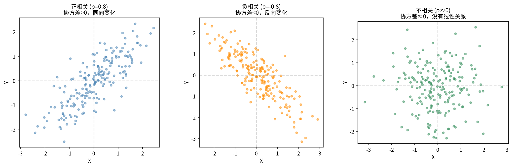

---

## 二维随机变量——一次描述两个量

很多实际问题中，我们关心两个（或多个）量的联合行为。

> **比如**：$X$ = 某学生的数学成绩等级（0=不及格, 1=及格），$Y$ = 同一学生的物理成绩等级（0=不及格, 1=及格）。单看数学或单看物理都不够——我们想知道"数学好的人物理是不是也好"，这就需要一个**联合分布**。

---

### 联合分布律（离散型）

两个离散型随机变量 $X$ 和 $Y$，它们的**联合分布律**给出每一对 $(x_i, y_j)$ 同时发生的概率：

$$P(X = x_i, Y = y_j) = p_{ij}$$

所有 $p_{ij}$ 加起来等于 1。

**例题**：$X$ = 数学成绩等级，$Y$ = 物理成绩等级。联合分布律：

| $X \setminus Y$ | 0（不及格） | 1（及格） |
|:-:|:-:|:-:|
| 0（不及格） | 0.1 | 0.2 |
| 1（及格） | 0.1 | 0.6 |

**解读**：数学和物理都不及格的概率是 0.1；数学不及格但物理及格是 0.2；都及格是 0.6。

---

### 边缘分布——"只关心一个变量时怎么办？"

> **动机**：联合分布告诉你全部信息。但很多时候你只想问一个问题——"不管物理成绩如何，数学及格的概率是多少？"这时候需要把不关心的变量**消掉**。消掉之后剩下的分布，叫**边缘分布**（Marginal Distribution）。

#### 离散型的边缘分布律

**核心操作**：把不关心的维度"加总"。

**$X$ 的边缘分布律**——把联合表中每一**行**加起来：

$$P(X = 0) = P(X=0, Y=0) + P(X=0, Y=1) = 0.1 + 0.2 = 0.3$$
$$P(X = 1) = P(X=1, Y=0) + P(X=1, Y=1) = 0.1 + 0.6 = 0.7$$

**$Y$ 的边缘分布律**——把联合表中每一**列**加起来：

$$P(Y = 0) = 0.1 + 0.1 = 0.2$$
$$P(Y = 1) = 0.2 + 0.6 = 0.8$$

补全后的联合表（边缘写在"边缘"上——这就是名字的由来）：

| $X \setminus Y$ | 0 | 1 | **$P(X=x_i)$** ← 行和 |
|:-:|:-:|:-:|:---:|
| 0 | 0.1 | 0.2 | **0.3** |
| 1 | 0.1 | 0.6 | **0.7** |
| **$P(Y=y_j)$** ← 列和 | **0.2** | **0.8** | 1.0 |

**一般公式**：

$$P(X = x_i) = \sum_{j} P(X = x_i, Y = y_j) = \sum_{j} p_{ij} \qquad \text{（行求和）}$$

$$P(Y = y_j) = \sum_{i} P(X = x_i, Y = y_j) = \sum_{i} p_{ij} \qquad \text{（列求和）}$$

---

#### 连续型的边缘密度函数

对于连续型二维随机变量 $(X, Y)$，给定联合密度函数 $f(x, y)$。

思路和离散型一样——把不关心的变量"积分掉"（连续型不能加总，只能积分）。

**$X$ 的边缘密度**——把 $Y$ 从 $-\infty$ 积分到 $+\infty$：

$$f_X(x) = \int_{-\infty}^{+\infty} f(x, y) \, dy$$

**$Y$ 的边缘密度**——把 $X$ 积分掉：

$$f_Y(y) = \int_{-\infty}^{+\infty} f(x, y) \, dx$$

> **怎么理解积分？** 联合密度 $f(x, y)$ 告诉你"落在 $(x, y)$ 附近一小块区域的概率密度"。如果你不关心 $y$ 的具体值，就把所有可能的 $y$ 都"扫一遍"累加起来——这就是对 $y$ 积分。积完之后剩下来的东西只依赖于 $x$，就是 $X$ 的边缘密度。

#### 连续型例题

> 设 $(X, Y)$ 的联合密度为：
> $$f(x, y) = \begin{cases} 2, & 0 < x < y < 1 \\ 0, & \text{其他} \end{cases}$$
> 求 $X$ 和 $Y$ 的边缘密度。

**第一步**：求 $f_X(x)$。

固定一个 $x$，看 $y$ 的范围。条件 $0 < x < y < 1$ 意味着 $y$ 从 $x$ 变到 $1$：

$$f_X(x) = \int_{x}^{1} 2 \, dy = 2 \cdot (1 - x), \quad 0 < x < 1$$

（当 $x \notin (0,1)$ 时，$f_X(x) = 0$）

**第二步**：求 $f_Y(y)$。

固定一个 $y$，$x$ 的范围：$0 < x < y$。

$$f_Y(y) = \int_{0}^{y} 2 \, dx = 2y, \quad 0 < y < 1$$

（当 $y \notin (0,1)$ 时，$f_Y(y) = 0$）

**第三步**：验证——边缘密度必须积分为 1：

$$\int_0^1 f_X(x) \, dx = \int_0^1 2(1-x) \, dx = 2\left[x - \frac{x^2}{2}\right]_0^1 = 1 \quad \checkmark$$

$$\int_0^1 f_Y(y) \, dy = \int_0^1 2y \, dy = [y^2]_0^1 = 1 \quad \checkmark$$

---

### 边缘分布总结

| | 离散型 | 连续型 |
|------|--------|--------|
| 联合分布 | $P(X=x_i, Y=y_j) = p_{ij}$ | 联合密度 $f(x, y)$ |
| **$X$ 的边缘** | $\sum_j p_{ij}$（**行求和**） | $\int_{-\infty}^{+\infty} f(x,y) \, dy$ |
| **$Y$ 的边缘** | $\sum_i p_{ij}$（**列求和**） | $\int_{-\infty}^{+\infty} f(x,y) \, dx$ |
| 直观理解 | 把不关心的变量"加起来" | 把不关心的变量"积分掉" |

> 🔑 **记忆口诀**：求谁的边缘，就把另一个消掉——离散用求和，连续用积分。就像从侧面看一个三维物体——联合分布是完整的立体，边缘分布是它在某一个方向上的"投影"。

---

### 条件分布——知道一个变量的值后，另一个怎么分布？

有了边缘分布，还可以问更深入的问题：**已知** $Y$ 取某个值，$X$ 的分布是什么？

这就是**条件分布**：

**离散型**：$P(X = x_i | Y = y_j) = \dfrac{P(X = x_i, Y = y_j)}{P(Y = y_j)} = \dfrac{p_{ij}}{p_{\cdot j}}$

**连续型**：$f_{X|Y}(x|y) = \dfrac{f(x, y)}{f_Y(y)}$（当 $f_Y(y) > 0$ 时）

> 以"成绩"例题为例：已知物理及格（$Y=1$），数学及格的概率是多少？
> $$P(X=1 | Y=1) = \frac{P(X=1, Y=1)}{P(Y=1)} = \frac{0.6}{0.8} = 0.75$$
> ——物理及格的人里，75% 数学也及格。

---

### 独立性判定

$X$ 和 $Y$ **相互独立**，当且仅当：

- **离散型**：$P(X=x_i, Y=y_j) = P(X=x_i) \cdot P(Y=y_j)$ 对所有的 $i,j$ 成立
- **连续型**：$f(x, y) = f_X(x) \cdot f_Y(y)$ 对所有的 $(x,y)$ 成立

换句话说：**联合 = 边缘的乘积**。如果不相等，说明两个变量之间存在关联。

> 成绩例题中：$P(X=1, Y=1) = 0.6$，而 $P(X=1) \cdot P(Y=1) = 0.7 \times 0.8 = 0.56$。$0.6 \neq 0.56$，所以数学和物理成绩**不独立**——它们确实有关联（数学好的人物理也倾向于好）。

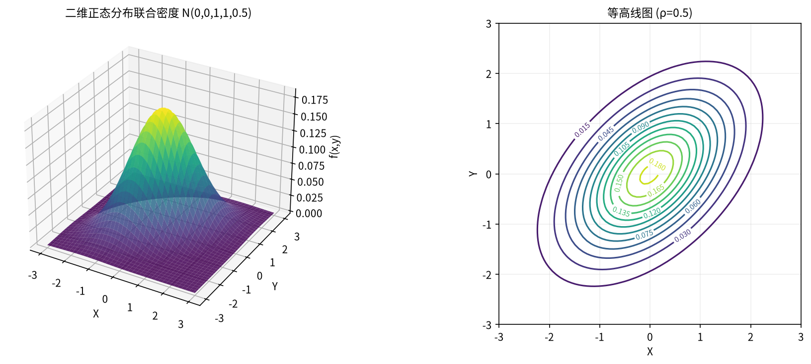

---

## 大数定律与中心极限定理

这两条定理是概率论的"两大支柱"。**大数定律**告诉你：试验做多了，频率会稳定到概率。**中心极限定理**告诉你：大量独立因素叠加，结果必然是正态分布。下面逐一详解。

---

### 切比雪夫不等式——"偏离均值的概率有多大？"

> **为什么要学这个？** 切比雪夫不等式是证明大数定律的关键工具。它回答一个很实际的问题：一个随机变量偏离它的均值超过某个值，这件事发生的概率最大是多少？而且它**不要求**知道分布的具体形式——只需要期望和方差就够了。

#### 从马尔可夫不等式出发

**马尔可夫不等式**（Chebyshev 的前置知识）：设 $Y$ 是一个**非负**随机变量（即 $Y \ge 0$ 恒成立），则对任意 $a > 0$：

$$P(Y \ge a) \le \frac{E(Y)}{a}$$

**零跳步推导**：

考虑 $Y$ 的数学期望（离散型，连续型同理）：

$$E(Y) = \sum_{y} y \cdot P(Y = y)$$

因为 $Y \ge 0$，我们把求和拆成两部分：$Y < a$ 的部分和 $Y \ge a$ 的部分。

$$E(Y) = \sum_{y < a} y \cdot P(Y = y) + \sum_{y \ge a} y \cdot P(Y = y)$$

第一部分每一项 $y \ge 0$，所以 $\sum_{y < a} y \cdot P(Y = y) \ge 0$。

第二部分每一项 $y \ge a$，所以把 $y$ 换成更小的 $a$ 会使式子变小：

$$\sum_{y \ge a} y \cdot P(Y = y) \ge \sum_{y \ge a} a \cdot P(Y = y) = a \cdot P(Y \ge a)$$

因此：

$$E(Y) \ge 0 + a \cdot P(Y \ge a)$$

两边除以 $a$（$a > 0$）：

$$P(Y \ge a) \le \frac{E(Y)}{a}$$

推导完成。这条不等式的含义很简单：**非负随机变量取值超过 $a$ 的概率，不超过它的期望除以 $a$**。期望越小，偏离的概率上限就越小。

#### 从马尔可夫推出切比雪夫

现在考虑随机变量 $X$（不必非负了），它有期望 $E(X) = \mu$ 和方差 $Var(X) = \sigma^2$。

我们关心 $X$ 偏离 $\mu$ 超过 $\varepsilon$ 的概率：$P(|X - \mu| \ge \varepsilon)$。

**关键技巧**：定义一个新的随机变量 $Y = (X - \mu)^2$。这个 $Y$ 有两个好性质：

1. $Y \ge 0$ 恒成立（平方必非负）——满足马尔可夫不等式的条件
2. $E(Y) = E[(X - \mu)^2] = Var(X) = \sigma^2$——这就是方差的定义！

另外，$|X - \mu| \ge \varepsilon$ 这句话等价于 $(X - \mu)^2 \ge \varepsilon^2$（两边同时平方，因为都是非负数，平方运算保序）。

所以：

$$P(|X - \mu| \ge \varepsilon) = P((X - \mu)^2 \ge \varepsilon^2) = P(Y \ge \varepsilon^2)$$

对 $Y$ 使用马尔可夫不等式（取 $a = \varepsilon^2$）：

$$P(Y \ge \varepsilon^2) \le \frac{E(Y)}{\varepsilon^2} = \frac{\sigma^2}{\varepsilon^2}$$

**得到切比雪夫不等式**：

$$P(|X - \mu| \ge \varepsilon) \le \frac{\sigma^2}{\varepsilon^2}$$

等价的互补形式：

$$P(|X - \mu| < \varepsilon) \ge 1 - \frac{\sigma^2}{\varepsilon^2}$$

#### 切比雪夫不等式的含义

> **一句话**：随机变量偏离均值超过 $\varepsilon$ 的概率，被 $\sigma^2 / \varepsilon^2$ 这个上界"控制"了。方差越小，偏离的概率上限越小；容许的偏离 $\varepsilon$ 越大，偏离概率的上限也越小。

#### 例题

> 设 $X$ 的期望 $\mu = 10$，方差 $\sigma^2 = 4$。估计 $P(|X - 10| \ge 3)$ 的上限。

代入公式：

$$P(|X - 10| \ge 3) \le \frac{4}{3^2} = \frac{4}{9} \approx 0.444$$

即：**偏离均值超过 3 的概率不超过 44.4%**——这个结论只用了期望和方差，没有假设 $X$ 是什么分布！

> 对于正态分布 $N(10, 4)$，可以精确计算 $P(|X - 10| \ge 3) = P(|Z| \ge 1.5) \approx 0.134$。切比雪夫给出的 0.444 是上界（比较宽松），但它对**任何分布**都成立——这才是它的威力。

---

### 大数定律——为什么频率会稳定？

切比雪夫不等式的最大用途，就是证明大数定律。

#### 问题

抛 $n$ 次硬币，记 $X_i = 1$（第 $i$ 次正面）或 $0$（第 $i$ 次反面）。每次 $E(X_i) = p = 0.5$，$Var(X_i) = p(1-p) = 0.25$。

样本均值（即正面频率）：

$$\bar{X}_n = \frac{X_1 + X_2 + \dots + X_n}{n}$$

直觉说：$n \to \infty$ 时，$\bar{X}_n$ 应该"稳定"到 0.5。怎么严格证明？

#### 用切比雪夫不等式证明

先算 $\bar{X}_n$ 的期望和方差：

$$E(\bar{X}_n) = E\left(\frac{1}{n}\sum_{i=1}^n X_i\right) = \frac{1}{n} \sum_{i=1}^n E(X_i) = \frac{1}{n} \cdot n\mu = \mu$$

$$Var(\bar{X}_n) = Var\left(\frac{1}{n}\sum_{i=1}^n X_i\right) = \frac{1}{n^2} \sum_{i=1}^n Var(X_i) = \frac{1}{n^2} \cdot n\sigma^2 = \frac{\sigma^2}{n}$$

> 关键洞察：$\bar{X}_n$ 的方差是 $\sigma^2 / n$——**随着 $n$ 增大，方差趋向于 0**！这意味着样本均值越来越"集中"在 $\mu$ 附近。

对 $\bar{X}_n$ 使用切比雪夫不等式：

$$P(|\bar{X}_n - \mu| \ge \varepsilon) \le \frac{Var(\bar{X}_n)}{\varepsilon^2} = \frac{\sigma^2}{n\varepsilon^2}$$

现在令 $n \to \infty$：

$$\lim_{n \to \infty} P(|\bar{X}_n - \mu| \ge \varepsilon) \le \lim_{n \to \infty} \frac{\sigma^2}{n\varepsilon^2} = 0$$

因为概率不能为负，所以：

$$\lim_{n \to \infty} P(|\bar{X}_n - \mu| \ge \varepsilon) = 0$$

等价地：

$$\lim_{n \to \infty} P(|\bar{X}_n - \mu| < \varepsilon) = 1$$

这就是**大数定律**：样本量足够大时，样本均值以概率 1 收敛到总体均值。

#### 三种形式的大数定律

| 名称 | 条件 | 结论 |
|------|------|------|
| **辛钦大数定律** | 独立同分布，期望 $\mu$ 存在 | $\bar{X}_n \xrightarrow{P} \mu$ |
| **切比雪夫大数定律** | 独立，方差有公共上界 | $\bar{X}_n \xrightarrow{P} \mu$ |
| **伯努利大数定律** | $X_i \sim B(1, p)$ | 频率 $\xrightarrow{P}$ 概率 $p$ |

> **伯努利大数定律**是大数定律最早的形式——"抛硬币次数够多，正面频率接近 0.5"。这也是"用频率估计概率"的数学基础。

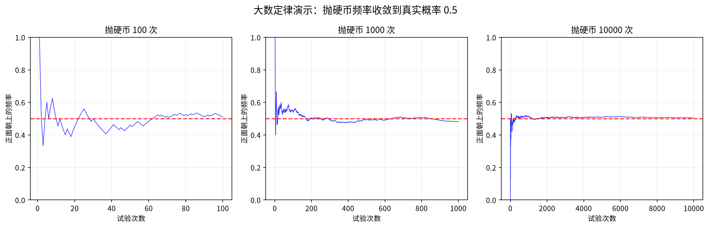

> **图表解读**：三张图分别展示 100、1000、10000 次抛硬币实验中正面频率的变化。随着试验次数增加，频率曲线越来越稳定地收敛到 0.5 这条红线。

---

### 中心极限定理——为什么正态分布无处不在？

大数定律告诉我们样本均值**趋向于** $\mu$。但它没有说**趋向的速度和形态**。中心极限定理补充了这个信息。

#### 先看一个惊人的现象

取 $X_i \sim U(0, 1)$（均匀分布——每个值等可能，**完全不像正态分布**）。定义：

$$S_n = X_1 + X_2 + \cdots + X_n$$

- $n=1$：$S_1 \sim U(0,1)$，均匀分布
- $n=2$：$S_2$ 呈三角形分布
- $n=5$：$S_5$ 已经有点"钟形"了
- $n=30$：$S_{30}$ 的分布**和正态分布几乎一模一样**！

#### 中心极限定理（林德伯格-列维）

设 $X_1, X_2, \dots$ 是**独立同分布**的随机变量，$E(X_i) = \mu$，$Var(X_i) = \sigma^2 > 0$。则当 $n \to \infty$ 时：

$$\frac{\sum_{i=1}^n X_i - n\mu}{\sigma\sqrt{n}} \xrightarrow{d} N(0, 1)$$

**逐部分解释**：

| 部分 | 含义 |
|------|------|
| $\sum_{i=1}^n X_i$ | $n$ 个变量的**总和** |
| $n\mu$ | 总和的**期望**（因为每个 $E(X_i)=\mu$） |
| $\sigma\sqrt{n}$ | 总和的**标准差**（因为 $Var(\sum X_i) = n\sigma^2$） |
| $\xrightarrow{d}$ | **依分布收敛**——分布函数逐点趋近 |

所以分子 $\sum X_i - n\mu$ 是"总和偏离期望的量"，分母 $\sigma\sqrt{n}$ 是标准化的尺度。整个分式是**标准化的总和**。

记标准化后的随机变量为：

$$Z_n = \frac{\sum_{i=1}^n X_i - n\mu}{\sigma\sqrt{n}}$$

则 CLT 可以等价地写成**分布函数的极限形式**：

$$\lim_{n \to \infty} P(Z_n \le z) = \Phi(z)$$

其中 $\Phi(z)$ 是标准正态分布 $N(0,1)$ 的**累积分布函数**（Cumulative Distribution Function，简称 CDF）：

$$\Phi(z) = \frac{1}{\sqrt{2\pi}} \int_{-\infty}^{z} e^{-\frac{t^2}{2}} \, dt$$

**逐部分解释**：

| 符号 | 含义 |
|------|------|
| $Z_n$ | 标准化后的总和（减期望，除标准差） |
| $P(Z_n \le z)$ | $Z_n$ 不超过某值 $z$ 的概率——即 $Z_n$ 的**分布函数** |
| $\lim_{n \to \infty}$ | 样本量无限增大时的极限行为 |
| $\Phi(z)$ | 标准正态分布的分布函数（一个固定的、不依赖于 $n$ 的数值） |

> **这个形式的含义**：不管 $X_i$ 原来是什么分布（均匀、指数、二项……），标准化总和的分布函数在 $n \to \infty$ 时，**每一点**都收敛到标准正态的分布函数。这是 CLT 最严格的数学表述。

> **一句话**：无论 $X_i$ 原来是什么分布，只要 $n$ 足够大，标准化的总和就近似 $N(0,1)$。等价地说，**总和本身近似 $N(n\mu, n\sigma^2)$**。

#### 等价形式（更方便使用）

**样本均值的近似分布**：

$$\bar{X}_n = \frac{1}{n}\sum_{i=1}^n X_i \quad \xrightarrow{\text{近似}} \quad N\left(\mu, \frac{\sigma^2}{n}\right)$$

这意味着：**样本均值近似服从正态分布，期望是 $\mu$，方差是 $\sigma^2/n$**。

> 这就比大数定律更精细了——不仅知道 $\bar{X}_n$ 趋向 $\mu$，还知道它围绕 $\mu$ 的波动幅度是 $\sigma/\sqrt{n}$，且分布形态接近正态。

#### 棣莫弗-拉普拉斯中心极限定理（特例）

当 $X_i \sim B(1, p)$（0-1 分布，即每次试验只有成功/失败）时：

$$S_n = \sum_{i=1}^n X_i \sim B(n, p)$$

由 CLT，当 $n$ 很大时：

$$S_n \xrightarrow{\text{近似}} N(np, np(1-p))$$

这就是为什么**二项分布在大 $n$ 时可以用正态分布近似**。历史上，棣莫弗最早发现的就是这个特例。

#### 三个重要应用

**(1) 保险定价**

$n$ 个人买保险，每人出事概率 $p$，出事赔 $a$ 元。总赔付 $S \sim B(n, p)$。当 $n$ 很大时：

$$S \xrightarrow{\text{近似}} N(np, np(1-p))$$

保险公司可以据此计算：需要收多少保费才能在 99.9% 的概率下不亏损。

**(2) 质量控制**

零件尺寸 $X \sim N(\mu, \sigma^2)$。抽 $n$ 个零件，样本均值 $\bar{X} \sim N(\mu, \sigma^2/n)$。如果 $\bar{X}$ 偏离 $\mu$ 超过 $3\sigma/\sqrt{n}$，几乎肯定生产过程出了问题（$3\sigma$ 规则）。

**(3) 民意调查**

调查 $n$ 个人，支持率 $\hat{p} = X/n$。由 CLT：

$$\hat{p} \xrightarrow{\text{近似}} N\left(p, \frac{p(1-p)}{n}\right)$$

这就是**误差范围** $\pm 1.96 \sqrt{p(1-p)/n}$ 的来源——95% 置信区间的公式。

#### 例题

> 某蛋糕店有 3 种蛋糕：A（5元，概率 0.2）、B（10元，概率 0.3）、C（12元，概率 0.5）。今天有 700 位顾客，每人独立买一个。用 CLT 求今天营业额在 7000 元到 7300 元之间的概率。

**解**：

设 $X_i$ = 第 $i$ 位顾客的消费额。先算 $X_i$ 的期望和方差：

$$E(X_i) = 5 \times 0.2 + 10 \times 0.3 + 12 \times 0.5 = 1 + 3 + 6 = 10$$

$$E(X_i^2) = 25 \times 0.2 + 100 \times 0.3 + 144 \times 0.5 = 5 + 30 + 72 = 107$$

$$Var(X_i) = E(X_i^2) - [E(X_i)]^2 = 107 - 100 = 7$$

总营业额 $S = \sum_{i=1}^{700} X_i$。由 CLT：

$$S \xrightarrow{\text{近似}} N(700 \times 10, 700 \times 7) = N(7000, 4900)$$

标准差 $\sigma_S = \sqrt{4900} = 70$。

所求概率：

$$P(7000 \le S \le 7300) = P\left(0 \le \frac{S - 7000}{70} \le \frac{300}{70}\right) \approx P(0 \le Z \le 4.29)$$

查标准正态表：$\Phi(4.29) \approx 0.99999$，$\Phi(0) = 0.5$。

$$P(7000 \le S \le 7300) \approx 0.99999 - 0.5 = 0.49999 \approx 0.5$$

即营业额在 7000 到 7300 元之间的概率约 **50%**。

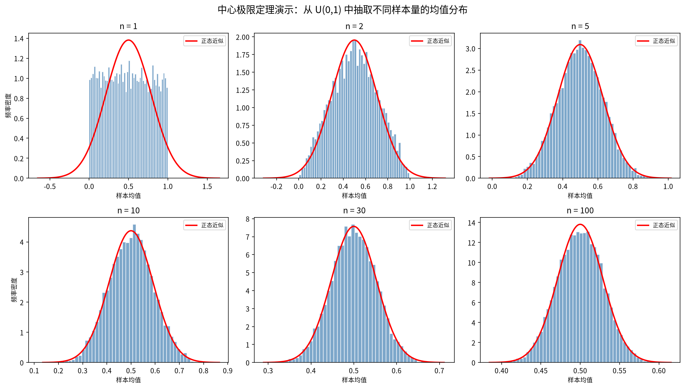

> **图表解读**：从 $U(0,1)$ 中分别取 $n=1,2,5,10,30,100$ 个样本求均值，重复 10000 次绘直方图。红色曲线是正态近似。$n=1$ 时是均匀分布，$n=5$ 时开始呈现钟形，$n=30$ 时几乎和正态曲线完全重合。

---

### 大数定律 vs 中心极限定理

| | 大数定律 (LLN) | 中心极限定理 (CLT) |
|------|------|------|
| 回答的问题 | 样本均值趋向哪里？ | 样本均值的分布是什么形状？ |
| 结论 | $\bar{X}_n \to \mu$（一个点） | $\bar{X}_n \sim N(\mu, \sigma^2/n)$（一个分布） |
| 精度信息 | 无——只说"会收敛" | 有——给出收敛的速度和波动范围 |
| 数学工具 | 切比雪夫不等式 | 特征函数 / 矩母函数 |
| 应用 | 用频率估计概率 | 置信区间、假设检验、误差分析 |

> 🔑 **一句话区分**：大数定律说"做多了会准"，中心极限定理说"波动服从正态分布"。两者配合使用：LLN 保证一致性，CLT 提供精度度量。

---

## 从概率论到数理统计

概率论 = 已知模型，预测结果。  
统计 = 已知结果（数据），推断模型。

数理统计的核心问题：
1. **如何从数据中估计未知参数？**（参数估计）
2. **如何用数据判断一个猜测是否正确？**（假设检验）

---

## 统计量与抽样分布

### 样本与总体

- **总体**：我们想研究的所有对象（如"所有中国人的身高"）
- **样本**：从总体中随机抽取的一部分（如"随机调查 1000 人的身高"）

**简单随机样本**：每个个体被抽到的概率相同，且抽取相互独立。

### 常用统计量

| 统计量 | 公式 | 含义 |
|-------|------|------|
| 样本均值 | $\bar{X} = \frac{1}{n}\sum_{i=1}^n X_i$ | 数据的"中心" |
| 样本方差 | $S^2 = \frac{1}{n-1}\sum_{i=1}^n (X_i - \bar{X})^2$ | 数据的"离散程度" |

> **为什么样本方差分母是 $n-1$ 而不是 $n$？** 这是为了保证 $S^2$ 是总体方差 $\sigma^2$ 的**无偏估计**——也就是说，$E(S^2) = \sigma^2$。如果用 $n$ 做分母，$E(S_n^2) = \frac{n-1}{n}\sigma^2 < \sigma^2$（系统性地低估方差）。

### 三大抽样分布

在进行统计推断时，经常用到以下三个分布：

**(1) $\chi^2$ 分布（卡方分布）**：$n$ 个独立标准正态变量的平方和。

**(2) $t$ 分布（学生氏分布）**：$\frac{Z}{\sqrt{\chi^2/n}}$，其中 $Z \sim N(0,1)$ 且与 $\chi^2$ 独立。当 $n$ 很大时趋近 $N(0,1)$。

**(3) $F$ 分布**：两个独立卡方变量（除以各自自由度）的比值。

---

## 参数估计——用数据猜参数

### 例题：估计产品的次品率

> 从一批产品中随机抽取 100 件，发现 5 件次品。如何估计整批产品的次品率 $p$？

**直觉**：$\hat{p} = \frac{5}{100} = 0.05$。这就是**矩估计**。

### 矩估计（Method of Moments）

> **为什么要学矩估计？** 很多实际问题中，我们只知道总体分布的类型（比如"这个是正态分布"），但不知道分布的参数（$\mu$ 和 $\sigma^2$ 是多少）。矩估计就是用样本数据来**反推**参数的最直观方法——它不需要复杂的优化，只需要"样本的统计量 = 总体的理论值"这一个等式。

---

#### 什么是"矩"？

**矩**（Moment）是描述分布形状的一类数值指标：

| 阶数 | 名称 | 符号 | 公式（离散型） |
|:---:|------|------|------|
| 1 阶 | **总体均值 / 期望** | $\mu = E(X)$ | $\sum x_k \cdot P(X=x_k)$ |
| 2 阶 | **总体二阶原点矩** | $E(X^2)$ | $\sum x_k^2 \cdot P(X=x_k)$ |
| 3 阶 | **总体三阶原点矩** | $E(X^3)$ | $\sum x_k^3 \cdot P(X=x_k)$ |

一般地，**$k$ 阶原点矩** = $E(X^k)$。

> **"矩"这个名字的由来**：在物理学中，力矩 = 力 × 距离。在概率论中，$k$ 阶矩 = $\sum$（概率 × 取值的 $k$ 次方）——形式上类似"概率为权重的幂的加权平均"，所以沿用了"矩"这个名字。你不需要深究，只需要知道**一阶矩就是期望，二阶矩 $E(X^2)$ 可以用来算方差**。

---

#### 矩估计的核心思想

**一句话**：让样本的矩等于总体的矩，然后解出参数。

**三步走**：

1. **写出总体矩**：将总体分布中的 $E(X)$、$E(X^2)$ 等用**未知参数**表达
2. **计算样本矩**：用实际观测数据算出 $\bar{x} = \frac{1}{n}\sum x_i$、$\frac{1}{n}\sum x_i^2$ 等
3. **令它们相等**：总体矩 = 样本矩 → 解方程组 → 得到参数的估计值

> **为什么这样做合理？** 大数定律告诉我们：样本均值 $\bar{x}$ 在 $n$ 很大时会趋向总体均值 $E(X)$。所以反过来，用 $\bar{x}$ 代替 $E(X)$ 来求解参数，在大样本下是合理的。

---

#### 例题 1：估计次品率（一个参数）

> 从一批产品中随机抽取 100 件，发现 5 件次品。估计次品率 $p$。

**第一步**：确定总体分布。每件产品要么次品（$X=1$）要么合格（$X=0$），所以 $X \sim B(1, p)$。

总体一阶矩：$E(X) = 1 \cdot p + 0 \cdot (1-p) = p$

**第二步**：计算样本一阶矩。100 件中有 5 件次品：

$$\bar{x} = \frac{1}{100}\sum_{i=1}^{100} x_i = \frac{5}{100} = 0.05$$

**第三步**：令总体矩 = 样本矩：

$$p = \bar{x} = 0.05$$

矩估计结果：$\hat{p} = 0.05$。

> 这就是"用频率估计概率"的数学表达。事实上，对于 0-1 分布，矩估计给出的就是样本均值，和直觉完全一致。

---

#### 例题 2：估计均匀分布的参数

> 设总体 $X \sim U(0, \theta)$，$\theta > 0$ 未知。抽取样本 $x_1, \dots, x_n$。求 $\theta$ 的矩估计。

**第一步**：写出总体一阶矩。

$X \sim U(0, \theta)$，密度为 $f(x) = \frac{1}{\theta}（0 < x < \theta）$。

$$E(X) = \int_{0}^{\theta} x \cdot \frac{1}{\theta} \, dx = \frac{1}{\theta} \cdot \left.\frac{x^2}{2}\right|_{0}^{\theta} = \frac{1}{\theta} \cdot \frac{\theta^2}{2} = \frac{\theta}{2}$$

**第二步**：样本一阶矩 = $\bar{x}$。

**第三步**：令它们相等：

$$\frac{\theta}{2} = \bar{x} \quad \Longrightarrow \quad \hat{\theta} = 2\bar{x}$$

> **验证**：假如样本是 {2, 5, 3, 6, 4}，则 $\bar{x} = 4$，$\hat{\theta} = 8$。这很合理——均匀分布的最大值应该大约是均值的两倍（因为均匀分布在 $[0, \theta]$ 上对称分布）。

---

#### 例题 3：需要用到二阶矩的情况

> 设总体 $X \sim N(\mu, \sigma^2)$，$\mu$ 和 $\sigma^2$ 都未知。求 $\mu$ 和 $\sigma^2$ 的矩估计。

这里有两个未知参数，需要**两个方程**——用一阶矩和二阶矩。

**第一步**：写出总体矩。

$$E(X) = \mu$$
$$E(X^2) = Var(X) + [E(X)]^2 = \sigma^2 + \mu^2$$

（这里用了 $Var(X) = E(X^2) - [E(X)]^2$ → $E(X^2) = \sigma^2 + \mu^2$）

**第二步**：计算样本矩。

一阶样本矩：$A_1 = \bar{x} = \frac{1}{n}\sum x_i$

二阶样本矩：$A_2 = \frac{1}{n}\sum x_i^2$

**第三步**：令总体矩 = 样本矩，建立方程组：

$$\begin{cases} \mu = \bar{x} \\ \sigma^2 + \mu^2 = \frac{1}{n}\sum x_i^2 \end{cases}$$

由第一个方程：$\hat{\mu} = \bar{x}$。

代入第二个方程：

$$\hat{\sigma}^2 = \frac{1}{n}\sum x_i^2 - \bar{x}^2$$

这个式子恰好等于 $\frac{1}{n}\sum (x_i - \bar{x})^2$（二项展开可验证）：

$$\frac{1}{n}\sum x_i^2 - \bar{x}^2 = \frac{1}{n}\sum (x_i^2 - 2x_i\bar{x} + \bar{x}^2) = \frac{1}{n}\sum (x_i - \bar{x})^2$$

所以 $\hat{\sigma}^2 = \frac{1}{n}\sum (x_i - \bar{x})^2 = S_n^2$（样本方差，分母为 $n$）。

> ⚠️ 矩估计给出的 $\sigma^2$ 估计使用了分母 $n$（而不是 $n-1$）。这个估计是**有偏的**——$E(S_n^2) = \frac{n-1}{n}\sigma^2 < \sigma^2$。但矩估计不在乎有偏无偏，它只追求"样本矩 = 总体矩"。

---

#### 矩估计的通用步骤

设有 $k$ 个未知参数 $\theta_1, \dots, \theta_k$：

1. 写出前 $k$ 个总体矩：$E(X), E(X^2), \dots, E(X^k)$，每个都是 $\theta_1, \dots, \theta_k$ 的函数
2. 计算对应的前 $k$ 个样本矩：$A_1 = \bar{x}, A_2 = \frac{1}{n}\sum x_i^2, \dots, A_k = \frac{1}{n}\sum x_i^k$
3. 解方程组：$E(X^j) = A_j \;(j = 1, 2, \dots, k)$ → 得到 $\hat{\theta}_1, \dots, \hat{\theta}_k$

---

#### 矩估计的优缺点

| 优点 | 缺点 |
|------|------|
| 计算简单，不需要复杂的优化 | 不一定是最优估计（方差可能比 MLE 大） |
| 不需要知道分布的完整形式 | 对某些分布可能给出不合理的估计值 |
| 大样本下是一致估计（收敛到真值） | 信息利用不充分（只用了前 $k$ 阶矩） |

> 🔑 **矩估计 vs 极大似然估计**：矩估计追求"样本和总体的矩相等"，像照镜子——样本长什么样，总体就得长什么样；极大似然估计追求"已经看到的样本，发生的概率最大"，像破案——看到的结果，回溯最可能导致它的原因。

---

### 极大似然估计（MLE）

**基本思想**：找一个参数值，使得"观察到当前样本"的概率最大。

**例题**：设总体 $X \sim Exp(\lambda)$，样本值为 $x_1, \dots, x_n$。求 $\lambda$ 的极大似然估计。

**零跳步推导**：

独立样本的联合密度 = 每个样本密度的乘积：

$$L(\lambda) = \prod_{i=1}^n \lambda e^{-\lambda x_i} = \lambda^n e^{-\lambda \sum x_i}$$

要最大化 $L(\lambda)$，对 $\lambda$ 取对数（单调变换，不改变最大值位置）：

$$\ln L(\lambda) = n \ln \lambda - \lambda \sum_{i=1}^n x_i$$

对 $\lambda$ 求导并令其为 0：

$$\frac{d}{d\lambda} \ln L(\lambda) = \frac{n}{\lambda} - \sum_{i=1}^n x_i = 0$$

$$\Rightarrow \frac{n}{\lambda} = \sum_{i=1}^n x_i$$

$$\Rightarrow \hat{\lambda} = \frac{n}{\sum_{i=1}^n x_i} = \frac{1}{\bar{x}}$$

所以指数分布参数 $\lambda$ 的极大似然估计就是样本均值的倒数。

### 点估计的评判标准

| 标准 | 含义 |
|------|------|
| 无偏性 | $E(\hat{\theta}) = \theta$——多次估计的平均等于真值 |
| 有效性 | 方差更小的无偏估计更好 |
| 相合性 | 样本量 $n \to \infty$ 时，$\hat{\theta}$ 趋向于 $\theta$ |

### 区间估计——不只猜一个点，给一个范围

> "次品率大概 5%"不如"次品率有 95% 的把握在 2% 到 8% 之间"。

**置信区间**：以一定置信水平（如 95%）包含真实参数的区间。

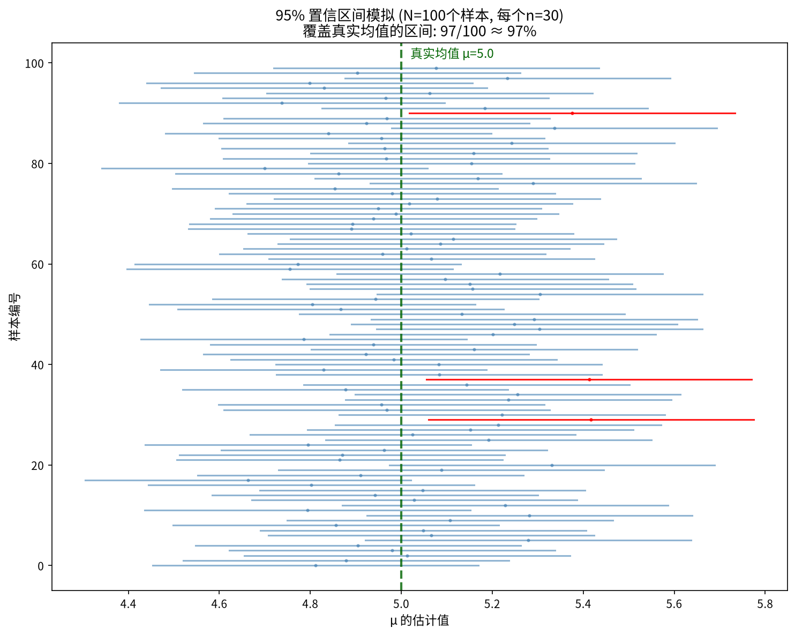

对于正态总体 $N(\mu, \sigma^2)$，$\sigma$ 已知时，$\mu$ 的 95% 置信区间：

$$\bar{X} \pm 1.96 \cdot \frac{\sigma}{\sqrt{n}}$$

> **为什么是 1.96？** 因为 $P(-1.96 < Z < 1.96) \approx 0.95$，其中 $Z \sim N(0,1)$。

---

## 假设检验——用数据做决策

### 例题：硬币是否均匀？

> 抛 100 次硬币，60 次正面。这枚硬币均匀吗？

**思路**：
1. **假设硬币是均匀的**（$p = 0.5$）——这叫**原假设** $H_0$
2. 在假设成立的前提下，计算观察到"60 次或更多正面"的概率
3. 如果这个概率很小（如 < 5%），则认为原假设不太可能成立 → **拒绝** $H_0$

$X \sim B(100, 0.5)$，在 $H_0$ 成立时：
$$P(X \ge 60) \approx P\left(Z \ge \frac{60 - 50}{\sqrt{100 \cdot 0.5 \cdot 0.5}}\right) = P(Z \ge 2) \approx 0.023$$

这个概率（0.023）小于常用的显著性水平 0.05，所以我们**拒绝原假设**——有充分证据认为这枚硬币**不均匀**。

> 这个概率（0.023）称为 **p 值**——在原假设成立的前提下，观察到"当前结果或更极端结果"的概率。p 值越小，证据越强。

### 假设检验的逻辑框架

1. **提出假设**：$H_0$（原假设，通常是无效应/无差异）vs $H_1$（备择假设）
2. **选择检验统计量**：一个能从数据中计算的值
3. **确定拒绝域**：什么情况下拒绝 $H_0$（基于显著性水平 $\alpha$，如 0.05）
4. **计算 p 值**或判断统计量是否在拒绝域内
5. **做出决策**：拒绝 $H_0$ 或不拒绝 $H_0$

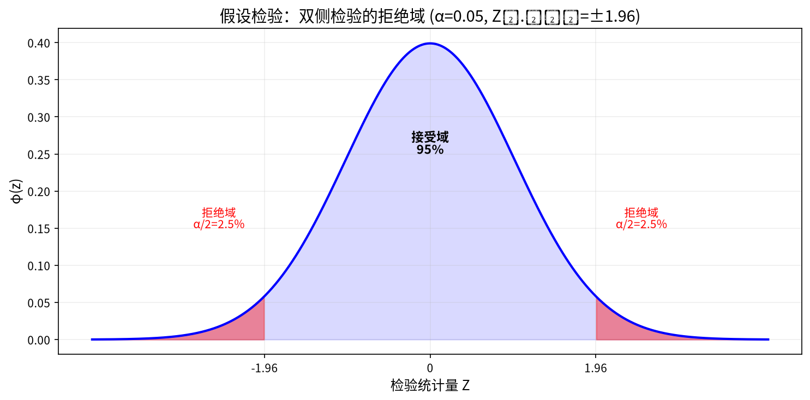

> ⚠️ **两类错误**：
> - **第一类错误（弃真）**：$H_0$ 为真但被拒绝（冤枉好人）。概率 = $\alpha$。
> - **第二类错误（取伪）**：$H_0$ 为假但未被拒绝（漏掉坏人）。概率 = $\beta$。
> - 这两类错误不能同时减小——减小 $\alpha$ 会增加 $\beta$，需要在两者之间权衡。

---

## 结尾：概率论思维的三个核心洞察

1. **随机 ≠ 没有规律**：单次结果不可预测，但大量重复后频率会稳定（大数定律），而且叠加效应趋向正态（中心极限定理）。

2. **新信息应该更新信念**：贝叶斯公式告诉我们，先验判断 + 新数据 = 后验判断。这是从数据中学习的数学基础。

3. **统计推断总是有不确定性**：估计有误差范围（置信区间），判断可能犯错（两类错误）。统计不是消除不确定性，而是**量化**不确定性。

---

## 附录 A：核心公式速查表

| 公式 | 名称 |
|------|------|
| $P(A \cup B) = P(A) + P(B) - P(AB)$ | 加法公式 |
| $P(A|B) = P(AB) / P(B)$ | 条件概率 |
| $P(B) = \sum_i P(A_i)P(B|A_i)$ | 全概率公式 |
| $P(A_i|B) = P(A_i)P(B|A_i) / P(B)$ | 贝叶斯公式 |
| $P(AB) = P(A)P(B)$（当独立） | 独立性条件 |
| $E(X) = \sum x_k p_k$ / $\int x f(x)dx$ | 数学期望 |
| $Var(X) = E(X^2) - [E(X)]^2$ | 方差简便公式 |
| $Cov(X,Y) = E(XY) - E(X)E(Y)$ | 协方差 |
| $\rho = Cov(X,Y) / \sqrt{Var(X)Var(Y)}$ | 相关系数 |
| $\frac{\sum X_i - n\mu}{\sigma\sqrt{n}} \sim N(0,1)$（近似） | 中心极限定理 |
| $\bar{X} \pm z_{\alpha/2} \cdot \sigma/\sqrt{n}$ | 置信区间（$\sigma$ 已知） |

## 附录 B：术语对照表

| 中文 | 英文 | 符号 |
|------|------|------|
| 样本空间 | Sample Space | $\Omega$ |
| 样本点 | Sample Point | $\omega$ |
| 随机事件 | Random Event | $A, B, C$ |
| 概率 | Probability | $P(A)$ |
| 条件概率 | Conditional Probability | $P(A|B)$ |
| 随机变量 | Random Variable | $X, Y$ |
| 分布函数 | Distribution Function | $F(x)$ |
| 密度函数 | Density Function | $f(x)$ |
| 数学期望 | Expected Value | $E(X)$ |
| 方差 | Variance | $Var(X)$ |
| 协方差 | Covariance | $Cov(X,Y)$ |
| 先验概率 | Prior Probability | $P(A_i)$ |
| 后验概率 | Posterior Probability | $P(A_i|B)$ |
| 原假设 | Null Hypothesis | $H_0$ |
| 显著性水平 | Significance Level | $\alpha$ |
| p 值 | p-value | — |
| 置信区间 | Confidence Interval | CI |
