# 现代工程制图 — 第一章 制图的基本知识和技能

> **阅读指引**：这份教程假设你没有任何工程制图基础，从"为什么要学工程制图"开始，一步步带你掌握国家制图标准的核心规定。每一节先解释「是什么」和「为什么这样规定」，再通过习题验证理解程度。

---

## 目录

**第一章 制图的基本知识和技能**

1. [什么是现代工程制图](#1-什么是现代工程制图)
2. [图纸幅面与格式](#2-图纸幅面与格式)
   - [2.1 基本幅面](#21-基本幅面)
   - [2.2 加长幅面](#22-加长幅面)
   - [2.3 标题栏](#23-标题栏)
3. [比例](#3-比例)
4. [字体](#4-字体)
   - [4.1 汉字](#41-汉字)
   - [4.2 数字和字母](#42-数字和字母)
   - [4.3 字号系列](#43-字号系列)
5. [图线](#5-图线)
6. [尺寸标注](#6-尺寸标注)
   - [6.1 标注四要素](#61-标注四要素)
   - [6.2 线性尺寸标注](#62-线性尺寸标注)
   - [6.3 角度、直径、半径标注](#63-角度直径半径标注)
   - [6.4 弧长标注](#64-弧长标注)
   - [6.5 标注基本原则](#65-标注基本原则)
7. [第一章速查表](#7-本章速查表)

**第二章 立体表面的截交线**

8. [圆柱的三种截交线](#第二章-立体表面的截交线)

**第三章 两形体间的连接方式**

9. [共面 · 相切 · 相交 · 相贯](#第三章-两形体间的连接方式)

**第四章 组合体的尺寸标注**

10. [定形尺寸 · 定位尺寸 · 总体尺寸](#第四章-组合体的尺寸标注)

**第五章 正等轴测投影**

11. [轴间角与轴向伸缩系数](#第五章-正等轴测投影)

**第六章 全剖视图**

12. [全剖视图的概念与适用条件](#第六章-全剖视图)

**第七章 移出断面图**

13. [断面图 vs 剖视图](#第七章-移出断面图)

14. [第二章~第七章速查表](#本章速查表第二章第七章)

---

## 1. 什么是现代工程制图

### 1.1 一句话定义

**工程制图 = 用标准化的图形语言来精确表达零件/构件的形状、大小和加工要求。**

它是工程师的"语言"——就像学英语要先学字母和语法，学工程制图要先学国家标准规定的基本规则。

### 1.2 为什么要标准化？

想象一个场景：你画了一张零件图给工厂，但工厂在另一个国家。如果没有统一标准——

- 你画的红线代表"可见边"，对方可能理解成"装饰线"
- 你标的尺寸是"毫米"，对方可能当成"厘米"
- 你写的字潦草，对方把"φ40"看成了"φ20"

**结果：零件做错了，机器装不上，甚至酿成事故。**

这就是为什么国家制定了严格的制图标准（GB/T 系列）。本章学的就是这些"语法规则"中最基础的部分。

### 1.3 本章学什么

| 知识板块 | 核心问题 | 对应习题 |
|----------|---------|:---:|
| **图纸幅面** | 用多大的纸？怎么折叠？怎么加长？ | 1-1-1(1)(2)(3)、1-1-2(13)(14) |
| **比例** | 实物 1 米，画在纸上画多大？ | 1-1-1(4)(5)(6)、1-1-2(15) |
| **字体** | 写什么字体？多大字号？字宽多少？ | 1-1-1(7)(8)、1-1-3(19)~(24) |
| **图线** | 用什么线画可见的？什么线画不可见的？线宽多少？ | 1-1-1(9)(10)、1-1-2(16)(17)(18) |
| **尺寸标注** | 怎么标尺寸才规范？四要素是什么？ | 1-2 全部 |

> **学习建议**：本章知识比较琐碎，但**每一条都是考点**。建议学完一节就做对应的习题，然后对照本章最后的[速查表](#7-本章速查表)反复记忆。

---

## 2. 图纸幅面与格式

> **本节目标**：理解 A0～A4 幅面的尺寸关系，掌握幅面裁切次数的计算，知道加长规则。

### 2.1 基本幅面

#### 核心概念：A 系列纸张的"对折"规律

国际标准（ISO 216）和国家标准（GB/T 14689）都采用 A 系列幅面。这个系列的奥秘是：**每次沿长边对折，就得到下一个号**。

```
A0 (841×1189)
┌──────────────────────┐
│                      │
│                      │    → 沿长边对折 → 得到 A1 (594×841)
│         A0           │
│                      │
└──────────────────────┘

A1 再对折 → A2 (420×594)
A2 再对折 → A3 (297×420)
A3 再对折 → A4 (210×297)
```

#### 基本幅面尺寸表

| 幅面代号 | 尺寸 B×L (mm) | 与 A0 的关系 | 从 A0 裁切次数 | 张数 |
|:---:|------|:---:|:---:|:---:|
| **A0** | 841 × 1189 | — | 0 次 | 1 张 |
| **A1** | 594 × 841 | A0 对折 1 次 | 1 次 | 2 张 |
| **A2** | 420 × 594 | A0 对折 2 次 | 2 次 | 4 张 |
| **A3** | 297 × 420 | A0 对折 3 次 | **3 次** | **8 张** |
| **A4** | 210 × 297 | A0 对折 4 次 | **4 次** | **16 张** |

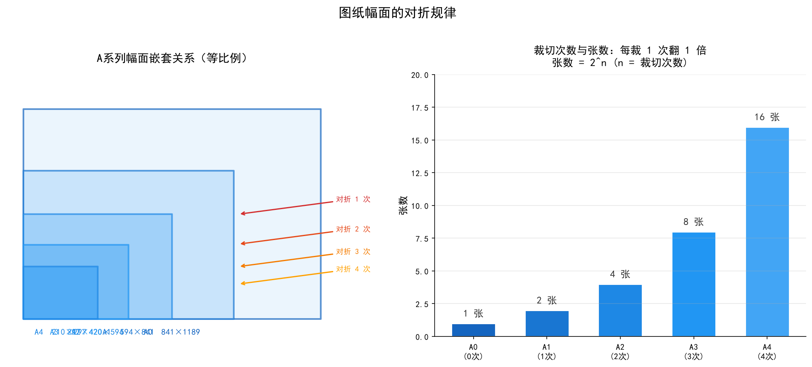

> 🔑 **核心规律**：
> - 裁切 $n$ 次 → 得到 $2^n$ 张图纸
> - A0 → A3：裁切 3 次，得 8 张（$2^3 = 8$）
> - A0 → A4：裁切 4 次，得 16 张（$2^4 = 16$）

#### 📝 习题对照

> **(1)** 将 A0 幅面的图纸裁切三次，应得到 **8** 张图纸，其幅面代号为 **A3**。
>
> **(2)** 要获得 A4 幅面的图纸，需将 A0 幅面的图纸裁切 **4** 次，可得到 **16** 张图纸。
>
> **(3)** A4 幅面的尺寸（B×L）是 **210×297**；A3 幅面的尺寸（B×L）是 **297×420**。

> ✅ **记忆技巧**：
> - A4 = 210×297（记住：**21×29.7**，以 cm 记更简单）
> - A3 = 297×420（A4 短边变成 A3 的长边）
> - A2 = 420×594（A3 短边变 A2 的长边）
> - **规律**：每个号的长边 = 上一个号的短边 × 2

#### 基本幅面的种类

国家标准规定，图纸幅面尺寸应**优先选用基本幅面**。基本幅面有几种？

> **(13)** 制图国家标准规定，图纸幅面尺寸应优先选用基本幅面尺寸，共 **5** 种。
> → A0、A1、A2、A3、A4，共 5 种。

### 2.2 加长幅面

当基本幅面不够用时，可以沿**短边**方向加长（加长量为 A4 短边的整数倍）。

> **(14)** 必要时图纸幅面尺寸可以沿 **短** 边加长。

> **为什么沿短边？** 沿长边加长会导致图纸在不同幅面间混用时不协调。沿短边加长保持一维尺寸不变，便于归档和装订。

### 2.3 标题栏

> **(13)** 制图国家标准规定，图纸的标题栏必须配置在图框的 **右下角** 位置。

> **为什么是右下角？** 图纸通常按标题栏位置折叠归档，统一在右下角方便查阅。

---

## 3. 比例

> **本节目标**：理解"比例"的含义，辨清放大比例和缩小比例，会计算绘图尺寸。

### 3.1 比例的定义

**比例 = 图样中图形尺寸 : 实物实际尺寸**

| 比例类型 | 例子 | 含义 |
|----------|------|------|
| **原值比例** | 1∶1 | 图形和实物一样大 |
| **放大比例** | 2∶1 | 图形是实物的 2 倍 |
| **缩小比例** | 1∶2 | 图形是实物的 1/2 |

> 🔑 **读法口诀**：冒号前面的数对应**图中**，冒号后面的数对应**实物**。
>
> - **2∶1** → 图中 2，实物 1 → 图比实物大 → **放大比例**
> - **1∶2** → 图中 1，实物 2 → 图比实物小 → **缩小比例**
> - **1∶5** → 图中 1，实物 5 → 图比实物小 → **缩小比例**

### 3.2 标注规则

比例标注在标题栏的"比例"栏中，格式为：

- 比值 = 图样尺寸 ∶ 实物尺寸

> **(4)** 用放大一倍的比例绘图，在标题栏的"比例"栏中应填写 **2∶1**。
>
> **(15)** 某产品用放大一倍的比例绘图，在其标题栏"比例"栏中应填 **2∶1**。
>
> ⚠️ **注意**：不能写成"放大一倍"、"1×2"、"2/1"——国家标准的格式是 **数字∶数字**。

> **(5)** 1∶2 是放大比例还是缩小比例？→ **缩小比例**。

### 3.3 绘图尺寸计算

> **(6)** 若采用 1∶5 的比例绘制一个直径为 φ40mm 的圆时，其绘图直径为 **φ8** mm。
>
> **计算**：绘图尺寸 = 实物尺寸 × (1/5) = 40 × 1/5 = 8mm

> **通用公式**：绘图尺寸 = 实物尺寸 × 比例值
> - 比例值 = 图中/实物
> - 1∶5 → 比例值 = 1/5
> - 2∶1 → 比例值 = 2/1 = 2

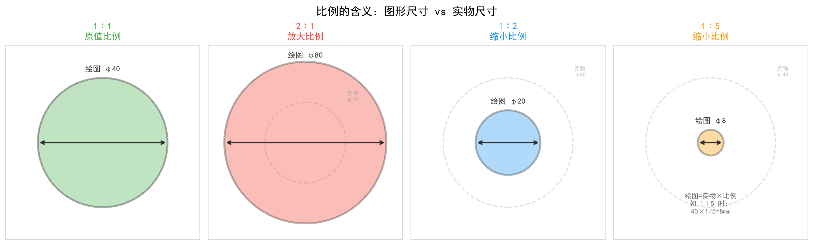

---

## 4. 字体

> **本节目标**：掌握汉字、数字、字母的书写规范，记住字号系列。

### 4.1 汉字

> **(7)** 国家标准规定，图样中汉字应写成 **长仿宋** 体，汉字字宽约为字高 h 的 **0.7** 倍。
>
> **(16)** 汉字应书写 **长仿宋体**，并应采用国家正式公布的简化字。

```
长仿宋体的特征：
┌─────┐
│     │  字宽 ≈ 字高 × 0.7（比正方形窄一些）
│ 工  │  笔画挺直、横平竖直
│ 程  │  起笔、落笔有顿挫
│ 制  │
│ 图  │
└─────┘
```

> **为什么选长仿宋体？** 笔画清晰、结构匀称、不易变形，适合手工书写和工程复制（蓝图）。

### 4.2 数字和字母

> **(23)** 图样中数字和字母分为 **A型和B型** 两种字型。
>
> **(24)** 字母写成斜体时，字头向右倾斜，与水平基准成 **75°**。
>
> **(15)** 斜体字字头向右倾斜，与 **水平基准** 成 75° 角。

| 字体类型 | 要求 |
|----------|------|
| 汉字 | **长仿宋体**，字宽 ≈ 0.7h |
| 数字和字母 | 可写成**直体**或**斜体** |
| 斜体 | 字头向右倾斜，与水平线成 **75°** |
| 字型分类 | **A 型**（较窄）和 **B 型**（较宽） |

### 4.3 字号系列

**字体的号数 = 字体的高度 (h)**，单位：mm。

> **(8)** 字体的号数，即字体的 **高度**。"4"号是国家标准规定的字高吗？→ **不是**。
>
> **(20)** 字体的号数，即字体的高度，单位为 **毫** 米。
>
> **(14)** "5号字"即指该字体高度为 5mm。字体号数代表 **字高**。

> **(19)** 字体高度的公称尺寸系列共分为 **8** 种。
>
> **(21)** 字体高度的公称尺寸系列为：1.8、2.5、3.5、5、**7**、10、14、20。

#### 字号系列表

| 字号 | 1.8 | 2.5 | 3.5 | 5 | **7** | 10 | 14 | 20 |
|:---:|:---:|:---:|:---:|:---:|:---:|:---:|:---:|:---:|
| 字高(mm) | 1.8 | 2.5 | 3.5 | 5 | 7 | 10 | 14 | 20 |

> ⚠️ **常考点**：
> 1. 共 **8 种**字号
> 2. 5 号后面是 **7** 号（没有 6、8、9 号）
> 3. 字号按 **√2** 比率递增（1.8×√2≈2.5，2.5×√2≈3.5...）

> **(22)** 汉字要书写更大的字，字高应按 **√2** 比率递增。

> **为什么是 √2？** 因为 √2 的几何意义是——正方形对角线的长度。在制图历史上，√2 比率确保放大两档后面积正好翻倍（(√2)² = 2），与 A 系列纸张的对折逻辑一致。

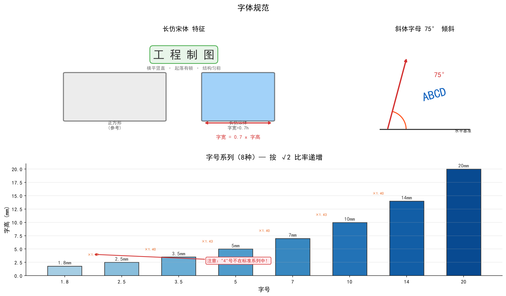

---

## 5. 图线

> **本节目标**：记住常用线型及用途，掌握粗线/细线的宽度比例。

### 5.1 常用线型

> **(9)** 国家标准规定，可见轮廓线用 **粗实线** 表示；不可见轮廓线用 **细虚线** 表示。
>
> **(10)** 在机械图样中，粗线和细线的线宽比例为 **2∶1**。
>
> **(17)** 机械图样中常用的图线线型有粗实线、**细实线**、细虚线、细点画线等。
>
> **(18)** 在绘制图样时，其断裂处的分界线，一般采用国家标准规定的 **波浪** 线绘制。

#### 常用线型速查表

| 图线名称 | 线型 | 用途 | 线宽 |
|----------|:---:|------|:---:|
| **粗实线** | ═══ | 可见轮廓线 | **粗 (d)** |
| **细实线** | ─── | 尺寸线、尺寸界线、剖面线 | 细 (d/2) |
| **细虚线** | ┈┈┈ | 不可见轮廓线 | 细 (d/2) |
| **细点画线** | ─·─·─ | 轴线、对称中心线 | 细 (d/2) |
| **波浪线** | ≈≈≈ | 断裂处分界线 | 细 (d/2) |
| **细双点画线** | ─··─··─ | 轨迹线、相邻辅助零件轮廓 | 细 (d/2) |

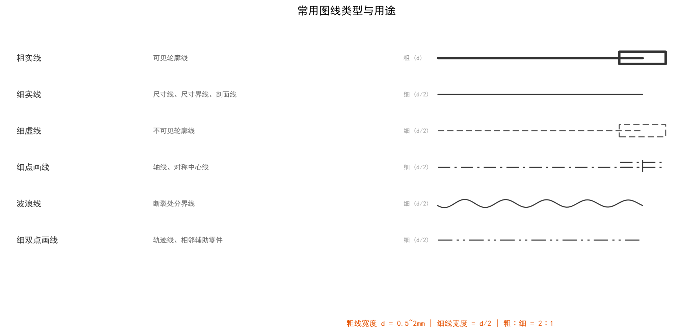

### 5.2 线宽

> **(17)** 绘制机械图样时，应采用机械制图国家标准规定的 **9** 种图线。

国家标准规定了 **9 种图线**类型。不同教材对"几种"的表述略有差异，以所用教材为准。

#### 线宽比例

粗线的宽度 $d$ 按图的复杂程度在 0.5～2 mm 间选择：

| | 粗线 | 细线 |
|---|:---:|:---:|
| 线宽 | **d** (0.5~2mm) | **d/2** |
| 比例 | **2** | **1** |

> **(17)** 图纸上的各种线型，一般分粗、细两种，细线的宽度应为粗线宽度的 **1/3**？（见下方说明）

> ⚠️ **注意**：(10) 和 (17) 的表述角度不同：
> - (10) 说"粗线和细线的线宽比例为 **2∶1**"→ 粗线 = 2 份，细线 = 1 份
> - (17) 说"细线为粗线的 **1/3**"→ 来自不同标准版本或不同教材表述
> - 以你所用教材《机工机械制图与 AutoCAD 习题集》为准：**(10) 的答案是 2∶1**，**(17) 的答案是 1/3**。两者属于不同标准体系（GB/T 4457.4 不同版本），考试以教材说法为准。

---

## 6. 尺寸标注

> **本节目标**：掌握尺寸标注的四要素和各类尺寸（线性、角度、直径、半径、弧长）的标注规则。这是本章**最重要、考点最多**的一节。

### 6.1 标注四要素

> **(1)** 尺寸标注由 **尺寸界线**、**尺寸线**、**尺寸数字** 和 **尺寸终端** 四要素组成。

```
四要素示意图：

  ← 尺寸界线
  ┊                    ← 尺寸线
  ┊      ┌─────┐       ← 尺寸数字
  ┊      │ 50  │
  ┊      └─────┘
  ┊   ←尺寸终端（箭头）→
  ← 尺寸界线
```

| 要素 | 画法 | 说明 |
|------|------|------|
| **尺寸界线** | 细实线 | 从图形轮廓线、轴线或对称中心线引出 |
| **尺寸线** | 细实线 | 与所标注线段平行，不能用其他图线代替 |
| **尺寸数字** | — | 表示机件的真实大小 |
| **尺寸终端** | 箭头或斜线 | 机械图样中一般用**箭头** |

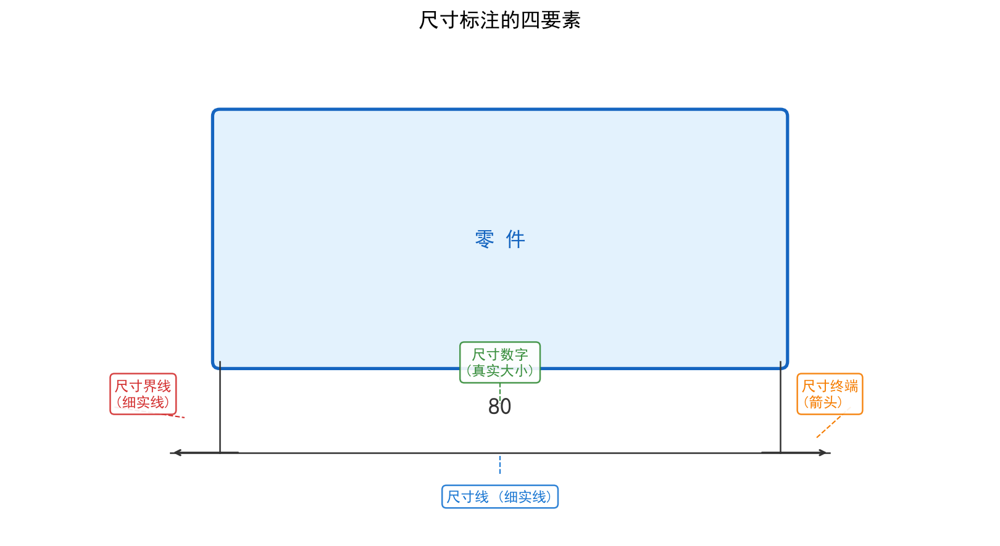

### 6.2 尺寸界线和尺寸线的规则

> **(2)** 尺寸界线一般应与尺寸线 **垂直**，必要时允许 **倾斜**。
>
> **(3)** 尺寸线不能用其它图线代替，一般也不得与其它图线 **重合** 或画在其 **延长线** 上。
>
> **(18)** 图样中 **尺寸线** 不能与其它图线重合或画在其延长线上。
>
> **(4)** 同一图样中，尺寸界线之间应 **平行**。
>
> **(5)** 标注线性尺寸时，尺寸线必须与所标注的线段 **平行**。

> **(26)** 尺寸线用 **细实线** 绘制。
>
> **(27)** 尺寸界线用细实线绘制，并应由图形的 **轮廓线、轴线或对称中心线** 处引出。

> **(11)** 在机械图样中一般采用 **箭头** 作为尺寸线的终端。

### 6.3 线性尺寸标注

#### 尺寸数字的位置

> **(6)** 线性尺寸的数字一般应注写在尺寸线的 **上方**，也允许注写在尺寸线的 **中断处**。
>
> **(28)** 线性尺寸的尺寸数字一般应注写在尺寸线的 **上方**，也允许注写在尺寸线的中断处。

```
一般注写：                    也允许：
  ┌──────┐                    ┌───┐
  │  50  │                    │   │
──┴──────┴──             ───  │50 │  ───
            尺寸线             └───┘
                             尺寸线中断处
```

#### 尺寸数字的方向

> **(7)** 线性尺寸数字的方向，水平数字应 **头朝上**，竖直数字应 **头朝左**。

```
水平尺寸：                  竖直尺寸：
                            头朝左
   头朝上                      ←
  ┌──┐                      ┌─┐
  │50│                      │5│
  └──┘                      │0│
    ↓                      └─┘
   头朝上
```

> ⚠️ **为什么竖直方向是头朝左？** 这样无论从哪个角度看图纸，数字都不会被读反。想象你把图纸旋转 90° 来看竖直尺寸——左侧就是"上方"。

#### 尺寸数字不可被图线通过

> **(8)** 尺寸数字不可被任何图线所通过，否则必须将该图线 **断开**。
>
> **(19)** 图样中尺寸数字不可被任何图线所通过，当不可避免时必须把 **图线** 断开。

```
    ┌───┐
    │ 30│        ← 尺寸数字优先，中心线断开让路
────┘   └────
  中心线在数字处断开
```

> **(23)** **线性** 尺寸数字不可被任何图线通过，否则必须将该图线断开。

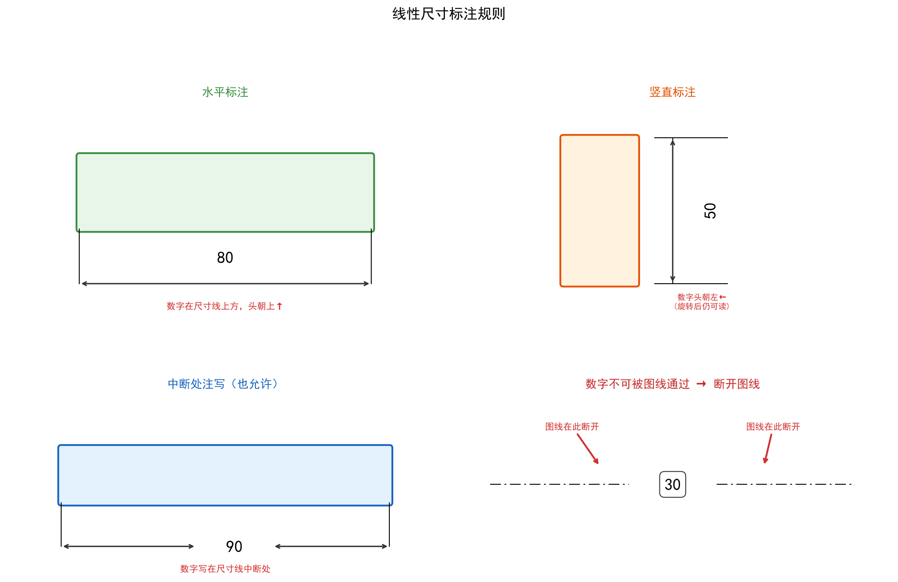

### 6.4 角度、直径、半径标注

#### 角度标注

> **(9)** 标注角度的尺寸数字，一律写成 **水平** 方向。
>
> **(12)** 机械图样中的角度尺寸一律 **水平** 方向注写。
>
> **(29)** 标注 **角度** 尺寸时，尺寸线应画成圆弧，该圆弧的圆心是该角的顶点。

```
  角度标注示例：
  
        45°
    ╱ 圆弧尺寸线
   ╱
  ●────
  顶点
```

> 角度尺寸数字永远是**水平**写的，不像线性尺寸那样顺着尺寸线方向。

#### 直径标注

> **(10)** 标注直径尺寸时，应在尺寸数字前加注符号 **φ**；标注半径尺寸时，加注符号 **R**。
>
> **(28)** 标注圆的直径尺寸时，一般 **尺寸线** 应通过圆心，箭头指到圆弧上。
>
> **(29)** 标注 **圆的直径** 尺寸时，应在尺寸数字前加注直径符号 φ。
>
> **(20)** 标注圆的 **直径** 尺寸时，尺寸线一般应通过该圆圆心。

```
  直径标注：
        φ50
  ╭──────→──────╮
  │             │    ← 尺寸线通过圆心
  │      ●      │
  ╰──────←──────╯
```

#### 半径标注

```
  半径标注：
        R25
         ←
  ╭──────→──────╮
  │             │    ← 尺寸线从圆心出发
  │      ●──────│ 箭头指到圆弧
  ╰─────────────╯
```

#### 球面标注

> **(11)** 标注球面的直径或半径尺寸时，应在符号 φ 或 R 前再加注符号 **S**。
>
> **(21)** 标注 **球面半径** 尺寸时，应在尺寸数字前加注符号 SR。

| 标注对象 | 符号 | 示例 |
|----------|:---:|------|
| 圆的直径 | φ | φ50 |
| 圆的半径 | R | R25 |
| 球的直径 | **Sφ** | Sφ80 |
| 球的半径 | **SR** | SR40 |

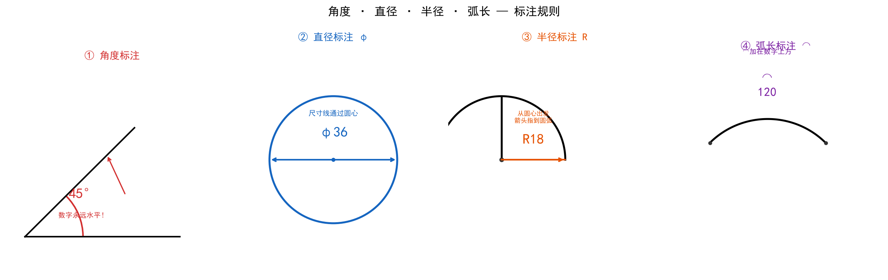

### 6.5 弧长标注

> **(12)** 标注弧长尺寸时，应在尺寸数字上方加注符号 **⌒**。
>
> **(30)** 标注 **弧长** 尺寸时，应在尺寸数字上方加注符号 ⌒。

```
      ⌒
      120
  ╭────────╮
 │          │
 │          │   ← 标注的是这段弧的长度
  ╰────────╯
```

### 6.6 标注基本原则

> **(25)** 零件的每一尺寸，一般只标注 **一次**，并应注在反映该结构最清晰的图形上。
>
> **(22)** 机件的每一尺寸，一般只标注 **一次**。

> **这条规则的意义**：同样的尺寸不要在不同视图上重复标注，避免不一致导致歧义。

> **(26)** 机械零件的真实大小应以图样上 **所注尺寸数值** 为依据，与图形的大小及绘图的准确度无关。
>
> **(24)** 机件的真实大小应以图样上 **所注尺寸** 为依据。

> 🔑 **核心理解**：不管图上的图形画得大还是小（比例 2∶1 或 1∶2），零件做多大**只看尺寸数字**。比如图上画了一个 8mm 的圆，但标了 φ40，那加工出来就是 40mm 的圆形零件——因为图是按 1∶5 画的。

> **(27)** 机械图样上所注的尺寸，为该图样所示零件的 **最后完工尺寸**，否则应另加说明。
>
> **(25)** 机械图样中所标注的尺寸，为该图样所示机件的 **最后完工尺寸**。

> **为什么标最后完工尺寸？** 加工过程中零件的尺寸在不断变化（毛坯→粗加工→精加工），图样上标的是最终成品尺寸。如果某个尺寸要留给后续工序，需要特别说明。

> **(30)** 1 毫米等于 **100忽米** 和 **1000微米**。
>
> - 1 mm = 100 忽米 (cmil) = 1000 微米 (μm)
> - 1 丝米 = 0.1 mm = 100 μm
> - 1 忽米 = 0.01 mm = 10 μm
> - ⚠️ "丝"在工程中是口语，含义依上下文而定（可能是丝米也可能是忽米），以教材为准。

---

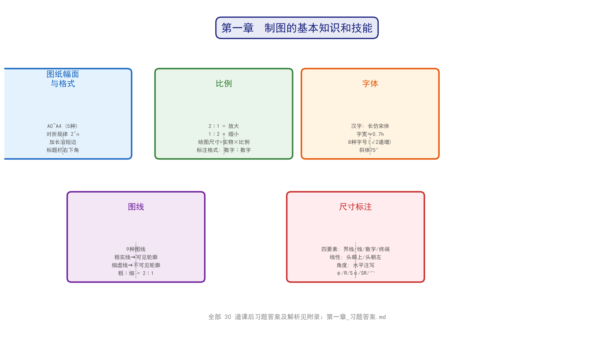

## 7. 本章速查表

### 7.1 核心数据速查

| 知识点 | 答案 |
|--------|------|
| 基本幅面有几种？ | **5 种**（A0~A4） |
| A4 尺寸 B×L | **210 × 297** |
| A3 尺寸 B×L | **297 × 420** |
| A0 → A3 裁切次数 / 张数 | **3 次 / 8 张**（2³ = 8） |
| A0 → A4 裁切次数 / 张数 | **4 次 / 16 张**（2⁴ = 16） |
| 加长沿哪条边？ | **短边** |
| 标题栏位置 | 图框 **右下角** |
| 放大一倍的比例写什么？ | **2∶1** |
| 1∶2 是放大还是缩小？ | **缩小比例** |
| 1∶5 画 φ40 的圆，绘图直径 | **φ8** mm |
| 汉字字体 | **长仿宋体** |
| 汉字字宽 ≈ ? × h | **0.7** 倍 |
| 字号系列共几种？ | **8 种** |
| 字号系列 | 1.8、2.5、3.5、5、**7**、10、14、20 |
| 字号递增比率 | **√2** |
| "4"是国标规定的字高吗？ | **不是**（8 种是 1.8~20） |
| 字号单位 | **毫米 (mm)** |
| 字母斜体倾斜多少度？ | **75°**（向右，与水平基准） |
| 数字字母分几种字型？ | **2 种**（A 型和 B 型） |
| 图线共几种？ | **9 种**（以教材为准） |
| 可见轮廓线用什么线？ | **粗实线** |
| 不可见轮廓线用什么线？ | **细虚线** |
| 波浪线用途 | **断裂处分界线** |
| 粗线 ∶ 细线线宽比 | **2∶1** |
| 尺寸终端（机械图样） | **箭头** |
| 尺寸标注四要素 | **尺寸界线、尺寸线、尺寸数字、尺寸终端** |
| 尺寸线用什么线？ | **细实线** |
| 尺寸数字写在哪？ | 尺寸线上方（或中断处） |
| 水平数字头朝哪？ | **朝上** |
| 竖直数字头朝哪？ | **朝左** |
| 图线通过数字怎么办？ | **断开图线** |
| 角度数字写什么方向？ | **水平** |
| 直径符号 | **φ** |
| 半径符号 | **R** |
| 球面直径/半径符号 | **Sφ / SR** |
| 弧长符号 | **⌒**（加在数字上方） |
| 每尺寸一般标注几次？ | **1 次** |
| 真实大小以什么为准？ | **所注尺寸数值** |
| 标注的是什么尺寸？ | **最后完工尺寸** |
| 1mm = 多少微米？ | **1000 μm** |

### 7.2 常考易错点

| 易错点 | 正确理解 |
|--------|---------|
| 比例 2/1 写法 | ❌ 2/1，✅ **2∶1** |
| 放大倍的写法 | ❌ "放大一倍"，✅ **2∶1** |
| 字号 5 后面 | ❌ 6 号，✅ **7 号** |
| "4"号字 | ❌ 认为是国标字高，✅ **不是**（不在 8 种标准字号里） |
| 尺寸数字被图线通过 | ❌ 没事，✅ **必须断开图线** |
| 尺寸线 | ❌ 可代用，✅ **不能用其他图线代替** |
| 尺寸数值 | ❌ 看图形大小，✅ **只看标注的尺寸数值** |
| 加长方向 | ❌ 长边，✅ **短边** |
| 字号单位 | ✅ **毫米 (mm)** |
| 细线宽 | ✅ **d/2**（教材说法可能不同，以教材为准） |

---

> **学完本章**：你已经掌握了工程制图的所有"语法规则"——图纸、比例、字体、图线、尺寸标注。这些是画图和读图的基本功。

---

## 第二章 立体表面的截交线

> **本节目标**：理解截交线的概念，掌握圆柱体被不同角度平面截切时的三种截面形状。

### 2.1 什么是截交线

**截交线 = 截平面与立体表面的交线。**

用一个平面去切一个立体（如圆柱、圆锥、球），切出来的断面轮廓就是截交线。

### 2.2 圆柱的三种截交线

圆柱体被平面截切时，截交线的形状**取决于截平面与圆柱轴线的相对位置**：

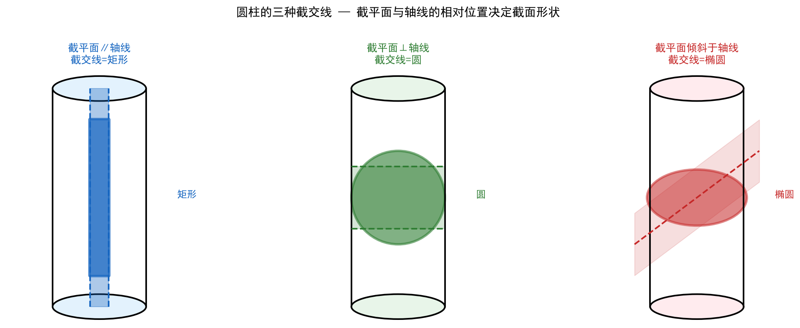

| 截平面位置 | 截交线形状 | 截面图形 | 典型示例 |
|-----------|:---:|:---:|------|
| **平行于轴线** | 矩形 | 两条母线+两条直线 | 轴上键槽的侧面 |
| **垂直于轴线** | **圆** | 与底面同大的圆 | 轴的横截面 |
| **倾斜于轴线** | **椭圆** | 完整椭圆（截全时） | 斜切圆柱管接头 |

> 🔑 **记忆口诀**：截平面平行 → 矩形，垂直 → 圆，倾斜 → 椭圆。
>
> 三条规则归根结底一条：**截交线的形状 = 截平面在圆柱面上的"投影"形状**。

### 2.3 截交线的画法要点

1. 截交线是**封闭的平面图形**。
2. 截交线上的点都是截平面与立体表面的**共有点**。
3. 画截交线 = 找特殊点（最高/最低/最左/最右）→ 找中间点 → 光滑连接。

---

## 第三章 两形体间的连接方式

> **本节目标**：掌握两形体组合时的四种连接方式，能正确判断分界处是否画线。

### 3.1 四种连接方式总览

两个形体组合在一起时，它们表面之间的连接方式决定了**在视图中分界处是否画线**。

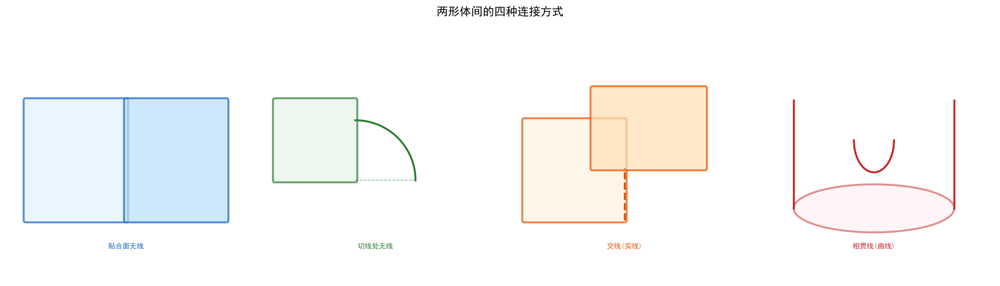

| 连接方式 | 定义 | 分界处画线？ | 关键判断 |
|:---:|------|:---:|------|
| **共面** | 两平面贴合在同一平面上 | ❌ **不画线** | 两面共面→无线 |
| **相切** | 平面与曲面光滑过渡 | ❌ **不画线** | 切点处无线（光滑） |
| **相交** | 两表面不共面，产生交线 | ✅ **画实线** | 交线处必画线 |
| **相贯** | 两立体表面相交产生的曲线 | ✅ **画曲线** | 相贯线是空间曲线 |

### 3.2 共面

两个形体的平面**在同一平面上**，贴合处无缝隙、无落差 → **不在贴合处分界线**。

> **判断技巧**：如果两个平面"高矮平齐"，它们就是共面的。共面处如果画了线，反而会误导读图者以为有了台阶。

### 3.3 相切

平面与曲面（或曲面与曲面）**光滑过渡**，在切点处两个表面"刚好碰上"但没有穿透 → **切点处不画线**。

> **常见例子**：矩形底板和半圆柱头的连接，底板平面与圆柱面相切——切线处不画线。

### 3.4 相交

两个表面**不共面**，相互交叉，产生一条明确的交线 → **交线处必须画实线**。

### 3.5 相贯

两个立体（圆柱与圆柱、圆柱与圆锥等）表面相交，交线通常是**空间曲线**。

以**两圆柱正交**（轴线垂直相交）为例：

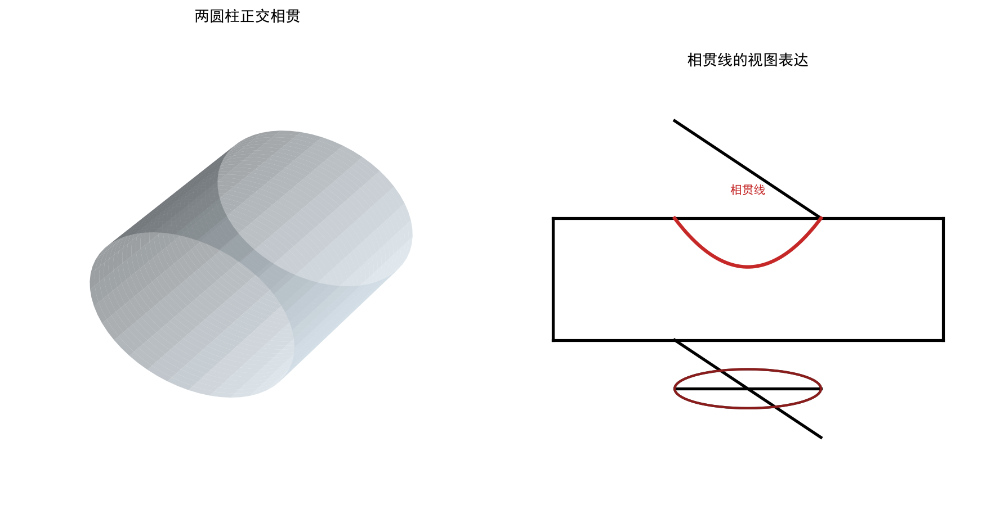

- **主视图**：相贯线表现为**向大圆柱轴线方向弯曲的曲线**。
- **俯视图**：相贯线投影为小圆柱的圆轮廓。

> 🔑 **相贯线口诀**：相贯线 = 两立体表面的**共有线** = 两立体表面一系列**共有点**的集合。

---

## 第四章 组合体的尺寸标注

> **本节目标**：掌握尺寸标注的三大分类——定形尺寸、定位尺寸、总体尺寸——做到"完整、正确、清晰"。

### 4.1 尺寸标注的总原则

**完整、正确、清晰**——缺一不可。

- **完整**：不遗漏、不重复
- **正确**：符合国家标准
- **清晰**：标注在反映形状最明显的视图上

### 4.2 三类尺寸

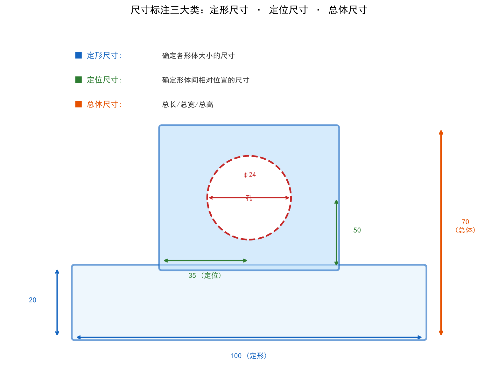

| 类型 | 定义 | 示例 |
|------|------|------|
| **定形尺寸** | 确定各组成部分**自身形状大小**的尺寸 | 底板长100、宽60、高20；孔径φ24 |
| **定位尺寸** | 确定各组成部分之间**相对位置**的尺寸 | 孔到左边距35、孔到底边距50 |
| **总体尺寸** | 物体的**总长、总宽、总高** | 总长100、总宽60、总高70 |

### 4.3 标注步骤

1. **先定形**：标出每个基本形体的定形尺寸
2. **再定位**：标出形体之间的定位尺寸
3. **最后总体**：标出总长、总宽、总高（注意不要与定形/定位尺寸重复）

> ⚠️ **注意**：当总体尺寸与某个定形尺寸相同时，只标一次！这体现了标注的"完整但不重复"原则。

---

## 第五章 正等轴测投影

> **本节目标**：掌握正等轴测图的轴测角、轴向伸缩系数，理解它与三视图的关系。

### 5.1 什么是轴测图

**轴测图 = 用平行投影法绘制的单面立体图**，它能在**一张图**中同时展示物体的长、宽、高三个方向。

- 正等轴测图 = 三个轴向伸缩系数相等的正轴测图。

### 5.2 轴测轴与轴间角

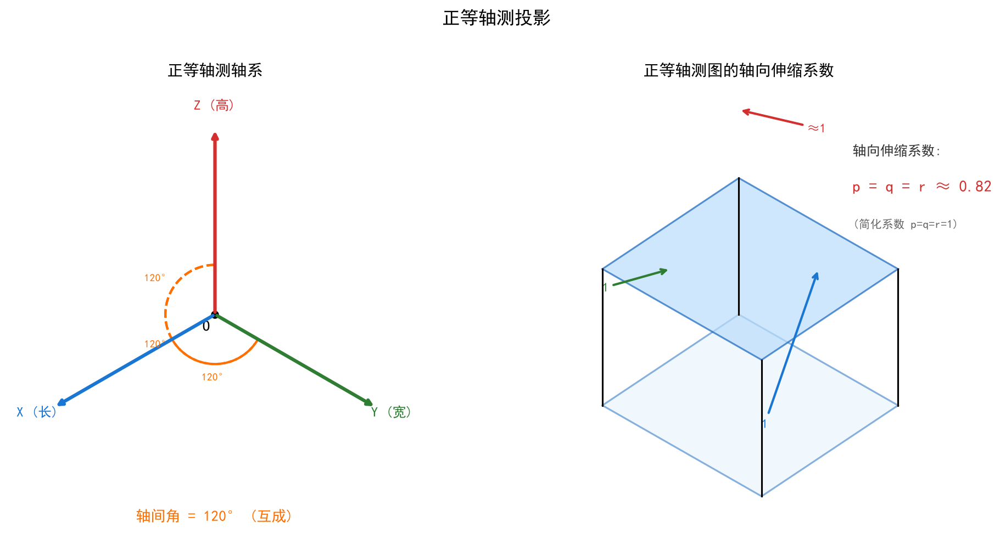

| 参数 | 数值 |
|------|------|
| **轴间角** | 三轴互成 **120°** |
| **轴向伸缩系数** | p = q = r ≈ **0.82** |
| **简化伸缩系数** | p = q = r = **1**（实际绘图时常用） |

### 5.3 三根轴的方向

```
          Z (高)
          │
          │  120°
          │
         / \
        /   \
  120° /     \ 120°
      /       \
     O─────────
    X (长)   Y (宽)
```

- **X 轴**：水平线向左下方 30°（或说与水平成 30°）
- **Y 轴**：水平线向右下方 30°
- **Z 轴**：竖直向上

### 5.4 轴向伸缩系数的含义

实际投影中，三轴方向的长度都会缩短为原来的 **0.82 倍**。但为了画图方便，工程上通常采用**简化系数 p = q = r = 1**，即三个方向按实际尺寸直接量取——画出来的图比真实投影大了约 1.22 倍，但形状完全一样。

> 🔑 **记忆点**：
> - 轴间角 = **120°**（三轴互成）
> - 理论系数 = **0.82**
> - 简化系数 = **1**（实际画图用这个）

---

## 第六章 全剖视图

> **本节目标**：理解剖视图的概念，掌握全剖视图的适用条件。

### 6.1 为什么要用剖视图

在三视图中，内部结构用**虚线**表示。当零件内部结构复杂（有很多孔、槽、腔）时，虚线会密密麻麻，难以分辨。

**解决方案**：假想用剖切面把零件"切开"，拿走前半部分，直接画出内部结构——这就是**剖视图**。

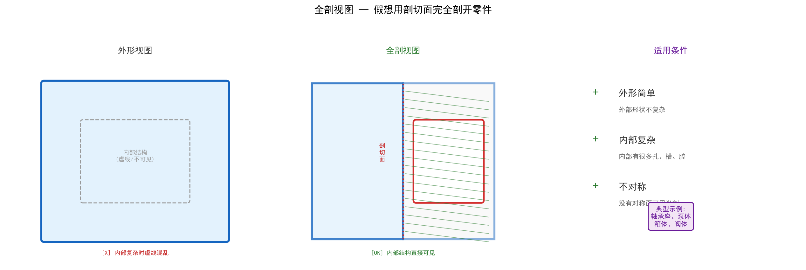

### 6.2 全剖视图的定义

**全剖视图 = 用剖切面完全地剖开零件所得的剖视图。**

### 6.3 适用条件

全剖视图主要用于表达**外形简单、内部结构复杂**且**不对称**的物体：

| 条件 | 说明 |
|------|------|
| **外形简单** | 外部形状不复杂，不需要特别表达 |
| **内部复杂** | 内部有很多孔、槽、腔等结构需要清晰表达 |
| **不对称** | 没有对称面可用半剖（有对称面时优先用半剖） |

> **典型零件**：轴承座、泵体、箱体、阀体等铸造或机加工零件。

### 6.4 剖面符号

剖切面切到的实体部分，应画上**剖面线**（45° 细实线）。不同材料用不同的剖面符号（金属材料统一用 45° 平行细实线）。

---

## 第七章 移出断面图

> **本节目标**：理解断面图与剖视图的区别，掌握移出断面图的用法。

### 7.1 什么是断面图

**断面图 = 假想用剖切面将机件某处切断，仅画出该剖切面与机件接触部分的图形。**

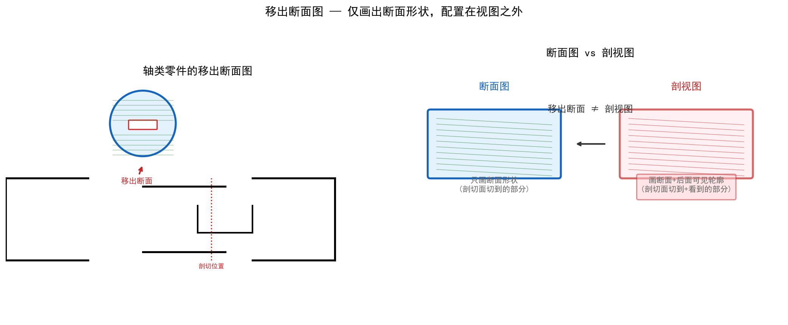

### 7.2 断面图 vs 剖视图

| | 断面图 | 剖视图 |
|---|--------|--------|
| **画什么** | **仅画断面形状** | 断面形状 + 剖切面后面的可见轮廓 |
| **内容** | 只包含被剖切面切到的部分 | 包含切到的和看到的 |
| **配置** | 可移出到视图外（移出断面） | 按投影关系配置 |

> 🔑 **核心区别**：断面图 = "只画伤口"；剖视图 = "画伤口+伤口后面能看到的一切"。

### 7.3 移出断面图的特点

- 画在视图**之外**，配置在剖切符号的延长线上或其他适当位置
- 轮廓线用**粗实线**绘制
- 断面内画**剖面线**
- 多用于**轴类零件**的断面表达（键槽、孔等）

### 7.4 典型应用

轴类零件上的**键槽、小孔、退刀槽**等，用移出断面图可以非常清晰地表达截面形状，而无需单独画一个剖视图。

---

## 本章速查表（第二章~第七章）

| 知识点 | 核心结论 |
|--------|---------|
| 圆柱截交线平行于轴线 | 截面 = **矩形** |
| 圆柱截交线垂直于轴线 | 截面 = **圆** |
| 圆柱截交线倾斜于轴线 | 截面 = **椭圆** |
| 共面连接 | 贴合面处 **不画线** |
| 相切连接 | 切点处 **不画线**（光滑过渡） |
| 相交连接 | 交线处 **必须画实线** |
| 相贯连接 | 两立体表面交线为**空间曲线** |
| 定形尺寸 | 确定形体自身大小的尺寸 |
| 定位尺寸 | 确定形体间相对位置的尺寸 |
| 总体尺寸 | 总长、总宽、总高 |
| 正等轴测轴间角 | 三轴互成 **120°** |
| 轴向伸缩系数(理论) | p = q = r ≈ **0.82** |
| 轴向伸缩系数(简化) | p = q = r = **1** |
| 全剖视图适用 | 外形简单 + 内部复杂 + **不对称** |
| 断面图 | 仅画断面形状（"只画伤口"） |
| 移出断面图 | 画在视图外，轮廓用粗实线 |

---

*最后更新：2026-06-25*
