# 电力电子技术 — 从零开始的完整教程

> **阅读指引**：这份教程假设你只有高中物理的基础（知道电压、电流、电阻、欧姆定律、正弦交流电的基本概念），从最基础的概念开始，一步步带你理解电力电子技术的全部核心知识。每一节都会先解释「是什么」，再解释「为什么」，最后说明「怎么用」。

---

## 目录

1. [电力电子技术是什么](#1-电力电子技术是什么)
2. [必备基础：电学概念回顾](#2-必备基础电学概念回顾)
3. [半导体的秘密：从沙子到开关](#3-半导体的秘密从沙子到开关)
4. [电力电子器件全家福](#4-电力电子器件全家福)
5. [整流电路：把交流变成直流](#5-整流电路把交流变成直流)
   - [5.1 单相半波不可控整流](#51-单相半波不可控整流电路)
   - [5.2 单相半波可控整流（电阻负载）](#52-单相半波可控整流电路)
   - [5.3 电感性负载：让整流变复杂的关键](#53-电感性负载让整流变复杂的关键)
   - [5.4 单相半波可控整流——电感性负载](#54-单相半波可控整流电感性负载无续流二极管)
   - [5.5 续流二极管：电感负载的"救星"](#55-续流二极管电感负载的救星)
   - [5.6 单相桥式整流电路（含电感负载）](#56-单相桥式整流电路)
   - [5.7 三相整流电路](#57-三相整流电路)
   - [5.8 整流电路小结](#58-整流电路小结)
6. [逆变电路：把直流变成交流](#6-逆变电路把直流变成交流)
7. [直流变换电路（斩波电路）](#7-直流变换电路斩波电路)
8. [交流变换电路](#8-交流变换电路)
9. [换流：电流如何在器件间"交接班"](#9-换流电流如何在器件间接交班)
10. [实际应用与总结](#10-实际应用与总结)

---

## 1. 电力电子技术是什么

### 1.1 一句话定义

**电力电子技术 = 用电子器件来处理电能的技术。**

更准确地说，它是利用**半导体开关器件**，对电能进行**变换和控制**的一门技术。

### 1.2 为什么要变换电能？

想象生活中的场景：

- 手机充电器把插座的 **220V 交流电** 变成 **5V 直流电** → 这是 **整流**（AC→DC） + **降压**（DC→DC）
- 电动车电池的直流电驱动交流电机 → 这是 **逆变**（DC→AC）
- 太阳能电池板发出不稳定的直流电，要并到电网上 → 需要 **逆变**
- 空调变频省电 → 这是 **变频**（改变交流电频率）
- 高铁牵引、工业电机调速 → 全都离不开电力电子

**电能变换有四种基本类型：**

| 变换类型    | 专业名称                       | 符号  | 典型应用               |
| ----------- | ------------------------------ | ----- | ---------------------- |
| 交流 → 直流 | **整流** (Rectification)       | AC→DC | 手机充电器、电镀电源   |
| 直流 → 交流 | **逆变** (Inversion)           | DC→AC | 电动车电机、太阳能并网 |
| 直流 → 直流 | **斩波** (Chopper)             | DC→DC | 开关电源、电池管理     |
| 交流 → 交流 | **变频/调压** (Cycloconverter) | AC→AC | 变频空调、风机调速     |

> **一句话记**：电力电子就是「AC、DC 之间任意转换」。

### 1.3 电力电子和普通电子学的区别

|              | 电力电子                            | 普通电子（信息电子） |
| ------------ | ----------------------------------- | -------------------- |
| **处理什么** | 电能本身（大功率）                  | 信号/信息（小功率）  |
| **功率等级** | 瓦(W)～兆瓦(MW)                     | 毫瓦(mW)～瓦(W)      |
| **关心的**   | 效率要高、发热要少                  | 信号不失真、速度快   |
| **开关状态** | 通常工作于**开关状态**（导通/关断） | 常工作于放大状态     |
| **典型器件** | 晶闸管、IGBT、功率MOSFET            | 三极管、运放、CPU    |

> **核心理解**：电力电子器件大多数时候像**电灯开关**一样工作——要么全开（导通），要么全关（关断），中间状态尽量少待。为什么？因为中间状态器件上既有电压又有电流，**发热 = 电压 × 电流**，会烧坏器件。

---

## 2. 必备基础：电学概念回顾

> **你可以当查字典用**。已经熟悉的可以快速浏览，不懂的停下来细看。

### 2.1 电压、电流、电阻和功率

**电压 (U)**：两点之间的"电势差"，类比水压。单位：伏特 (V)。

- 电压是"推动"电荷流动的力量。就像水位差推动水流。

**电流 (I)**：电荷的定向流动。单位：安培 (A)。

- 1A = 每秒钟流过 1 库仑电荷。类比水管中水的流量。

**电阻 (R)**：阻碍电流流动的能力。单位：欧姆 (Ω)。

- 欧姆定律：**I = U / R**。电压固定时，电阻越大，电流越小。

**功率 (P)**：单位时间消耗或转换的能量。单位：瓦特 (W)。

- 直流电路：**P = U × I**
- 交流电路：**P = U × I × cosφ**（cosφ 是功率因数，后面会讲）

> **类比记忆**：电流如水流，电压如水压，电阻如管道粗细。功率就是水流冲击涡轮机时每秒钟做的功。

### 2.2 直流电 (DC) 和交流电 (AC)

**直流电 (DC)**：
- 电流方向不变，电压大小不变。
- 例如：电池的 1.5V。

**交流电 (AC)**：
- 电压按正弦规律周期性变化，电流方向也周期性交替。
- 我国家用电：220V / 50Hz。
  - "220V"是**有效值**（RMS），不是最大值。最大值为 220 × √2 ≈ 311V。
  - "50Hz"表示每秒变化 50 个周期。

**正弦波交流电的三个参数：**

$$u(t) = U_m \sin(\omega t + \phi)$$

| 参数           | 符号 | 含义                 | 举例                |
| -------------- | ---- | -------------------- | ------------------- |
| 幅值（最大值） | U_m  | 正弦波的最大值       | 311V                |
| 角频率         | ω    | ω = 2πf，单位：rad/s | f=50Hz → ω=314rad/s |
| 初相位         | φ    | t=0 时的角度         | 0°                  |

**有效值的概念**：交流电的有效值 = 能产生相同发热效果的直流电值。

$$U_{\text{有效}} = \frac{U_m}{\sqrt{2}}$$

> **为什么是 √2？** 因为功率和电压的平方相关，正弦平方的平均值是 1/2，开根号就是 1/√2。

### 2.3 电感和电容

这两个元件是电力电子中的"储能仓库"。

**电感 (L)**：单位：亨利 (H)

- 电感 = 线圈绕成的元件。
- **核心特性**：电感中的电流不能突变。
  - 类比：电感像飞轮——想让它突然停下来？不行，它有惯性。
- 它存储的是**磁场能量**：$E = \frac{1}{2}LI^2$
- 对直流：稳态下是**短路**（理想导线）。
- 对交流：阻碍高频，"通低频阻高频"。

**电容 (C)**：单位：法拉 (F)

- 电容 = 两片金属中间夹绝缘层。
- **核心特性**：电容两端的电压不能突变。
  - 类比：电容如水缸——往里面突然灌很多水？水位不会立刻升高。
- 它存储的是**电场能量**：$E = \frac{1}{2}CU^2$
- 对直流：稳态下是**断路**（完全不导电）。
- 对交流："通高频阻低频"。

> **关键对比**（考试必考）：
>
> |  | 电感 | 电容 |
> |---|---|---|
> | 不能突变 | **电流 i** | **电压 u** |
> | 储能形式 | 磁场 | 电场 |
> | 对直流稳态 | 短路 | 断路 |
> | **在逆变器中充当** | 电流源型逆变器的储能 | 电压源型逆变器的储能 |

### 2.4 电角度与相位

**电角度**是将交流电的一个周期（360°）和正弦函数的周期（2π 弧度）对应起来。

- 一个交流电周期 = 360° 电角度 = 2π 弧度
- 50Hz 交流电：一个周期 = 1/50 = 0.02秒 = 20毫秒
- 所以 1ms 对应的电角度 = 360° / 20ms × 1ms = 18°

**为什么要用电角度？** 因为在电力电子中，我们控制的是"在交流电波形中哪个时刻打开开关"，这个时刻用电角度来描述最方便。

---

## 3. 半导体的秘密：从沙子到开关

> **本节目标**：理解为什么半导体能做开关，以及 PN 结是什么。这是所有电力电子器件的基础。

### 3.1 导体、绝缘体和半导体

- **导体**（如铜、铝）：里面有大量自由电子，容易导电。电阻率很小。
- **绝缘体**（如橡胶、玻璃）：几乎没有自由电子，很难导电。电阻率极大。
- **半导体**（如硅 Si、锗 Ge）：介于两者之间。
  - **纯硅**几乎不导电（4 个外层电子都用于共价键，没有自由电子）。
  - 但可以通过**掺杂**来改变导电性。

### 3.2 掺杂——给硅"加调料"

| 掺杂类型 | 掺什么                    | 效果                     | 叫法               |
| -------- | ------------------------- | ------------------------ | ------------------ |
| **N 型** | 磷(P)、砷(As)（5 价元素） | 多出自由电子             | 电子是"多数载流子" |
| **P 型** | 硼(B)、铝(Al)（3 价元素） | 产生"空穴"（缺电子位置） | 空穴是"多数载流子" |

> **空穴是什么？** 把半导体想象成一个停车场，P 型掺杂相当于故意拿掉一些车，留下空车位。旁边的车可以往空车位挪动，看起来就像空车位在"移动"。空穴带正电，它的移动也形成电流。

### 3.3 PN 结——半导体的心脏

把一块 **P 型半导体** 和一块 **N 型半导体** 贴在一起，交界面就形成了 **PN 结**。

**PN 结的核心特性：单向导电性**

- **正向偏置**（P 接正极，N 接负极）→ **导通**（电流流过）
- **反向偏置**（P 接负极，N 接正极）→ **截止**（电流几乎为零）

> **为什么？** 因为 PN 结内部有一个"耗尽层"——相当于一道没有载流子的"城墙"。正向偏置使城墙变薄，电流可以通过；反向偏置使城墙变厚，完全堵死。

**基础知识：1 个二极管 = 1 个 PN 结。**

### 3.4 晶闸管（Thyristor / SCR）的内部结构

**晶闸管有 3 个 PN 结**：J1、J2、J3（从外到内的编号）。

等效结构：可以看作一个 **PNP 三极管** 和一个 **NPN 三极管** 的组合。

晶闸管有三个电极：
- **阳极 (Anode, A)**：高电位端
- **阴极 (Cathode, K)**：低电位端
- **门极 (Gate, G)**：控制端

> 门极就像"扳机"——给它一个小信号，就能触发整个管子导通。

---

## 4. 电力电子器件全家福

> **本节目标**：认识每种器件的名字、符号、特点，理解"半控型"和"全控型"的区别。

### 4.1 器件分类总览

电力电子器件按**可控程度**分为三大类：

| 类型         | 定义                       | 代表器件                 | 能控制导通？ | 能控制关断？ |
| ------------ | -------------------------- | ------------------------ | ------------ | ------------ |
| **不可控型** | 导通和关断由电路自身决定   | 电力二极管 (Power Diode) | ❌            | ❌            |
| **半控型**   | 能控制导通，但不能控制关断 | 晶闸管 (SCR / Thyristor) | ✅            | ❌            |
| **全控型**   | 既能控制导通，也能控制关断 | GTO、GTR、MOSFET、IGBT   | ✅            | ✅            |

> **一句话**：不可控 = 随波逐流；半控 = 能开不能关；全控 = 开和关都能控制。

### 4.2 电力二极管 (Power Diode)

- **符号**：`▶|`（三角形指向竖线）
- **本质**：1 个 PN 结
- **特性**：正向导通，反向截止
- **不可控**：你无法通过任何控制信号命令它导通或关断——它自己看电压极性决定。
- **导通条件**：阳极电压 > 阴极电压（且超过门槛电压，约 0.7V）
- **关断条件**：阴极电压 > 阳极电压（反向偏置）

### 4.3 晶闸管 (SCR / Thyristor)

- **符号**：类似二极管但多一条门极线
- **全名**：硅控整流器 (Silicon Controlled Rectifier)
- **类型**：**半控型**

**导通条件**（两个条件必须同时满足）：

1. 阳极电压 > 阴极电压（正向偏置）
2. 门极有正向触发脉冲（给一个小电流）

**关断条件**：

- 阳极电流 < 维持电流 (I_H)，即电流几乎降到零。
- 或者给阳极加反向电压，迫使电流降为零。

> **晶闸管的核心记忆点**：
> - 一旦导通，门极就**失去控制权**了——你撤掉门极信号，它照样导通。
> - 这就像手榴弹：拉了引信（门极触发）就扔出去了（导通），引信坏不坏都不影响爆炸。
> - 关断的唯一办法：**让阳极电流降到零**（或加反向电压）。

**晶闸管的 3 个 PN 结 (J1, J2, J3)**：

```
阳极 — [P — N — P — N] — 阴极
        J1    J2   J3
```

**型号举例**：KK200-9
- KK = 快速晶闸管
- 200 = 额定电流 200A
- 9 = 额定电压 900V（9×100）

### 4.4 门极可关断晶闸管 (GTO)

- **类型**：**全控型**
- GTO = Gate Turn-Off Thyristor
- 门极加**正脉冲** → 导通
- 门极加**负脉冲**（大电流）→ 关断
- 优点：能自己关断
- 缺点：关断需要很大的门极负电流（约为阳极电流的 1/3 到 1/5）

### 4.5 电力三极管 (GTR / BJT)

- **类型**：**全控型**
- GTR = Giant Transistor（巨型三极管）
- 本质就是功率放大版的普通三极管。
- **电流驱动**：基极加电流 → 导通；撤掉基极电流 → 关断。
- 缺点：基极需要持续电流维持导通，驱动功耗大。

### 4.6 电力 MOSFET

- **类型**：**全控型**
- MOSFET = Metal-Oxide-Semiconductor Field-Effect Transistor（金属-氧化物-半导体场效应晶体管）
- 名字很长但原理不复杂：**用电场来控制导通**。
- **电压驱动**：栅极加电压 → 导通；撤掉栅极电压 → 关断。
- 栅极几乎不取电流（输入阻抗极高）→ 驱动功耗极小。
- 特点：开关速度快，但耐压不如 IGBT 高。

**为什么叫"场效应"？** 因为它是用电场（电压）来控制器件的，不是用电流。

| 对比         | MOSFET       | GTR/BJT      |
| ------------ | ------------ | ------------ |
| 驱动方式     | **电压**驱动 | **电流**驱动 |
| 所需驱动功率 | 极小         | 较大         |
| 开关速度     | 快           | 较慢         |

### 4.7 绝缘栅双极型晶体管 (IGBT)

- **类型**：**全控型**
- IGBT = Insulated Gate Bipolar Transistor
- **可等效为一个 MOSFET 和一个 GTR 的级联组合**
- MOSFET 部分负责"电压控制"（输入特性好）
- GTR 部分负责"大电流"（输出能力强）
- **集两者之长**：电压控制 + 大功率能力
- 目前在中等功率到较大功率场合应用最广泛（如高铁牵引、电动车驱动）

### 4.8 双向晶闸管 (TRIAC)

- **类型**：**半控型**（双向 SCR）
- 相当于两个晶闸管反并联在一起，能**双向导电**。
- 三个电极：**门极 G**、**主电极 T1**、**主电极 T2**
- 四种触发方式：
  - **Ⅰ⁺**：T2 为正，门极加正信号
  - **Ⅰ⁻**：T2 为正，门极加负信号
  - **Ⅲ⁻**：T2 为负，门极加负信号
  - **Ⅲ⁺**：T2 为负，门极加正信号
- 用于交流调压、台灯调光等。

### 4.9 器件关键参数

| 参数         | 含义                 | 重要原因                             |
| ------------ | -------------------- | ------------------------------------ |
| **通态压降** | 导通时器件两端的电压 | 决定**通态损耗**：压降越低，损耗越小 |
| **额定电压** | 能承受的最大电压     | 超过就击穿                           |
| **额定电流** | 能通过的最大电流     | 超过就烧毁                           |
| **开关速度** | 导通/关断需要的时间  | 决定工作频率上限                     |

> **考试重点**：通态压降越低 → 通态损耗越小；通态压降越高 → 通态损耗越大。

---

## 5. 整流电路：把交流变成直流

> **本节目标**：理解用二极管或晶闸管如何把交流电变成直流电，掌握控制角 α 的概念。

### 5.1 单相半波不可控整流电路

这是最简单的整流电路——只用 **1 个二极管**。

```
交流电源──▶│──电阻负载──地
         二极管
```

**工作原理**：
- 交流电正半周（上正下负）：二极管正向偏置 → **导通**，电流流过负载。
- 交流电负半周（上负下正）：二极管反向偏置 → **截止**，没有电流。

**波形分析**：

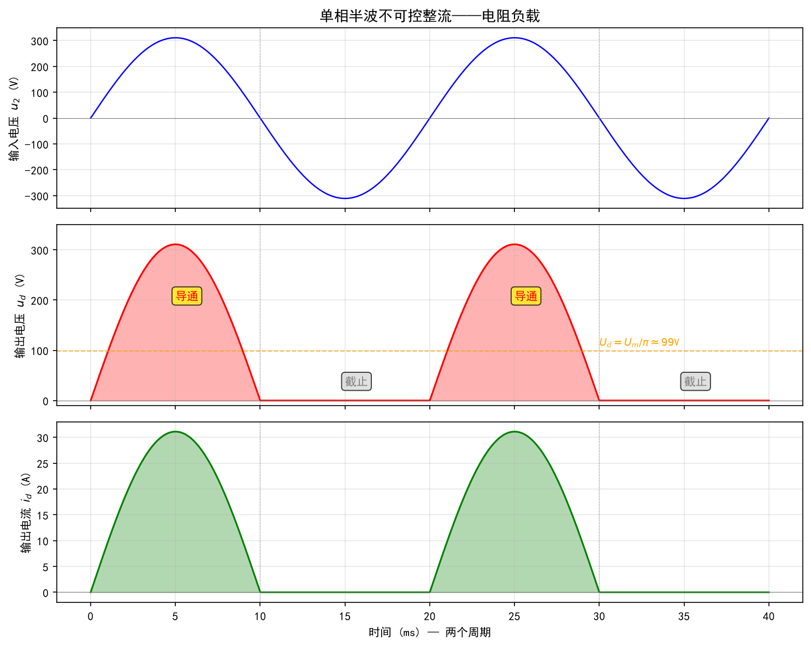

> **波形解读**：
> - **输入电压 $u_2$**：标准的正弦波，正负各半。
> - **输出电压 $u_d$**：只有正半周的"山头"——二极管在正半周导通、负半周截止，把负半周全部"切掉"了。
> - **输出电流 $i_d$**：与输出电压同形状（纯电阻负载，$i_d = u_d / R$）。

**平均输出电压**：

$$U_d = \frac{U_m}{\pi} \approx 0.318 \cdot U_m$$

（半波整流的平均值 = 最大值除以 π）

**推导思路**：把一个正弦半波面积平均到一个完整周期上。
$$U_d = \frac{1}{2\pi} \int_0^{\pi} U_m \sin(\omega t) \, d(\omega t) = \frac{U_m}{\pi}$$

> 想象正弦波是山，只取上半部分的面积，再摊平到整个周期上。

### 5.2 单相半波可控整流电路

把二极管换成**晶闸管**，就变成了可控整流。

**核心改变**：不是正半周一开始就导通，而是你在**控制角 α** 时刻给门极发触发脉冲，晶闸管才导通。

#### 控制角 α 的概念（极其重要）

> **控制角 α**：从晶闸管开始承受正向电压起，到你发触发脉冲让它导通这一刻之间的**电角度**。

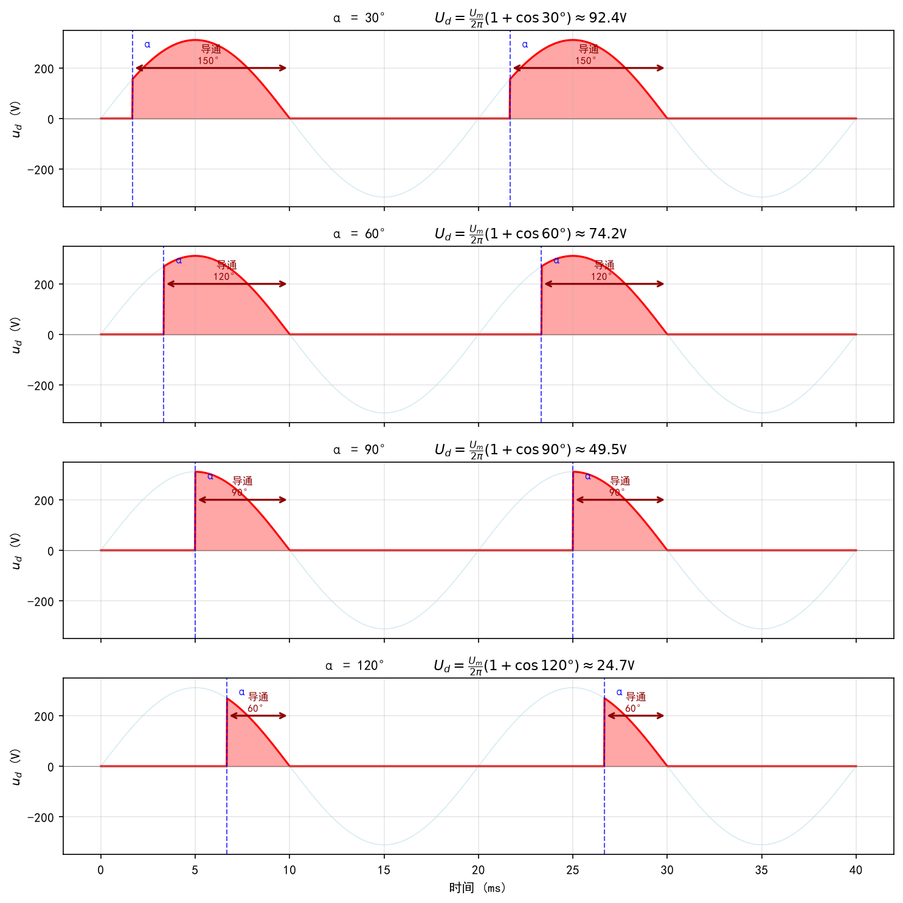

> **波形解读**：
> - 四张子图分别对应 α = 30°、60°、90°、120°。
> - 浅蓝色背景是输入正弦波，**红色填充区域**是实际输出电压。
> - α 越大 → 导通角越小（导通角 = 180° − α）→ 输出电压越低。
> - α = 120° 时，输出电压几乎为零，因为正半周都快结束了才触发。

- α=0°：正半周一开始就导通 → 输出最大（和二极管整流一样）
- α=90°：正半周过了一半才导通 → 输出一半
- α=180°：正半周结束了才触发 → 没输出

**因此 α 越大，输出电压越小。**

#### 电阻负载时平均输出电压：

$$U_d = \frac{U_m}{2\pi}(1 + \cos\alpha)$$

> **推导**：积分从 α 到 π，而不是从 0 到 π。
> $$U_d = \frac{1}{2\pi} \int_{\alpha}^{\pi} U_m \sin(\omega t) \, d(\omega t) = \frac{U_m}{2\pi}(1+\cos\alpha)$$

**平均输出电流**：
$$I_d = \frac{U_d}{R}$$

#### 计算题示例（来自复习资料）

> 单相半波可控整流电路，$u_2 = 311\sin(\omega t + 100°)$，R = 20Ω，α = 60°，求 $U_d$ 和 $I_d$。

解答：
1. $U_m = 311V$
2. $U_d = \frac{311}{2\pi}(1 + \cos 60°) = \frac{311}{2\pi}(1 + 0.5) = \frac{311 × 1.5}{2\pi} ≈ 74.2V$
3. $I_d = U_d / R = 74.2 / 20 ≈ 3.71A$

> **注意**：初相角 100° 在一个周期内不影响积分结果。
> 但 $u_2=311\sin(9t+100°)$ 中 9 是角频率且非常规值（通常 50Hz 对应 ω=314）。
> 这里可能是 $u_2 = 311\sin(\omega t + 100°)$ 的书写变形。

### 5.3 电感性负载：让整流变复杂的关键

> **本节目标**：理解电感负载对整流电路的根本影响——为什么加了电感，一切都变了。

#### 5.3.1 什么是电感性负载？

前面的分析都假设负载是**纯电阻**的。但在实际应用中，很多负载都含有电感成分：

- **电机绕组**（线圈绕制，天生带电感）
- **变压器的原边/副边**（本质就是绕在铁芯上的线圈）
- **电磁铁、继电器线圈**
- **滤波电感**（电路中故意串入的电感）

这些负载不能简单地当作纯电阻来处理。电感的存在会**彻底改变**整流电路的工作方式。

#### 5.3.2 电感的"惯性"——电流不能突变

回顾第 2.3 节的核心知识：**电感中的电流不能突变**。

> **类比**：电感像一个很重的飞轮。你给它通电 = 推动飞轮旋转；你断开电源 = 飞轮不会立刻停止，它有巨大的惯性，会继续带着"电流"往前转。你越想让它停（电压消失甚至反转），它越要"反抗"。

这个特性在整流电路中意味着什么？

| | 纯电阻负载 | 电感性负载 |
|---|---|---|
| 电压过零时 | 电流也过零，晶闸管自然关断 | 电感"惯性"让电流继续流，**晶闸管不关断** |
| 电压变负时 | 没有电流流过 | 电感释放储能，电流继续流 |
| 输出电压波形 | 只有正（或零） | 可能出现**负值** |

#### 5.3.3 电感性负载的物理过程——感应电动势

当交流电源电压变化时，电感会产生**感应电动势**来"反抗"电流的变化：

$$e_L = -L\frac{di}{dt}$$

- **电流增加时**（$di/dt > 0$）：电感产生反向电动势，**阻碍**电流增加 → 电感在"吸收能量"（储存磁场能）
- **电流减小时**（$di/dt < 0$）：电感产生正向电动势，**试图维持**电流 → 电感在"释放能量"

> **核心理解**：当电源电压降到零甚至变负时，电感释放之前储存的磁场能量，继续"推着"电流流过晶闸管。这导致晶闸管在电压过零后仍然导通，输出电压出现**负向面积**。

#### 5.3.4 电感性负载的等效模型

实际电感性负载通常等效为**电感 L 和电阻 R 的串联**（R-L 串联负载）。

```
     L        R
  ──༈༈༈───≈≈≈──
  电感    电阻
```

- **L 的大小**决定"惯性"多大：L 越大，电流越不易变化，导通时间越长。
- **R 的大小**决定能量消耗多快：R 越大，电感储能越快耗尽。

> 极端情况：如果 L → ∞（电感无限大），电流几乎恒定不变 —— 这是分析中常用的理想化假设。

---

### 5.4 单相半波可控整流——电感性负载（无续流二极管）

#### 5.4.1 电路结构

```
交流电源 ──▶│─────────┬──────────┬── 地
          晶闸管   电感 L    电阻 R
                    (R-L 串联负载)
```

> 注意：这里没有续流二极管。我们先分析没有它时会发生什么，才能理解为什么需要它。

#### 5.4.2 工作过程详解（四个阶段）

**阶段一：触发导通（ωt = α）**
- 在控制角 α 时刻，门极加触发脉冲。
- 此时阳极电压为正（交流电正半周），晶闸管满足导通条件。
- 电流开始从零上升，流过电感和电阻。

**阶段二：电流上升（α → 电流峰值）**
- 电感阻碍电流快速增加（$e_L$ 与电源电压反向），电流从零开始**缓慢上升**。
- 电源能量一部分消耗在电阻上（发热 = $I^2R$），一部分储存在电感中（磁场能 = $\frac{1}{2}LI^2$）。
- 电流达到峰值的时刻**滞后于**电压峰值时刻（因为电感的"拖延"效应）。

**阶段三：电压过零后（ωt > π）—— 关键！**
- 电源电压变为负值！
- 但是电感释放储存的能量，感应电动势的方向试图**维持原电流方向**。
- 只要电感释放的能量足够大，电流继续朝同一方向流动。
- 晶闸管**依然导通**——因为电流方向没变，阳极电流仍大于维持电流 $I_H$。
- **输出电压出现负值**（因为电源电压已变负，但电流还在流）。

**阶段四：晶闸管关断（电流降到零）**
- 电感储存的能量逐渐被电阻消耗殆尽。
- 当电流降到晶闸管维持电流 $I_H$ 以下时，晶闸管关断。
- 关断时刻的电角度记作 **关断角 θ_off**（或熄灭角）。

#### 5.4.3 输出电压波形

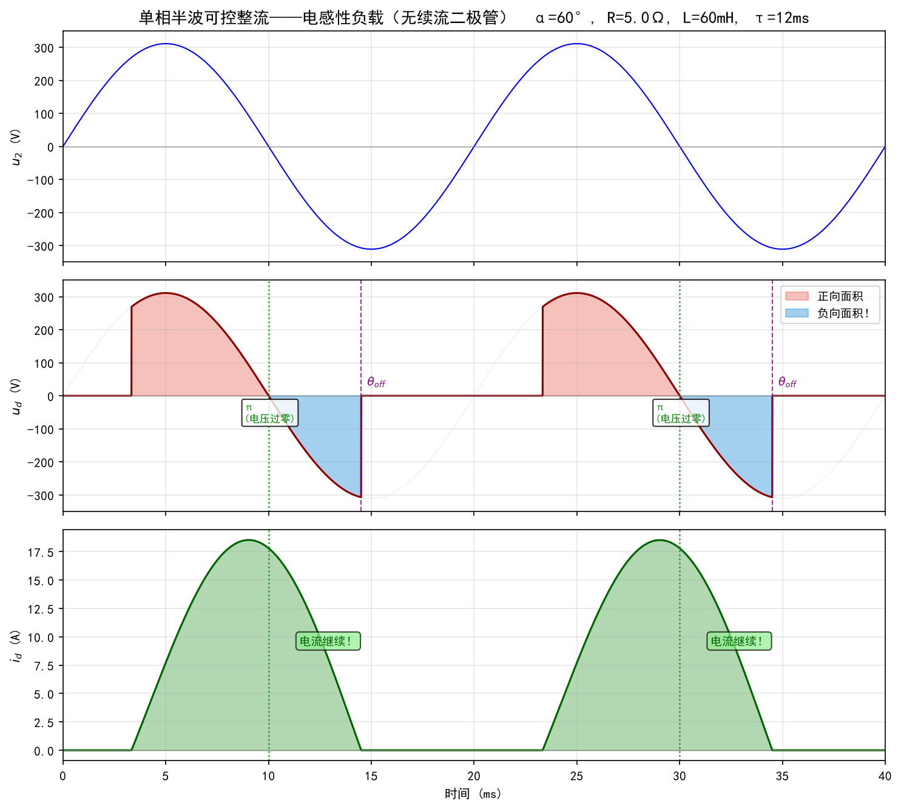

> **波形解读（重点！）**：
> - **输出电压 $u_d$**：导通从 α 开始，一直延续到 π **之后**！绿色虚线标记了 ωt = π（电压过零点）。π 之后输出电压出现**负值**（蓝色填充区域 = 负向面积）。
> - **输出电流 $i_d$**：波形圆滑（电感平滑作用），在电压过零后仍继续流动——电感释放储能"拖着"电流不放。
> - **红色区域**（正向面积）被**蓝色区域**（负向面积）部分抵消 → $U_d$ 比同 α 下电阻负载时**更低**。

#### 5.4.4 平均输出电压

电感性负载（无续流二极管）时，设导通角为 $\theta = \theta_{off} - \alpha$：

$$U_d = \frac{1}{2\pi}\int_{\alpha}^{\alpha+\theta} U_m \sin(\omega t) \, d(\omega t) = \frac{U_m}{2\pi}[\cos\alpha - \cos(\alpha+\theta)]$$

> 由于导通延伸到负半周（$\theta > \pi - \alpha$），$U_d$ **小于**同 α 下电阻负载的值。

**极端情况**：如果电感非常大（L → ∞，理论上），电流几乎不变，导通角趋近于 $2\pi - 2\alpha$。但实际中电感总是有限的，电感储能最终会被电阻消耗完。

**电感大小对波形的影响**：

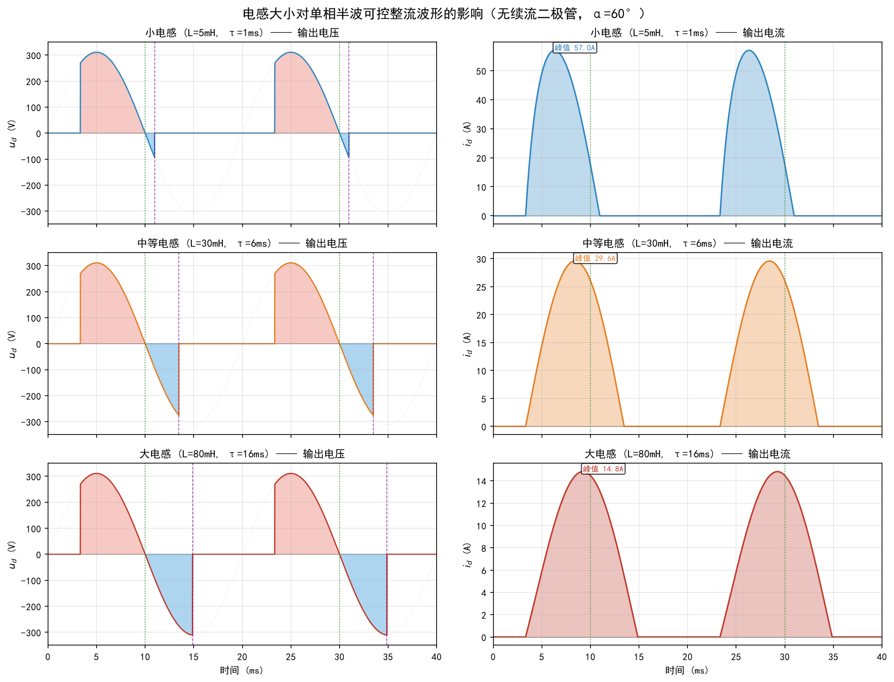

> **波形解读**：
> - **小电感（L=5mH, τ=1ms）**：电流在 π 附近就快速衰减到零，负向面积几乎不可见，接近电阻负载特性。
> - **中等电感（L=30mH, τ=6ms）**：电流明显延续到 π 之后，出现可见的负向面积（蓝色区域）。
> - **大电感（L=80mH, τ=16ms）**：电流延伸到很远的负半周，负向面积很大，$U_d$ 显著降低。紫色虚线标记了各电感下的关断角 $\theta_{off}$。

#### 5.4.5 电感性负载无续流二极管时的问题总结

| 问题 | 原因 | 后果 |
|------|------|------|
| **输出电压降低** | 负向面积抵消正向面积 | 同样的 α，Ud 比电阻负载小 |
| **输出电流脉动大** | 电流不连续 | 不适合需要平稳直流的场合 |
| **晶闸管关断不可靠** | 电流"拖着不放" | 控制不精准 |
| **输出电压调节范围受限** | α 较大时可能完全不导通 | 调压范围变窄 |

> 这些问题引出了**续流二极管**的发明——它是解决电感性负载整流问题的关键！

---

### 5.5 续流二极管：电感负载的"救星"

#### 5.5.1 续流二极管的原理

**续流二极管**（Freewheeling Diode，简称 FWD）是一个普通的电力二极管，**反向并联在感性负载两端**（即与 R-L 负载并联）。

```
交流电源 ──▶│─────────┬── 电感L ── 电阻R ──┬── 地
          晶闸管      │                     │
                      └──────▶├─────────────┘
                              续流二极管
                            (阴极在上，阳极在下)
```

> **接法要点**：续流二极管的**阳极接负载下端，阴极接负载上端**。在晶闸管导通（整流）期间，二极管承受反向电压 → **不导通**。

#### 5.5.2 带续流二极管时的工作过程

**阶段一：晶闸管导通阶段（ωt = α → π）**
- 晶闸管被触发导通，交流电源向负载供电。
- 续流二极管承受反向电压（阴极电位高于阳极）→ **不导通**。
- 电流路径：**电源 → 晶闸管 → 电感 → 电阻 → 回到电源**。
- 电感在"充电"（储存磁场能）。

**阶段二：电源电压过零变负（ωt = π）—— 续流开始**
- 电源电压变为负值！
- 电感产生感应电动势：**上负下正**（试图维持原电流方向从下往上）。
- 这个感应电动势使续流二极管变为**正向偏置** → 续流二极管**导通**！
- 晶闸管因承受反向电压（阳极接电源负端，阴极通过续流二极管接负载上端）而**关断**。

**阶段三：续流阶段（ωt = π → 2π+α）**
- 电流不再经过电源和晶闸管。
- 电流沿回路：**电感下端 → 电阻 → 续流二极管（阳极→阴极）→ 回到电感上端**。
- 电感储存的磁场能量通过续流二极管消耗在电阻上，电流逐渐衰减。
- **负载两端电压** = 续流二极管导通压降 ≈ **0V**（忽略二极管管压降约 0.7V~1V）。

**阶段四：下一个触发脉冲到来（ωt = 2π + α）**
- 晶闸管再次被触发导通。
- 续流二极管重新承受反向电压，自然关断。
- 新的周期开始，重复上述过程。

#### 5.5.3 为什么续流二极管能解决电感负载的问题？

| 解决的问题 | 原理 |
|-----------|------|
| **消除负向电压** | 晶闸管在 ωt=π 时承受反向电压而关断，输出电压不再为负 |
| **保护晶闸管** | 电感电流有了"出路"，不会强迫晶闸管继续导通 |
| **提高输出电压** | 没有负向面积抵消，平均输出电压更高 |
| **改善输出波形** | 电流更加连续、平滑 |
| **防止过电压** | 没有续流二极管时，电感电流被突然切断会产生极高感应电压 $L\frac{di}{dt}$，可能击穿器件 |

> **核心记忆**：续流二极管 = 给电感电流一个"回路"继续流，不让它"纠缠"晶闸管。电感能量在负载内部消耗掉，不影响电源侧。

#### 5.5.4 波形分析

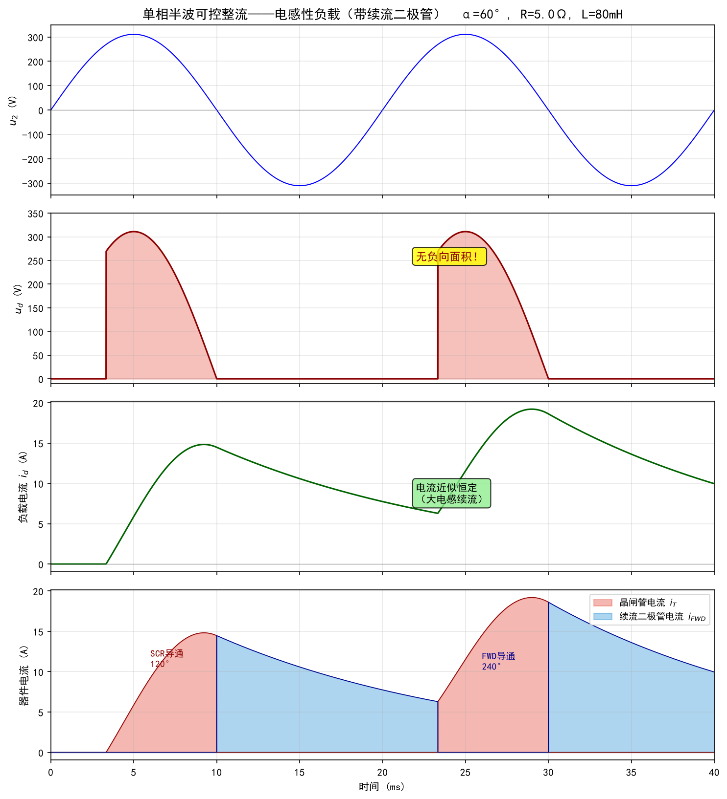

> **波形解读（四张子图对照看）**：
> - **① 输入电压 $u_2$**：标准正弦波（对照参考）。
> - **② 输出电压 $u_d$**：**完全没有负向面积！** 晶闸管在 ωt = π 时可靠关断，红色填充 = 全部正向输出。
> - **③ 负载电流 $i_d$**：大电感下电流**近似恒定**（一条接近水平的线），续流二极管在 π→2π+α 期间维持电流不中断。
> - **④ 器件电流分配**：红色 = 晶闸管电流（导通角 π−α），蓝色 = 续流二极管电流（导通角 π+α），两者**轮流承载**负载电流。

#### 5.5.5 带续流二极管时的输出电压

由于续流二极管的存在，晶闸管在 ωt = π 时（电源电压过零）可靠关断，导通区间严格为 α → π。输出电压公式与**电阻负载相同**：

$$U_d = \frac{U_m}{2\pi}(1 + \cos\alpha)$$

> **关键区别**：输出电压公式和电阻负载一样，但**电流波形完全不同**。
>
> - **电阻负载**：电流与电压同形状，ωt = π 时电流也降到零 → 电流断续。
> - **电感负载（带续流二极管）**：电流在续流阶段（π → 2π+α）通过续流二极管继续流动，电流波形更平滑 → 电流连续（L 足够大时）。

#### 5.5.6 输出电流分析（大电感情况）

当电感 L 足够大（使得续流阶段电流不衰减到零）时：

- **晶闸管导通期间（α → π）**：晶闸管电流 = 负载电流 $I_d$（近似恒定）
- **续流二极管导通期间（π → 2π+α）**：续流二极管电流 = $I_d$（近似恒定）
- **晶闸管导通角**：$\pi - \alpha$
- **续流二极管导通角**：$\pi + \alpha$

> **重要结论**：电感足够大时，负载电流 $I_d$ 近似为一个恒定直流（脉动很小），而晶闸管和续流二极管轮流承担这个恒定电流。

---

### 5.6 单相桥式整流电路

#### 5.6.1 单相桥式全控整流电路——电阻负载

用 **4 个晶闸管** 组成桥式结构（也称 H 桥），可以让交流电的正负半周**都**被整流。

**桥式结构**：
```
      VT1         VT3
   A ──┬───────────┬── 输出+ ──[负载]── 输出- ──┬───────────┬── B
       │           │                            │           │
      VT4         VT2                           │           │
       └───────────┴────────────────────────────┴───────────┘
```

**晶闸管分组与触发脉冲**：

| 组别 | 晶闸管 | 触发时刻 | 导通区间 |
|------|--------|---------|---------|
| 第一组 | **VT1 + VT4**（同脉冲） | ωt = α | α → π（≤180°） |
| 第二组 | **VT2 + VT3**（同脉冲） | ωt = π + α | π+α → 2π（≤180°） |

> **脉冲关系**：
> - VT1 和 VT4 **触发脉冲相同**
> - VT2 和 VT3 **触发脉冲相同**
> - VT1 与 VT2 的触发脉冲相差 **180°**
> - VT3 与 VT4 的触发脉冲相差 **180°**

**工作原理**：
- **正半周**：触发 VT1 和 VT4，电流 A→VT1→负载→VT4→B
- **负半周**：触发 VT2 和 VT3，电流 B→VT2→负载→VT3→A

> 不管正半周还是负半周，负载上电流方向**一致**——这就是整流的关键！

**波形分析**：

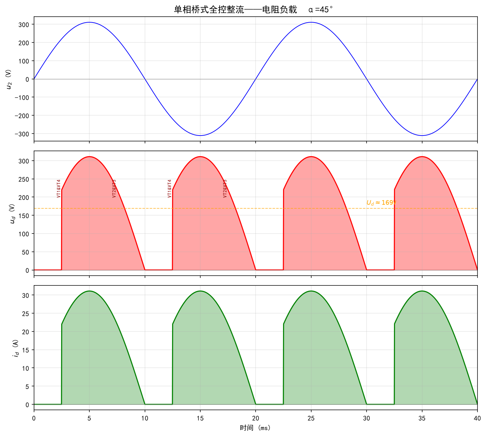

> **波形解读**：
> - **输入电压 $u_2$**：正弦波，正负半周对称。
> - **输出电压 $u_d$**：正半周（VT1+VT4）和负半周（VT2+VT3）都被整流为正向输出。每个周期有**两个脉冲**，比半波多一倍。
> - **输出电流 $i_d$**：与电压同形状（电阻负载，$i_d = u_d/R$），每个周期也有两个脉冲。

**电阻负载时输出电压**（比半波多一倍）：
$$U_d = \frac{U_m}{\pi}(1 + \cos\alpha)$$

**晶闸管导通角**（电阻负载）：$\pi - \alpha$（≤ 180°，随 α 增大而减小）

---

#### 5.6.2 单相桥式全控整流电路——阻感性负载（R-L 负载）

当负载为 **R-L 串联**（阻感负载）且电感足够大时，桥式电路的波形和特性发生根本变化。

**核心特征：电流连续**

大电感使负载电流**不能突变**，在两组晶闸管交替导通时，电流通过"接力"方式连续流动。只要电感足够大（$L \gg R$），负载电流 $i_d$ 近似为**一条水平直线**（恒定直流）。

**触发与导通规律**（阻感负载，电流连续）：

| 组别 | 触发时刻 | 实际导通区间 | 导通角 |
|------|---------|-------------|:---:|
| VT1 + VT4 | ωt = α | α → π+α | **180°** |
| VT2 + VT3 | ωt = π+α | π+α → 2π+α | **180°** |

> 🔑 **关键结论**：阻感负载、电流连续时，**每个晶闸管的导通角恒为 180°**，**与触发角 α 无关！**
>
> 这是因为电感维持电流不中断，每个晶闸管必须导通整整半个周期（π 弧度 = 180°），直到下一组晶闸管被触发接替。

**输出电压分析**：

当 α < 90° 时，输出电压波形包含正、负两段：
- [α, π]：VT1&VT4 导通，$u_d = u_2 > 0$（正向面积）
- [π, π+α]：VT1&VT4 仍导通，但 $u_2 < 0$，所以 $u_d = u_2 < 0$（**负向面积！**）
- [π+α, 2π]：VT2&VT3 导通，$u_d = -u_2 > 0$（正向面积）
- [2π, 2π+α]：VT2&VT3 仍导通，$u_2 > 0$，$u_d = -u_2 < 0$（**负向面积！**）

平均输出电压（积分区间 = π）：
$$U_d = \frac{1}{\pi}\int_{\alpha}^{\pi+\alpha} U_m\sin(\omega t)\,d(\omega t) = \frac{2U_m}{\pi}\cos\alpha$$

用有效值 $U_2 = U_m/\sqrt{2}$ 表示：
$$U_d = 0.9U_2\cos\alpha$$

> ⚠️ **注意**：输出电压中**存在负向面积**（当 α > 0° 时，[π, π+α] 区间 $u_d < 0$），但因为正面积 > 负面积，$U_d$ 仍为正（α < 90° 时）。

**α 的移相范围：0° ~ 90°**
- α = 0° 时：$U_d = U_{d0} = 0.9U_2$（最大）
- α = 90° 时：正负面积相等 → $U_d = 0$
- α > 90° 时：$U_d < 0$ → 进入**逆变状态**

**输入交流电流（变压器二次侧电流）**：

大电感负载下，负载电流 $i_d \approx I_d$（恒定直流）。输入电流 $i_2$ 为 **±180° 矩形波**（方波）：

- VT1&VT4 导通期间（α → π+α）：$i_2 = +I_d$
- VT2&VT3 导通期间（π+α → 2π+α）：$i_2 = -I_d$

矩形波的**相位由 α 决定**，宽度恒为 180°。矩形波**不含直流分量**，因此变压器无直流磁化问题。

**晶闸管电气参数**：

| 参数 | 数值 | 说明 |
|------|------|------|
| 最大反向电压 | $U_m$（输入电压峰值） | 晶闸管关断时承受 |
| 平均电流 $I_{T(avg)}$ | $I_d / 2$ | 每组导通半个周期 |
| 导通角 | **180°** | 与 α 无关！ |
| 电流有效值 $I_{T(RMS)}$ | $I_d / \sqrt{2}$ | 导通 180° 的方波 |

**变压器二次侧**：
- 二次电流有效值 $I_2 = I_d$
- 二次电流中**无直流分量** → 无直流磁化问题

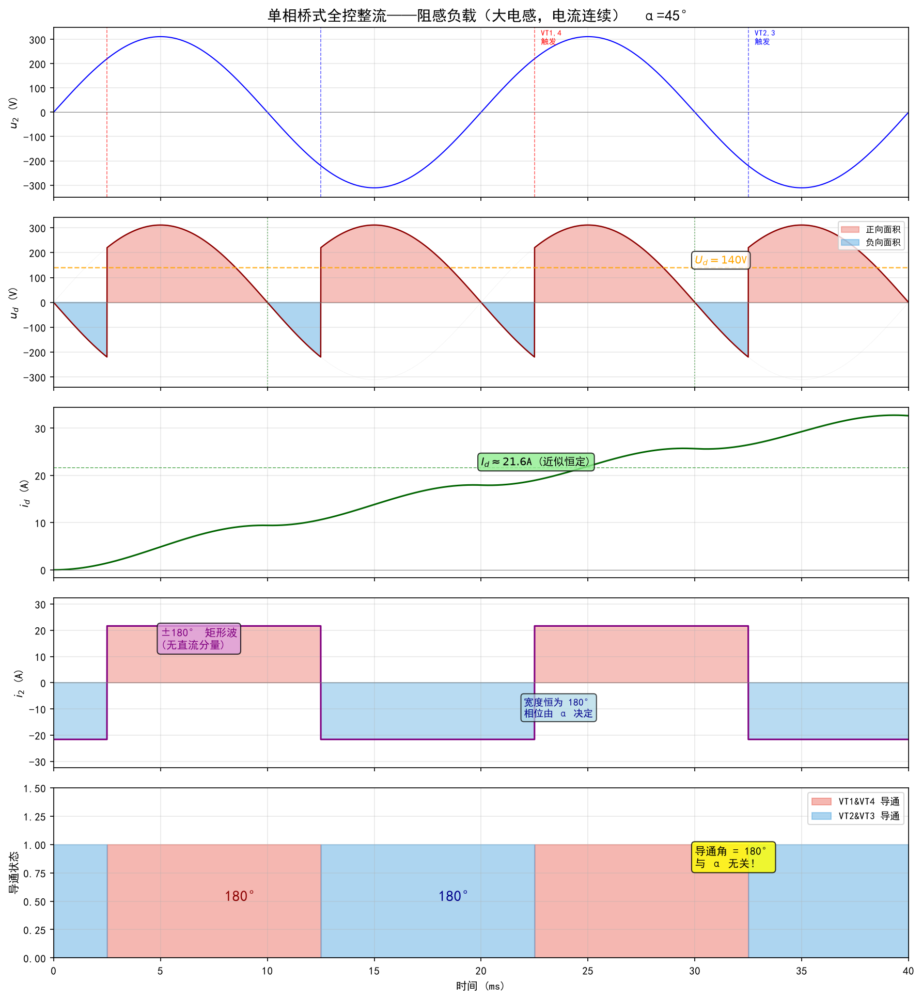

> **波形解读**：
> - **输出电压 $u_d$**：注意[π, π+α]区间出现负向电压（蓝色标注），这是电感"拖着"晶闸管继续导通的结果。
> - **输出电流 $i_d$**：大电感下近似**水平直线**（恒定直流），纹波极小。
> - **交流输入电流 $i_2$**：±$I_d$ 的 **180° 矩形波**，相位随 α 偏移。无直流分量。
> - 对比半波整流的 50Hz 纹波，桥式输出纹波频率为 **100Hz**（$f_{uo} = 2f_{uin}$）。

**α=30° 和 α=90° 波形对比**：

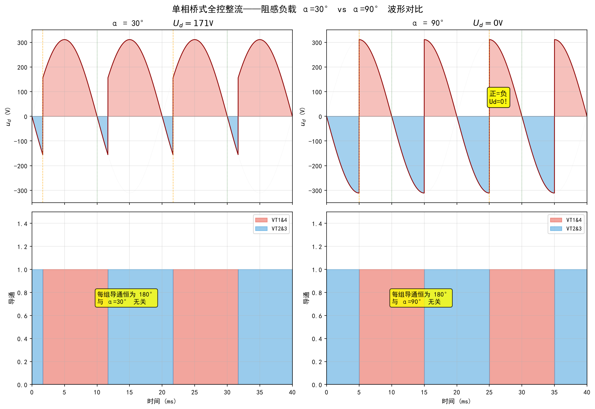

> **波形解读**：
> - **α = 30°**：$U_d > 0$，正面积明显大于负面积。
> - **α = 90°**：正面积 = 负面积，$U_d = 0$。此时正负面积恰好抵消。α > 90° 后进入逆变区。
> - 无论 α 多大，每个晶闸管导通角恒为 **180°**。

**电阻负载 vs 阻感负载（大L）Ud 对比：**

| α | 电阻负载 $U_d = \frac{U_m}{\pi}(1+\cos\alpha)$ | 阻感负载 $U_d = \frac{2U_m}{\pi}\cos\alpha$ |
|---|-----------------------------------------------|---------------------------------------------|
| 0° | $0.637U_m$（最大） | $0.637U_m$（最大） |
| 30° | $0.594U_m$ | $0.552U_m$ |
| 60° | $0.318U_m$ | $0.318U_m$ |
| 90° | $0.159U_m$ | **0** |
| 120° | 0 | $-0.318U_m$（逆变区） |

> 🔑 **阻感负载下晶闸管导通角恒为 180°（与 α 无关），移相范围为 0°~90°。**

#### 5.6.3 反电动势负载（电压源负载）

除了 R 和 R-L 负载外，实际中还有一种重要负载——**反电动势负载**（电压源负载）。

**什么是反电动势负载？**

负载中含有直流电压源，例如：
- **蓄电池充电**（电池本身有电压）
- **直流电动机电枢**（旋转时产生反电动势 $E$）
- **电解电源**

**电路模型**：R + L + E 串联，其中 E 为反电动势（恒定直流电压）。

```
 晶闸管桥 ──┬── R ── L ──┬── + E ──
            │             │
            └─────────────┘
```

**核心特点**：

晶闸管只有在**电源电压 $|u_2| > E$** 时才能被触发导通——因为晶闸管需要正向偏置（阳极电压 > 阴极电压）。

**解决负向面积的方法**：

在桥式全控整流 + 阻感负载中，当 α 较大时输出电压出现负向面积。加入**反电动势 E** 可以改变这一情况：
- 反电动势 E 抬高了负载侧电位
- 在 [π, π+α] 区间，若 $|u_2| < E$，则晶闸管可能提前关断
- 合理设计 E 的大小可以**消除或减小负向面积**

> **物理意义**：反电动势负载相当于在负载侧加了一个"电压壁垒"，改变了晶闸管的导通/关断条件。这在电池充电和电机驱动中非常常见。

---

#### 5.6.4 单相桥式半控整流电路

半控桥使用 **2 个晶闸管（上桥臂）+ 2 个二极管（下桥臂）**代替全控桥的 4 个晶闸管。

```
      VT1         VT3
   A ──┬───────────┬── 输出+ ──[负载]── 输出- ──┬───────────┬── B
       │           │                            │           │
      D4          D2                            │           │
       └───────────┴────────────────────────────┴───────────┘
```

**特点**：
- 成本更低（二极管比晶闸管便宜）
- 只能用交流电源电压过零来关断晶闸管（电网换流）
- **不能工作于逆变状态**（因为没有可控的负半周通路）

**⚠️ 电感性负载时必须加续流二极管！**

> **为什么半控桥必须加续流二极管？**
>
> 不加续流二极管时，当电源电压过零变负，电感电流会通过一个晶闸管和一个二极管形成续流回路（例如 VT1 → 负载 → D4 → 回到 VT1），导致晶闸管**无法关断**，出现**失控**现象——输出电压不再受 α 控制，这是严重的电路故障。

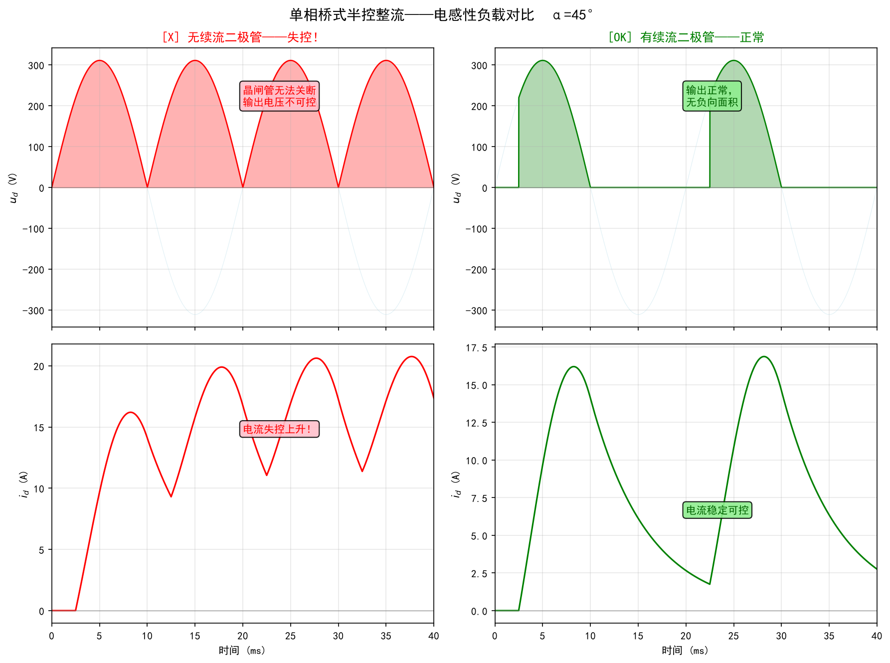

> **波形解读（左 vs 右对比）**：
> - **左侧（无续流二极管）**：晶闸管无法关断，电流失控上升，输出电压不可控——**这是故障状态！**
> - **右侧（有续流二极管）**：续流二极管在 ωt=π 时提供电流通路，晶闸管可靠关断，输出正常可控。

带续流二极管的半控桥输出电压（与电阻负载公式相同）：
$$U_d = \frac{U_m}{\pi}(1 + \cos\alpha) = 0.45U_2(1 + \cos\alpha)$$

#### 5.6.5 桥式整流电感性负载总结对比

| 电路类型 | 负载类型 | 需要续流二极管？ | Ud 公式 | 晶闸管导通角 | 备注 |
|---------|---------|:---:|--------|:---:|------|
| 单相半波 | 电阻 | — | $\frac{U_m}{2\pi}(1+\cos\alpha)$ | π−α | 基准公式 |
| 单相半波 | 电感 | ✅ **必须加** | $\frac{U_m}{2\pi}(1+\cos\alpha)$ | π−α | 不加会有负向面积 |
| 单相桥式全控 | 电阻 | — | $\frac{U_m}{\pi}(1+\cos\alpha)$ | π−α | 半波的 2 倍 |
| 单相桥式全控 | 阻感（大L） | ❌ 不需要 | $\frac{2U_m}{\pi}\cos\alpha$ | **180°（恒）** | 含有负向面积，Ud>0需α<90° |
| 单相桥式半控 | 电感 | ✅ **必须加** | $\frac{U_m}{\pi}(1+\cos\alpha)$ | π−α | 不加会失控！ |
| 单相桥式全控 | 反电动势 | ❌ | 由E和α决定 | ≤180° | 电压源负载，可消除负面积 |

---

### 5.7 三相整流电路

单相整流的输出波动较大，大功率场合用三相整流，输出电压更平滑。

三相对称交流电：三根线（A、B、C），每相之间的电压相差 120°。

#### 5.7.1 三相桥式不可控整流（二极管整流）

用 6 个二极管组成三相桥：
- **共阴极组**（上桥臂）：D1、D3、D5 — 阳极分别接 A、B、C 三相
- **共阳极组**（下桥臂）：D4、D6、D2 — 阴极分别接 A、B、C 三相

**工作原理**：在任何时刻，共阴极组中**阳极电位最高**的那相二极管导通，共阳极组中**阴极电位最低**的那相二极管导通。每个二极管导通 120°（三分之一周期）。

输出电压脉动频率为 **300Hz**（6 × 50Hz），纹波远小于单相整流（单相桥式为 100Hz）。

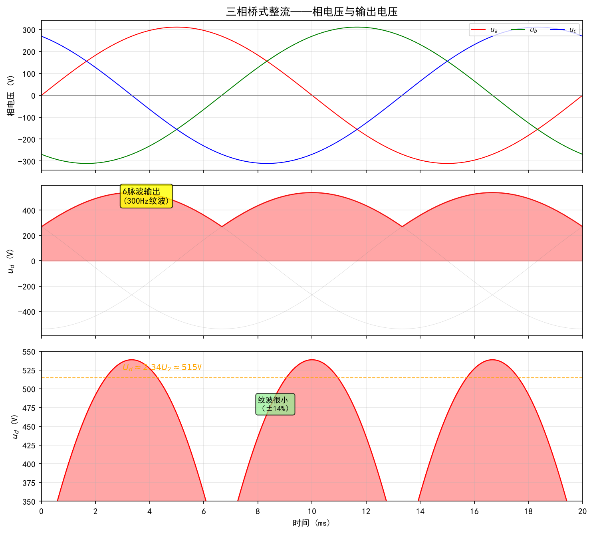

> **波形解读**：
> - **第一张图**：三相输入电压 $u_a$（红）、$u_b$（绿）、$u_c$（蓝），相位各差 120°。
> - **第二张图**：输出电压 $u_d$ = 任意时刻线电压的最大值，形成**6脉波**输出。纹波频率 = 300Hz（6×50Hz）。
> - **第三张图（放大）**：可见纹波幅度仅约 ±14%，输出电压已经相当平滑，这就是为什么大功率场合都用三相整流。

#### 5.7.2 三相桥式全控整流——电感性负载

用 6 个晶闸管代替二极管。

在大电感负载（电流连续）下，输出电压为：

$$U_d = 2.34U_2\cos\alpha$$

其中 $U_2$ 为**相电压**有效值（我国为 220V）。

> **数值感知**：α = 0° 时 $U_d = 2.34 \times 220 = 514.8V$；α = 90° 时 $U_d = 0$。

**三相全控桥的触发规律**：
- 共阴极组晶闸管和共阳极组晶闸管的触发脉冲依次相差 **60°**
- 每个晶闸管导通 **120°**
- 触发顺序：VT1 → VT2 → VT3 → VT4 → VT5 → VT6 → VT1（循环）
- 大电感负载下电流连续，输出电压平滑，是工业中最常用的整流方案

---

### 5.8 整流电路小结

#### 电压公式速查表

| 电路类型 | 器件数 | 电阻负载 Ud | 大电感负载 Ud | 备注 |
|---------|-------|-----------|-------------|------|
| 单相半波（不可控） | 1 二极管 | $U_m/\pi$ | — | 最简单，效率低 |
| 单相半波（可控） | 1 晶闸管 | $\frac{U_m}{2\pi}(1+\cos\alpha)$ | 同电阻负载（需续流二极管） | 负向面积问题 |
| 单相桥式（全控） | 4 晶闸管 | $\frac{U_m}{\pi}(1+\cos\alpha)$ | $\frac{2U_m}{\pi}\cos\alpha$ | 导通角恒180°，移相0~90° |
| 单相桥式（半控） | 2 晶闸管+2 二极管 | $\frac{U_m}{\pi}(1+\cos\alpha)$ | 同电阻负载（必须加续流二极管） | 成本低，不能逆变 |
| 三相桥式（全控） | 6 晶闸管 | — | $2.34U_2\cos\alpha$ | 大功率，输出平滑 |

#### 波形对比总览

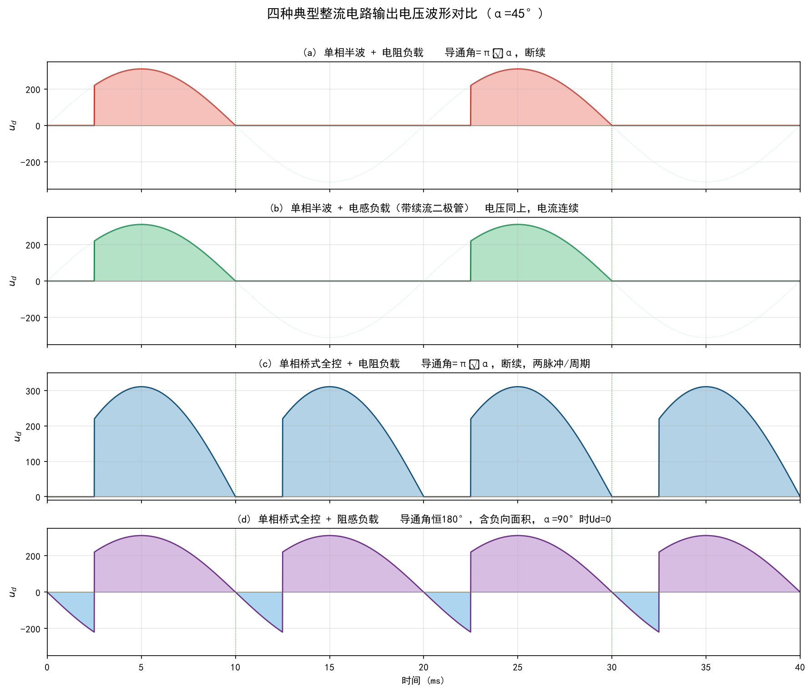

> **四合一对比解读**：
> - **(a) 半波+电阻**：每周期一个脉冲，α 后导通，π 时关断。导通角 = π−α。波形断续。
> - **(b) 半波+电感+续流二极管**：输出电压波形同(a)（Ud 公式相同），但续流二极管使**电流连续**。
> - **(c) 桥式全控+电阻**：每周期**两个脉冲**，Ud 是半波的 2 倍。导通角 = π−α，波形断续。
> - **(d) 桥式全控+阻感负载**：导通角**恒为 180°**（与 α 无关）。注意[π, π+α]区间出现**负向面积**（蓝色），正面积−负面积 = $U_d = \frac{2U_m}{\pi}\cos\alpha$。α=90° 时正负抵消，$U_d=0$。

#### α 对输出电压的影响曲线

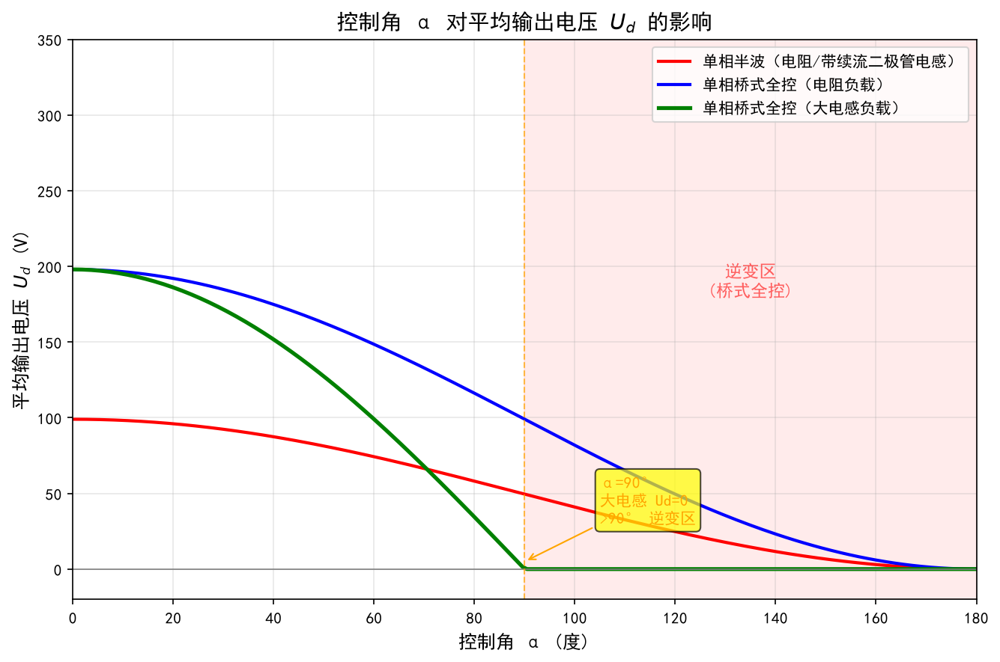

> **曲线解读**：
> - **红色**（半波/带续流电感）：α = 0° 时 Ud ≈ 99V，α = 180° 时 Ud = 0。
> - **蓝色**（桥式电阻负载）：α = 0° 时 Ud ≈ 198V（半波的 2 倍），α = 180° 时 Ud = 0。
> - **绿色**（桥式大电感）：α = 0° 时 Ud = 198V，**α = 90° 时 Ud = 0**，α > 90° 进入**逆变区**。

#### 🔑 电感性负载十大核心结论

1. **电感电流不能突变** → 电源电压过零后，电感释放储能继续推着电流 → 晶闸管不关断。
2. **半波 + 电感 + 无续流二极管** → 输出电压出现**负向面积**，平均电压降低。
3. **续流二极管的作用** → 为电感电流提供独立回路，晶闸管在电压过零时可靠关断，消除负向面积。
4. **桥式全控 + 阻感负载** → 不加续流二极管也可正常工作（另一组桥臂自然接替），$U_d = \frac{2U_m}{\pi}\cos\alpha$。
5. **桥式全控 + 阻感负载** → 每个晶闸管导通角**恒为 180°**，与 α 无关！
6. **桥式全控 + 阻感负载** → 交流输入电流为 **±180° 矩形波**（方波），相位由 α 决定，无直流分量。
7. **桥式全控 + 阻感负载** → 移相范围 **0° ~ 90°**，α = 90° 时 $U_d = 0$，α > 90° 进入逆变区。
8. **桥式全控 + 阻感负载** → 晶闸管平均电流 $I_{T(avg)} = I_d / 2$，最大反向电压 $= U_m$。
9. **桥式半控 + 电感** → **必须**加续流二极管，否则晶闸管无法关断 → **失控**！
10. **续流二极管接法**：阳极接负载下端，阴极接负载上端。**反电动势负载**可通过电压源消除负面积。

#### 续流二极管必要性速查

| 电路 | 纯电阻负载 | 电感性负载 |
|------|:---:|:---:|
| 单相半波可控 | 不需要 | ✅ **需要** |
| 单相桥式全控 | 不需要 | ❌ 不需要（桥臂自然续流）|
| 单相桥式半控 | 不需要 | ✅ **必须**（否则失控）|

---

## 6. 逆变电路：把直流变成交流

> **本节目标**：理解如何用开关器件把直流电变成交流电，以及电压型和电流型逆变器的区别。

### 6.1 逆变的基本原理

**逆变 = 把直流电变成交流电。**

最核心的思想：用开关快速交替地改变负载上电压的**方向**。

**简单类比**：你有一个电池（直流），快速交替地把它正接和反接到灯泡上，灯泡看到的就是交流电。

### 6.2 电压型逆变电路 (VSI)

- **直流侧**：并联大**电容**作为储能元件。
- **直流侧电压基本恒定**（因为电容稳住电压）。
- **输出电压波形**：**方波**（通过 PWM 可接近正弦波）。
- **输出电流波形**：由负载决定（感性负载时接近正弦波）。

> **一句话**：电压型逆变器 → 直流侧用电容 → 输出电压是方波。

### 6.3 电流型逆变电路 (CSI)

- **直流侧**：串联大**电感**作为储能元件。
- **直流侧电流基本恒定**（因为电感的电流不能突变，维持电流稳定）。
- **输出电流波形**：**方波**。
- **输出电压波形**：由负载决定。

> **一句话**：电流型逆变器 → 直流侧用电感 → 输出电流是方波。

### 6.4 电压型和电流型对比（必考点）

|                    | 电压型逆变器 (VSI) | 电流型逆变器 (CSI) |
| ------------------ | ------------------ | ------------------ |
| **直流侧储能元件** | **电容**           | **电感**           |
| **直流侧什么恒定** | **电压**恒定       | **电流**恒定       |
| **输出方波的是**   | **电压**           | **电流**           |
| **不能突变的是**   | 电容电压           | 电感电流           |
| **交流侧等效**     | 电压源             | 电流源             |

> **记忆诀窍**：名字就是提示——
> - "电压型" → 输出电压是方波 → 直流侧有电容（电容稳住电压）→ 直流侧电压恒定
> - "电流型" → 输出电流是方波 → 直流侧有电感（电感稳住电流）→ 直流侧电流恒定

### 6.5 逆变电路中的换流方式概述

逆变电路中，不同的器件需要不同的换流方式：

- **全控型器件**（IGBT、MOSFET、GTO 等）→ **器件换流**——利用器件自身的关断能力实现换流。
- **半控型器件**（晶闸管 SCR）→ 需要**电网换流**、**负载换流**或**强迫换流**——晶闸管不能自关断，必须借助外部条件。

> 🔑 **考试常考点**：全控型器件的换流方式是**器件换流**。这也是逆变电路发展的趋势——用全控器件省去复杂的换流电路。

换流方式的完整分类体系详见第9章。

### 6.6 负载特性对逆变输出的影响

逆变电路的输出波形和相位关系**因负载性质不同而不同**。这是理解逆变电路实际工作的关键。

#### 纯电阻负载

当负载为纯电阻时：

| 特性 | 表现 |
|------|------|
| **输出电流 $i_o$ 波形** | 与输出电压 $u_o$ 波形**相同** |
| **输出电流 $i_o$ 相位** | 与输出电压 $u_o$ 相位**相同**（同相位） |
| **原因** | 纯电阻中 $i = u/R$，电流与电压成比例，无相位差 |

> **理解**：电阻不储能、不"拖延"，电压给多少，电流立刻响应多少。

#### 阻感负载（R-L 负载）

当负载含有电感（如电机、变压器）时：

| 特性 | 表现 |
|------|------|
| **输出电流 $i_o$ 波形** | 与输出电压 $u_o$ 波形**不同** |
| **输出电流 $i_o$ 相位** | **滞后于**输出电压 $u_o$ 的相位 |
| **原因** | 电感的电流不能突变，存在"惯性延迟"效应 |

> **理解**：电感使电流"慢半拍"——电压已经上去了，电流还在"爬坡"。电压都下来了，电流还没跟上。这和时间常数 $\tau = L/R$ 相关。

#### 容性负载

当负载呈容性时（电流相位超前于电压相位），这种场合**可以实现负载换流**。

> 🔑 **负载换流的条件**：负载电流的相位**超前于**负载电压的相位（负载呈容性）。因为超前意味着过零时电压可以反向施加到晶闸管上。

| 负载类型 | $i_o$ 与 $u_o$ 波形 | $i_o$ 相位 | 能否负载换流 |
|----------|:---:|:---:|:---:|
| 纯电阻 | 相同 | 相同（同相） | ❌ |
| 阻感（感性） | 不同 | 滞后于 $u_o$ | ❌ |
| 容性 | 不同 | **超前于** $u_o$ | ✅ |

### 6.7 逆变输出电压频率的控制

逆变电路中，交流输出电压的频率由**电力电子器件的开关频率**决定。

> **核心原理**：只需改变器件的开通和关断频率，即可改变输出交流电的频率。这是变频调速的基础。

例如：
- 开关频率 50Hz → 输出 50Hz 交流电
- 开关频率 100Hz → 输出 100Hz 交流电
- 通过 PWM 技术，还可以在改变频率的同时控制电压幅值（VVVF——变压变频）。

### 6.8 换相失败

逆变电路中，晶闸管需要在正确的时刻完成换流（电流从一个管子转到另一个管子）。如果换流不成功——**换相失败**——会导致严重的短路故障。

> **后果**：如果应该关断的晶闸管没来得及关断，而应该导通的晶闸管已经导通，两个管子同时导通形成短路。这在高压大电流场合会烧毁设备。

---

## 7. 直流变换电路（斩波电路）

> **本节目标**：掌握三种基本 DC-DC 变换器的工作原理和输入输出关系。

### 7.1 斩波电路是什么

**斩波电路 = DC-DC 变换器 = 把一种直流电压变成另一种直流电压。**

"斩波"的意思就是：把直流电快速"切碎"（开关通断），然后用储能元件（电感、电容）"滤平滑"，从而改变输出电压的平均值。

核心原理：**通过改变开关导通和关断的时间比例，来改变输出电压平均值。**

### 7.2 关键参数：占空比

设开关周期为 T（频率 f = 1/T），每个周期中：
- $t_{on}$ = 导通时间
- $t_{off}$ = 关断时间
- T = $t_{on} + t_{off}$

**占空比 (Duty Ratio)**：
$$D = \frac{t_{on}}{T}$$

> D 是 0～1 之间的数。D=0.5 表示一半时间导通，一半时间关断。

### 7.3 降压斩波电路 (Buck Converter)

**功能**：把高电压变成低电压。

$$
V_{out} = D \cdot V_{in}
$$

> **推导**：开关导通时 $V_{in}$ 加到负载上；开关关断时电压为 0。平均值 = $V_{in} \times \frac{t_{on}}{T} = D \times V_{in}$。

- 输出电压 ≤ 输入电压（因为 D ≤ 1）
- **导通时间越长（D 越大），输出电压越高**

电路结构（简化）：
```
Vin —[开关]—┬—[电感]—┬— Vout
            │         │
           [二极管]  [电容]
            │         │
           GND      GND
```

- 开关导通时：电流流过电感，给电容充电。
- 开关关断时：电感通过二极管续流，电容放电维持输出电压。

### 7.4 升压斩波电路 (Boost Converter)

**功能**：把低电压变成高电压。

$$
V_{out} = \frac{1}{1-D} \cdot V_{in}
$$

> **推导思路**：开关导通时电感储能（电流上升）；开关关断时电感释放能量，和输入电压串联叠加到输出端，所以输出电压比输入电压高。通过能量平衡可推导出上述关系。

- 输出电压 ≥ 输入电压
- D 越接近 1，输出电压越高（理论可无限大，但实际上受限于器件和损耗）
- **输出电压数值高于输入电压**

### 7.5 升降压斩波电路 (Buck-Boost Converter)

**功能**：既能升压也能降压，但输出电压和输入电压极性**相反**。

$$
V_{out} = \frac{D}{1-D} \cdot V_{in}
$$

> 负号表示输出电压的极性和输入电压相反。

- D < 0.5 时：降压（|Vout| < Vin）
- D > 0.5 时：升压（|Vout| > Vin）

### 7.6 三种斩波电路关系总结

| 电路类型                | 输入输出关系                            | D 增大时 Vout | 输出 vs 输入       |
| ----------------------- | --------------------------------------- | ------------- | ------------------ |
| **降压 (Buck)**         | $V_{out} = D \cdot V_{in}$              | **增大**      | 输出 ≤ 输入        |
| **升压 (Boost)**        | $V_{out} = \frac{1}{1-D} \cdot V_{in}$  | **增大**      | 输出 ≥ 输入        |
| **升降压 (Buck-Boost)** | $V_{out} = -\frac{D}{1-D} \cdot V_{in}$ | 绝对值增大    | 可升可降，极性反转 |

---

## 8. 交流变换电路

### 8.1 AC-AC 变换的基本概念

把一种交流电变成另一种交流电，有两种方式：

1. **交-交变频 (Cycloconverter)**：AC→AC 直接变换，不经过中间直流环节。
2. **交-直-交变频**：AC→DC→AC，先整流再逆变（中间有直流电容或电感）。这是目前最主流的方式。

### 8.2 交流调压

用双向晶闸管（TRIAC）来调节交流电压有效值。

- 类似于可控整流，但是双向晶闸管在**正负半周都能导通**。
- 改变控制角 α，就可以改变输出交流电压的有效值。
- 典型应用：台灯调光、电风扇调速、电热器调温。

---

## 9. 换流：电流如何在器件间"交接班"

> **本节目标**：理解"换流"是什么，掌握换流方式的**完整分类体系**（两层分类），能区分"外部换流"和"自换流"，了解强迫换流的两个子类。

### 9.1 什么是换流（换相）

**换流**（Commutation）= 电流从一条支路向另一条支路转移的过程，也称为**换相**。

在整流或逆变电路中，不同时刻需要不同的器件导通。让一个器件关断、另一个器件导通的过程，就是换流。

> **一句话记**：换流 = 电流在器件之间"交接班"。

### 9.2 换流方式的完整分类体系

换流方式按**换流能量的来源**分为两个大类，这是本章**最重要的分类框架**：

```
换流方式（按能量来源分）
│
├── 外部换流（他换流）
│   ├── 电网换流 —— 利用电网电压反向关断晶闸管
│   └── 负载换流 —— 利用负载电压反向关断晶闸管
│
└── 自换流（内部换流）
    ├── 器件换流 —— 利用全控型器件自身的关断能力
    └── 强迫换流 —— 设置附加换流电路给晶闸管施加反压/反电流
        ├── 直接耦合式强迫换流（电压换流）
        └── 电感耦合式强迫换流（电流换流）
```

> 🔑 **记忆口诀**：
> - **外部换流 = 电网换流 + 负载换流**（记住"外电网负载"——外部换流包含电网和负载两种）
> - **自换流 = 器件换流 + 强迫换流**（记住"自器件强迫"——自己搞定，靠器件或强迫）

### 9.3 两大类换流的对比

| 大类 | 别称 | 包含的子类 | 换流能量来源 | 适用器件 |
|------|------|-----------|-------------|---------|
| **外部换流** | 他换流 | 电网换流 + 负载换流 | 来自**器件外部**（电网或负载） | 晶闸管（半控型） |
| **自换流** | 内部换流 | 器件换流 + 强迫换流 | 来自**器件自身**或**附加电路** | 全控型 / 晶闸管+附加电路 |

> ⚠️ **易错提醒**：不要将"自然换流"当作正式分类名称。"电网换流"和"负载换流"在学术分类中属于**外部换流**，因为它们依赖外部条件（电网电压或负载电压）。"自然换流"只是口语中的说法。

### 9.4 四种换流方式详解

#### ① 电网换流（Line Commutation）

- **原理**：利用电网交流电压的自然过零或反向，使流过晶闸管的电流降到零从而关断。
- **过程**：交流电每隔半个周期电压过零一次，晶闸管电流在电压过零后自然降到零（或承受反向电压）→ 关断。
- **典型应用**：整流电路中的晶闸管。
- **一句话**：将负的电网电压施加在欲关断的晶闸管上即可使其关断。

#### ② 负载换流（Load Commutation）

- **原理**：利用负载自身的电压反向来关断晶闸管。
- **条件**：负载电流相位**超前于**负载电压相位（负载呈容性）。
- **典型应用**：谐振逆变器（RLC 负载）。
- ⚠️ **注意**：负载电流相位超前于负载电压的场合，**可以**实现负载换流。试题中常考此判断——"负载电流超前于负载电压的场合都不可实现负载换流"这个说法是**错误**的。

#### ③ 器件换流（Device Commutation）

- **原理**：利用全控型器件自身的**自关断能力**实现换流。
- **适用器件**：GTO、GTR、MOSFET、IGBT 等全控型器件。
- **特点**：不需要额外电路，是最简洁的换流方式。
- 🔑 **考试重点**：在逆变电路中，**全控型器件的换流方式就是器件换流**。

#### ④ 强迫换流（Forced Commutation）

- **原理**：设置附加的换流电路，给欲关断的晶闸管**强迫施加反向电压或反向电流**，迫使其关断。
- **适用场景**：直流电路中的晶闸管（没有交流电的自然过零可以利用）。
- **分为两个子类**（见 9.5 节）。

### 9.5 强迫换流的两种子类（重要！）

强迫换流按换流电路的结构和原理，分为两种：

| 子类 | 别称 | 原理 | 换流能量提供方式 |
|------|------|------|-----------------|
| **直接耦合式强迫换流** | **电压换流** | 换流电路内的**电容直接**提供换流电压 | 电容电压直接施加到晶闸管两端 |
| **电感耦合式强迫换流** | **电流换流** | 通过换流电路内**电容和电感的耦合**来提供换流电压或换流电流 | 电容和电感通过电磁耦合传递能量 |

> 🔑 **记忆诀窍**：
> - 电容**直接**提供 → **电压**换流（电容两端是电压源性质）
> - 电容+电感**耦合** → **电流**换流（电感传递的是电流）

### 9.6 自然换相点 —— 从零推导"30°"的来源

> **本节目标**：用最简单的方式理解自然换相点是什么，并用数学严格推导出"30°"这个数字。

#### 9.6.1 先理解"换相"在发生什么

假设你有一个三相整流电路，上面接了三个二极管（分别接 A、B、C 三相）。在任何时刻，**只有电压最高的那一相的二极管会导通**——就像三个门，谁家门前的"水位"最高，水就从谁家流过去。

```
三个二极管争着导通：
   A 相 ——▶├──┐
   B 相 ——▶├──┤── 负载 ── 地
   C 相 ——▶├──┘

规则：只有阳极电压最高的那个二极管导通
```

关键问题是：**什么时候"最高电压"的头衔从一相交到另一相？** 这个交接的时刻就是自然换相点。

#### 9.6.2 两相电压的交点就是换相点

两相电压相等的那一刻，就是"最高电压"交接的时刻——前一相把"最高"让给后一相。

以 A 相和 B 相为例，找到它们的交点：

两相电压：
$$u_A = U_m \sin(\omega t)$$
$$u_B = U_m \sin(\omega t - 120°)$$

交点处 $u_A = u_B$：
$$\sin(\omega t) = \sin(\omega t - 120°)$$

#### 9.6.3 数学推导：用初中三角知识解交点

> 回忆：$\sin X = \sin Y$ 有两种情况：
> 1. $X = Y + 360°n$（同一个位置，差整数圈）
> 2. $X = 180° - Y + 360°n$（关于 90° 对称）

**情况①**：
$$\omega t = \omega t - 120° + 360°n$$
$$0 = -120° + 360°n$$
$$n = \frac{1}{3}$$

$n$ 不是整数 → **无解**。两条正弦波不是同一个波。

**情况②**：
$$\omega t = 180° - (\omega t - 120°) + 360°n$$
$$\omega t = 180° - \omega t + 120° + 360°n$$
$$2\omega t = 300° + 360°n$$
$$\omega t = 150° + 180°n$$

取 $n = 0$：$\omega t = 150°$。取 $n = -1$：$\omega t = -30° = 330°$。

> ✅ **A 相和 B 相的交点在 150° 和 330°。**

接下来找 A 相和 C 相的交点：

$$u_A = U_m \sin(\omega t)$$
$$u_C = U_m \sin(\omega t + 120°)$$

交点处：
$$\sin(\omega t) = \sin(\omega t + 120°)$$

用情况②：
$$\omega t = 180° - (\omega t + 120°) + 360°n$$
$$2\omega t = 60° + 360°n$$
$$\omega t = 30° + 180°n$$

> ✅ **A 相和 C 相的交点在 30° 和 210°。**

#### 9.6.4 把交点画在时间轴上

从 $\omega t = 0°$ 开始（取 A 相的正向过零点为起点），画出三相电压：

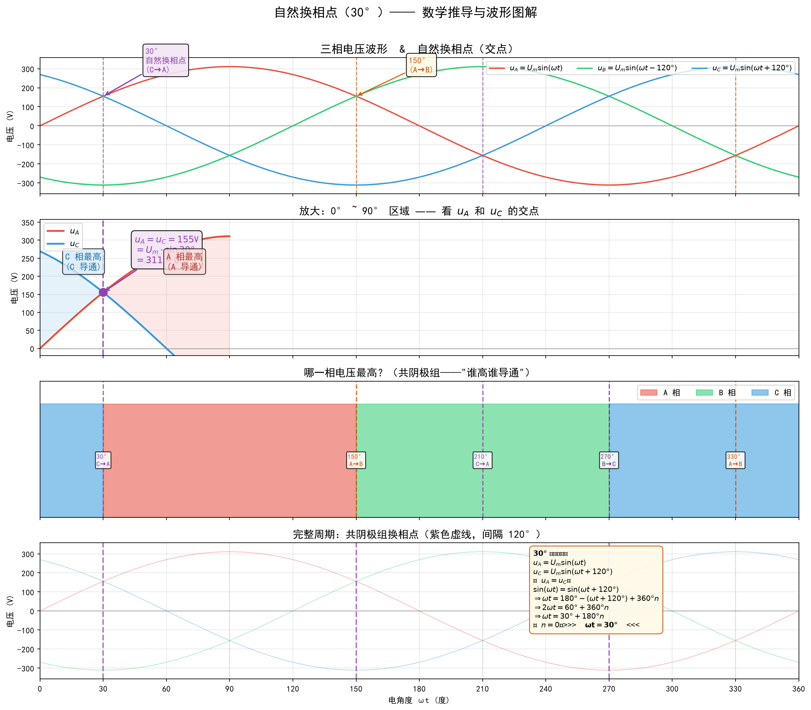

> **图表解读**：第一栏显示三相电压波形及交点；第二栏放大 0°~90° 区域展示 C→A 换相；第三栏用色带标出每个时刻"哪一相电压最高"；第四栏汇总整个周期的换相点，并在右下角附完整数学推导。

```
ωt:      0°    30°         150°       180°     210°        270°      330°  360°
        ├──────┼────────────┼──────────┼─────────┼───────────┼─────────┼──────┤
uA:      0    ↗1/2        ↗最大值      ↘0        负         负         负      0
uB:     -√3/2  负          0         ↗1/2      ↗最大值      ↘0        负    -√3/2
uC:     +√3/2 ↘1/2        负          负        0          ↗1/2      ↗最大值   √3/2

最高相:  C  ┃    A     ┃     B     ┃   C  ┃      A      ┃     B    ┃    C
           ↑            ↑           ↑       ↑             ↑          ↑        ↑
         30°          150°        210°    270°         330°       390°      ...
```

> **规律一目了然**：
> - 每隔 **60°**，"最高相"换人一次
> - 以 A 相的过零点（ωt = 0°）为参考，**第一个自然换相点在 30°**（C 相把"最高"交给 A 相）

#### 9.6.5 "30°"的真正含义

```
"自然换相点在 30°"的意思：

从 A 相电压刚好从零变正（ωt = 0°）这个时刻算起，
再往前走 30° 电角度（即 1/12 个周期，50Hz 下约 1.67ms），
C 相把"最高电压"的接力棒交给了 A 相。

这个 30° 不是瞎猜的——它来自 sin(ωt) = sin(ωt + 120°) 的数学解！
```

#### 9.6.6 为什么叫"自然"换相点

| 对比 | 自然换相 | 可控换相 |
|------|---------|---------|
| **谁决定换相时刻** | 电源电压波形本身 | 控制电路（门极触发信号） |
| **换相时刻** | 固定（30°, 150°, 210°...） | 可调（控制角 α） |
| **用什么器件** | 二极管（不可控） | 晶闸管（可控） |
| **类比** | 太阳落山自然天黑 | 拉窗帘人工变暗 |

> 🔑 **核心理解**：二极管没有"脑子"——它不看任何控制信号，完全由电压极性决定通断。当 B 相电压超过 A 相电压时，A 相的二极管自然而然被反向偏置而关断，B 相的二极管自然而然正向偏置而导通。这个切换点由三相电压的数学关系唯一确定，就是 30°。

#### 9.6.7 扩展到三相桥式电路

三相桥式整流有 6 个自然换相点（共阴极组 3 个 + 共阳极组 3 个），在一个周期内等间隔排列：

| 换相点 | 角度 | 哪个二极管导通→哪个二极管导通 |
|--------|:---:|------|
| 自然换相点 1 | **30°** | D5(C 相) → D1(A 相)，共阴极组 |
| 自然换相点 2 | 90° | D6(B 相) → D2(B 相)，共阳极组 |
| 自然换相点 3 | **150°** | D1(A 相) → D3(B 相)，共阴极组 |
| 自然换相点 4 | 210° | D2(B 相) → D4(C 相)，共阳极组 |
| 自然换相点 5 | **270°** | D3(B 相) → D5(C 相)，共阴极组 |
| 自然换相点 6 | 330° | D4(C 相) → D6(A 相)，共阳极组 |

> 6 个换相点均匀间隔 **60°**，所以三相桥式整流的输出电压每个周期有 **6 个脉波**（6-pulse rectifier）。

#### 9.6.8 总结

```
"自然换相点在 30°"——记住三句话就够了：

1. 什么是自然换相点？
   → 二极管自然切换导通/关断的时刻，不由人控制，由电压波形决定。

2. 为什么是 30°？
   → sin(ωt) = sin(ωt + 120°) 的解是 ωt = 30° + 180°n。
     以 A 相正向过零点为时间原点，第一个交点就是 30°。

3. 考试怎么考？
   → "电力二极管关断和导通的切换点被称为自然换相点，即 30° 的地方。" ← 原题
```

### 9.7 换流知识总表

| 分类层级 | 换流方式 | 关键特征 | 考试关键词 |
|---------|---------|---------|-----------|
| 外部换流 | 电网换流 | 电网电压反向关断晶闸管 | "负电网电压"、"过零关断" |
| 外部换流 | 负载换流 | 负载电压反向，需电流超前电压 | "容性负载"、"电流超前" |
| 自换流 | 器件换流 | 全控型器件自关断 | "全控型"、"IGBT/MOSFET/GTO" |
| 自换流 | 强迫换流 | 附加电路加反压/反电流 | "附加换流电路"、"晶闸管" |

| 强迫换流子类 | 别称 | 关键特征 |
|------------|------|---------|
| 直接耦合式 | 电压换流 | 电容**直接**提供换流电压 |
| 电感耦合式 | 电流换流 | 电容和电感**耦合**提供换流 |

---

## 10. 实际应用与总结

### 10.1 电力电子无处不在

| 应用领域            | 用到什么        | 功率等级           |
| ------------------- | --------------- | ------------------ |
| 手机充电器          | 整流 + 降压斩波 | 几瓦～几十瓦       |
| LED 照明            | 整流 + DC-DC    | 几瓦～几百瓦       |
| 变频空调            | 整流 + 逆变     | 几百瓦～几千瓦     |
| 电动车驱动          | DC-DC + 逆变    | 几十千瓦～几百千瓦 |
| 高铁牵引            | 整流 + 逆变     | 兆瓦级             |
| 高压直流输电 (HVDC) | 整流 + 逆变     | 千兆瓦级           |
| 光伏并网            | 升压斩波 + 逆变 | 千瓦～兆瓦级       |
| UPS 不间断电源      | 整流 + 逆变     | 几百瓦～兆瓦级     |

### 10.2 核心公式速查表

| 公式 | 含义 |
|------|------|
| $U_d = \frac{U_m}{2\pi}(1+\cos\alpha)$ | 单相半波可控整流（电阻负载 / 电感负载带续流二极管） |
| $U_d = \frac{U_m}{\pi}(1+\cos\alpha)$ | 单相桥式全控整流（电阻负载）/ 半控桥（带续流二极管） |
| $U_d = \frac{2U_m}{\pi}\cos\alpha = 0.9U_2\cos\alpha$ | 单相桥式全控整流（阻感负载，导通角恒180°，移相0~90°） |
| $U_d = \frac{U_m}{2\pi}[\cos\alpha - \cos(\alpha+\theta)]$ | 单相半波可控整流（电感负载，无续流二极管） |
| $I_{T(avg)} = I_d/2$ | 桥式全控阻感负载晶闸管平均电流 |
| $U_d = 2.34U_2\cos\alpha$ | 三相桥式全控整流（大电感负载） |
| $V_{out} = D \cdot V_{in}$ | 降压斩波 (Buck) |
| $V_{out} = \frac{1}{1-D} \cdot V_{in}$ | 升压斩波 (Boost) |
| $V_{out} = -\frac{D}{1-D} \cdot V_{in}$ | 升降压斩波 (Buck-Boost) |
| $D = t_{on} / T$ | 占空比 |

### 10.3 器件对比速查表

| 器件       | 类型         | 驱动方式     | 能自关断 | 典型功率       |
| ---------- | ------------ | ------------ | -------- | -------------- |
| 二极管     | 不可控       | 电压自行偏置 | ❌        | 所有功率       |
| SCR/晶闸管 | 半控         | 门极电流脉冲 | ❌        | 大功率         |
| TRIAC      | 半控（双向） | 门极电流脉冲 | ❌        | 中小功率       |
| GTO        | 全控         | 门极正负脉冲 | ✅        | 大功率         |
| GTR/BJT    | 全控         | 基极**电流** | ✅        | 中等功率       |
| MOSFET     | 全控         | 栅极**电压** | ✅        | 中小功率(高频) |
| IGBT       | 全控         | 栅极**电压** | ✅        | 中大功率(中频) |

### 10.4 五十个核心知识点（对应复习资料）

以下 50 个知识点覆盖了复习资料中的全部考点，每个都以问答形式呈现：

1. **逆变电路按直流侧电源性质分类？** → 电压型逆变电路和电流型逆变电路。
2. **通态压降和通态损耗的关系？** → 压降越低，损耗越小；压降越高，损耗越大。（成正比）
3. **电流源型逆变器中间直流环节的储能元件是？** → 电感。**电压源型呢？** → 电容。
4. **KK200-9 型号含义？** → KK=快速晶闸管，200=200A，9=900V（9×100V）。
5. **控制角 α 的定义？** → 从晶闸管开始承受正向电压起到导通之间的电角度，用 α 表示。
6. **电力电子器件通常工作在什么状态？** → 开关状态（导通或关断，不是放大状态）。
7. **晶闸管触发导通后，撤去门极信号会怎样？** → 依旧保持导通。门极只能触发导通，不能控制关断。
8. **变流电路实现换流的方式有哪四种？** → 器件换流、电网换流、负载换流、强迫换流。
9. **双向晶闸管的四种触发方式？** → Ⅰ⁺、Ⅰ⁻、Ⅲ⁺、Ⅲ⁻。
10. **斩波电路的功能？** → 既能将直流高压降为低压，也能将直流低压升为高压。
11. **逆变电路换相失败的后果？** → 造成电路短路故障。
12. **电力电子变换包含哪四种基本形式？** → 整流、逆变、斩波、变频。
13. **整流电路能否调节输出电压大小？** → 不可控整流不能调，可控整流能调（通过控制角 α）。但电感性负载无续流二极管时，由于负向面积的存在，调压范围和精度都受影响。
14. **晶闸管有几个 PN 结？** → 3 个（J1、J2、J3），可用三个二极管或两个三极管来等效。
15. **AC→DC 电路又称什么？** → 整流变换电路。**DC→AC？** → 逆变变换电路。**DC→DC？** → 斩波变换电路。
16. **电力电子技术是一种什么技术？** → 能量处理技术。
17. **单相桥式全控整流电路晶闸管的触发脉冲关系？** → VT1和VT4触发脉冲相同，VT2和VT3触发脉冲相同。VT1与VT2的触发脉冲相差180°，VT3与VT4的触发脉冲相差180°。阻感负载（大L）下每组导通角恒为180°，与α无关。
18. **哪些器件属于全控型？** → GTR（电力三极管）、GTO（门极可关断晶闸管）、MOSFET、IGBT。**SCR 呢？** → SCR 是半控型。
19. **全桥整流电路中，电感负载加续流二极管后，输出电压波形特点？** → 没有负向面积（全部是正或零）。因为续流二极管在电压过零后为电感电流提供续流通路，晶闸管承受反向电压可靠关断。
20. **带电感性负载没有续流二极管时，晶闸管在电源电压过零时关断吗？** → 不关断。电感释放储能维持电流继续流过晶闸管，输出电压出现负值（负向面积），直到电感能量被电阻消耗完、电流降到维持电流以下才关断。半波电路中这会导致 Ud 降低；半控桥中这会导致失控。
21. **降压斩波电路中，开关管导通时间越长，输出电压如何变化？** → 输出电压平均值越高。
22. **单相半波整流电路（电阻负载），输出电压有负值吗？** → 没有。
23. **不可控二极管能通过控制信号改变通断状态吗？** → 不能。
24. **晶闸管关断后过早加正向电压会怎样？** → 会引起误导通。
25. **IGBT 可等效为什么结构？** → 一个 MOSFET 和一个 GTR 级联而成。
26. **升压斩波电路输出电压比输入电压？** → 更高。
27. **晶闸管导通的必要条件？** → (1) 阳极电压 > 阴极电压，(2) 门极有正向触发脉冲。**关断条件？** → 阳极电流 < 维持电流。
28. **电力 MOSFET 是什么驱动型器件？** → 电压驱动型。
29. **逆变电路的定义？** → 将直流电变换为交流电的电路。
30. **双向晶闸管外部有几个电极？分别是什么？** → 3 个：门极和两个主电极（T1、T2）。
31. **电流型逆变器输出什么波形是方波？** → 输出电流。**电压型呢？** → 输出电压。
32. **升压/降压/升降压斩波电路的输入输出电压关系式？** → 见 7.6 节总结表。
33. **单相半波可控整流的计算（Ud 和 Id）？** → 电阻负载或电感负载带续流二极管时：$U_d=\frac{U_m}{2\pi}(1+\cos\alpha)$，$I_d=U_d/R$。电感负载无续流二极管时：$U_d=\frac{U_m}{2\pi}[\cos\alpha-\cos(\alpha+\theta)]$（θ 为导通角，θ > π-α），Ud 更小。
34. **交流电有效值和最大值的关系？** → $U_{\text{有效}} = U_m / \sqrt{2}$。
35. **整流电路的定义？** → 将交流电变换为直流电的电路。
36. **占空比 D 的公式？** → $D = t_{on} / T = t_{on} / (t_{on} + t_{off})$。
37. **PN 结的核心特性？** → 单向导电性（正向导通，反向截止）。
38. **电力电子器件的一般损耗来源？** → 通态损耗（导通时压降×电流）+ 开关损耗（开通/关断过程的瞬时功耗）。
39. **续流二极管的作用？** → ①为电感负载提供电流续流路径，消除输出电压的负向面积；②使晶闸管在电源电压过零时承受反向电压而可靠关断；③防止电感电流被突然切断时产生的高压（$L\frac{di}{dt}$）损坏器件。接法：阳极接负载下端、阴极接负载上端（与 R-L 负载反并联）。
40. **为什么电力电子追求高效率？** → 大功率下即使效率差 1%，损耗的热量也极大——不仅费电，还需要庞大的散热系统。
41. **PWM 是什么的缩写？** → Pulse Width Modulation（脉宽调制），通过改变脉冲宽度来等效产生任意波形。
42. **电压型逆变器的交流侧等效是什么？** → 等效为电压源。
43. **电流型逆变器的交流侧等效是什么？** → 等效为电流源。
44. **IGBT 为什么能同时做到电压控制和功率大？** → MOSFET 输入级提供电压控制（高阻抗），GTR 输出级提供大电流。
45. **半控桥和全控桥的区别？** → 半控桥用两个晶闸管+两个二极管，不能逆变，电感负载必须加续流二极管；全控桥全部用四个晶闸管，能逆变，阻感负载下晶闸管导通角恒为180°（与α无关），输入电流为±180°方波。
46. **晶闸管代号 SCR 的全称？** → Silicon Controlled Rectifier（硅控整流器）。
47. **电容在电力电子电路中的两个主要作用？** → 滤波（平滑电压波形）和储能（电压型逆变器的直流侧储能）。
48. **电感在电力电子电路中的两个主要作用？** → 滤波（平滑电流波形）和储能（电流型逆变器的直流侧储能，升压斩波的能量传递）。
49. **单相桥式全控整流的输出电压是单相半波的几倍？** → 电阻负载时：桥式 $U_d$ = 半波 $U_d$ × 2。阻感负载（大L）时公式不同：桥式 $U_d=\frac{2U_m}{\pi}\cos\alpha$，移相范围 0°~90°，导通角恒 180°（与α无关）；半波 $U_d=\frac{U_m}{2\pi}(1+\cos\alpha)$，需续流二极管。
50. **变频和变压的先后关系？** → 通常同时进行，即 VVVF（Variable Voltage Variable Frequency，变压变频），保持磁通恒定。

---

## 附录 A：术语对照表

| 中文               | 英文缩写        | 说明                              |
| ------------------ | --------------- | --------------------------------- |
| 交流电             | AC              | Alternating Current               |
| 直流电             | DC              | Direct Current                    |
| 晶闸管             | SCR / Thyristor | Silicon Controlled Rectifier      |
| 门极可关断晶闸管   | GTO             | Gate Turn-Off thyristor           |
| 电力三极管         | GTR / BJT       | Giant Transistor                  |
| 电力场效应管       | Power MOSFET    | Metal-Oxide-Semiconductor FET     |
| 绝缘栅双极型晶体管 | IGBT            | Insulated Gate Bipolar Transistor |
| 双向晶闸管         | TRIAC           | Triode for Alternating Current    |
| 脉宽调制           | PWM             | Pulse Width Modulation            |
| 电压源型逆变器     | VSI             | Voltage Source Inverter           |
| 电流源型逆变器     | CSI             | Current Source Inverter           |
| 有效值             | RMS             | Root Mean Square                  |
| 控制角 / 触发角    | α               | Firing angle                      |
| 续流二极管         | FWD             | Freewheeling Diode                |
| 电感性负载         | R-L Load        | Resistive-Inductive Load          |
| 关断角 / 熄灭角    | θ_off           | Turn-off / Extinction angle       |

## 附录 B：推荐学习路径

1. **第一步**：理解直流电和交流电的区别、正弦波的三要素。
2. **第二步**：理解 PN 结的单向导电性 → 理解二极管的工作原理。
3. **第三步**：用二极管搭最简单的整流电路（半波→桥式），看波形。
4. **第四步**：了解晶闸管和二极管的不同（多了门极），理解控制角 α。
5. **第五步**：用晶闸管搭可控整流电路，推导 Ud 公式。
6. **第六步**：学习 Buck/Boost 斩波电路，理解占空比和能量传递。
7. **第七步**：学习逆变器，用 H 桥把直流变成交流。
8. **第八步**：认识各类型器件（GTO、MOSFET、IGBT），理解全控 vs 半控。
9. **第九步**：学习更多细节（换流方式、保护电路、软开关等）。

---

> **最后的话**：电力电子技术本质上就是「用半导体开关来控制电能的流动和变换」。只要理解了开关（器件）怎么工作，电路（拓扑）怎么连接，控制（占空比、控制角）怎么实现，就能掌握这门技术的核心。希望这份教程能帮你建立起完整的知识体系！
